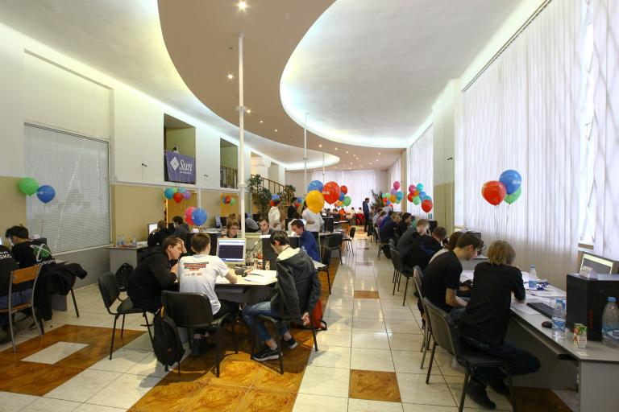
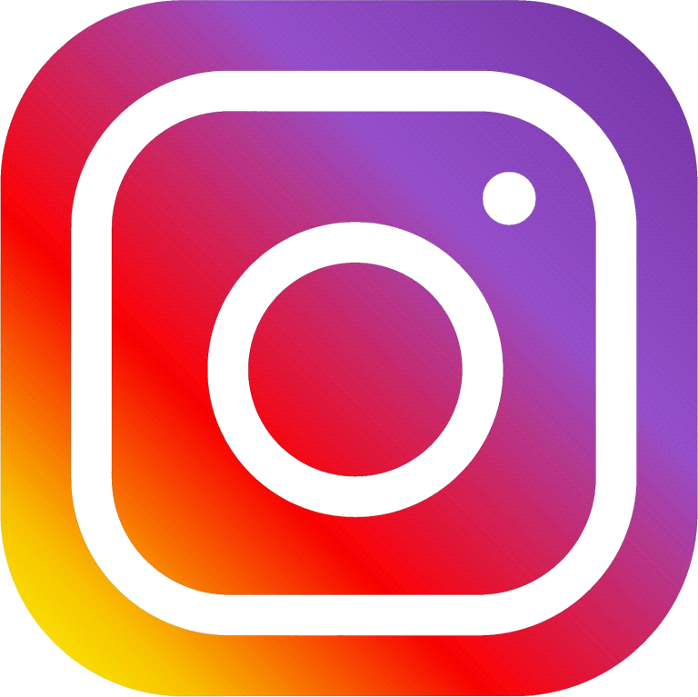

# Announcement

Olá a todos!

[Current Standings](https://codeforces.com/http://neerc.ifmo.ru/archive/2018/standings.html)

The first winter weekend of the year would be tough for students who arrive to St. Petersburg, Barnaul, Almaty and Tbilisi. On the 1-2 of December ITMO University, Altai State Technical University, European University and Kazakh-British Technical University will host the final contest of [Northern Eurasia](https://codeforces.com/http://neerc.ifmo.ru). Participants are going to face a serious competition – they will fight for the right to represent their university on the finals of the [ICPC 2019](https://codeforces.com/https://icpc2019.up.pt/) in April in Portugal.

At the ITMO University stage we also expect 131 teams, including the Champions and Vice-Champions (but, worth mentioning, NEERC Champions) from last year ICPC'18.

Stay tuned for the latest news and monitors from the competition! These guys will go to the Porto to represent our Northern Eurasian region! Participants of our region have been taken the Final ICPC Cup for the last seven years. Will they continue their series of victories? Will see!

**UPD:** To the finals ICPC 2019 were qualified 15 teams:

 1. Moscow SU 3 (Makeev, Reznikov, Ipatov)
2. Moscow IPT 6 (Sergunin, Belykh, Stepanov)
3. International IT U 1 (Satylkhanov, Baimukanov, Kuanyshbay)
4. SPb ITMO University 2 (Poduremennykh, Naumov, Korobkov)
5. SPb br of NRU HSE 1 (Ermilov, Fedorov, Labutin)
6. U of Latvia 2 (Klevickis, Pretkalnins, Pakalns)
7. SPb SU 5 (Grebennikov, Fadeeva, Zavarin)
8. Belarusian SU 1 (Lukyanov, Rak, Kim)
9. NRU HS of Economics 1 (Sakhabiev, Nikolenko, Gribov)
10. Kazakh-British TU 1 (Amanov, Aman, Zhussupov)
11. Saratov SU 1 (Androsov, Glazov, Dalabaev)
12. Belarusian SUIR 1 (Mosko, Razhkou, Shilyaev)
13. Tbilisi IBSU 1 (Ksovreli, Narushvili, Svanidze)
14. Northern FU (Dyachkov, Guriev, Asyutchenko)
15. Ural FU 6 (Permyakov, Zuev, Mullabaev)

Follow the official competition hashtag #NEERC and join a live video, organized by [ICPCLive](https://codeforces.com/http://icpclive.com/) and, in person, [Aksenov239](https://codeforces.com/profile/Aksenov239 "Candidate Master Aksenov239"). 

We are pleased to notice that this year at the NEERC will be special! We host some unique guests from the Committee of the ICPC organization – the Executive Director of the ICPC, Dr. Bill Poucher and Deputy Executive Director of the ICPC, Dr. Jeff Donahue. We will passionate to hear some inspiring words for our teams from Bill! And, of course, don’t miss the interviews with our special guests live!

If you want to visit the championship as a guest – please fill out the [form](https://codeforces.com/https://goo.gl/forms/C1nVj6AC7QHRnOSl2).

If you do not participate in the semifinals, you can try to solve problems from 23rd NEERC challenge in the [mirror](https://codeforces.com/contestRegistrants/1089). It will start in a few minutes after the main round on December 2nd. The tasks will be provided in English only. The mirror is an unrated contest.

We have compiled a table of participating teams with the total Codeforces rating >= 7000. Who is your favorite thou? 

 

| Team | Participant 1 | Participant 2 | Participant 3 | Rating |
| --- | --- | --- | --- | --- |
| Moscow SU: Red Panda | Ipatov ([LHiC](https://codeforces.com/profile/LHiC "Legendary Grandmaster LHiC")) | Reznikov ([vintage_Vlad_Makeev](https://codeforces.com/profile/vintage_Vlad_Makeev "Specialist vintage_Vlad_Makeev")) | Makeev ([V--o_o--V](https://codeforces.com/profile/V--o_o--V "Legendary Grandmaster V--o_o--V")) | 7788 |
|
| Moscow IPT: Shock Content | Stepanov([irkstepanov](https://codeforces.com/profile/irkstepanov "Grandmaster irkstepanov")) | Sergunin([AndreySergunin](https://codeforces.com/profile/AndreySergunin "International Grandmaster AndreySergunin")) | Belykh([WHITE2302](https://codeforces.com/profile/WHITE2302 "Grandmaster WHITE2302")) | 7689 |
|
| Moscow IPT: Good Game | Golovanov([Golovanov399](https://codeforces.com/profile/Golovanov399 "International Grandmaster Golovanov399")) | Uvarov([-imc-](https://codeforces.com/profile/-imc- "Grandmaster -imc-")) | Machula([mHuman](https://codeforces.com/profile/mHuman "Grandmaster mHuman")) | 7671 |
|
| SPb SU 1 | Gorbachev([peltorator](https://codeforces.com/profile/peltorator "Grandmaster peltorator")) | Ivanov([orz](https://codeforces.com/profile/orz "International Master orz")) | Safonov([isaf27](https://codeforces.com/profile/isaf27 "International Grandmaster isaf27")) | 7638 |
|
| SPb ITMO University 1 | Sayutin([cdkrot](https://codeforces.com/profile/cdkrot "Grandmaster cdkrot")) | Kirillov([craborac](https://codeforces.com/profile/craborac "International Grandmaster craborac")) | Drozdova([demon1999](https://codeforces.com/profile/demon1999 "Grandmaster demon1999")) | 7604 |
|
| Moscow IPT: Racoons | Grigoryev([gop2024](https://codeforces.com/profile/gop2024 "Grandmaster gop2024")) | Tretyakov([ShadowLight](https://codeforces.com/profile/ShadowLight "International Master ShadowLight")) | Shpakovskij([Denisson](https://codeforces.com/profile/Denisson "International Grandmaster Denisson")) | 7440 |
|
| SPb SU 2 | Milshin([Morokei](https://codeforces.com/profile/Morokei "Master Morokei")) | Filippov([step_by_step](https://codeforces.com/profile/step_by_step "International Grandmaster step_by_step")) | Fedorov([DaniilF](https://codeforces.com/profile/DaniilF "International Master DaniilF")) | 7367 |
|
| SPb ITMO University 2 | Korobkov([romanasa](https://codeforces.com/profile/romanasa "International Master romanasa")) | Poduremennykh([PoDuReM](https://codeforces.com/profile/PoDuReM "Grandmaster PoDuReM")) | Naumov([josdas](https://codeforces.com/profile/josdas "Grandmaster josdas")) | 7360 |
|
| Moscow SU: NoNames | Kalendarov([Andreikkaa](https://codeforces.com/profile/Andreikkaa "Master Andreikkaa")) | Koshelev([SendThemToHell](https://codeforces.com/profile/SendThemToHell "Master SendThemToHell")) | Chunaev([ch_egor](https://codeforces.com/profile/ch_egor "International Grandmaster ch_egor")) | 7243 |
|
| NRU HSE: IOI is not ICM, said MS | Nikolenko([qoo2p5](https://codeforces.com/profile/qoo2p5 "Grandmaster qoo2p5")) | Gribov([grphil](https://codeforces.com/profile/grphil "Grandmaster grphil")) | Sakhabiev([super_azbuka](https://codeforces.com/profile/super_azbuka "Master super_azbuka")) | 7052 |
|
| Saratov SU #2 | Androsov([BledDest](https://codeforces.com/profile/BledDest "Grandmaster BledDest")) | Dalabaev([adedalic](https://codeforces.com/profile/adedalic "International Master adedalic")) | Glazov([Roms](https://codeforces.com/profile/Roms "Master Roms")) | 7000 |

Вoa sorte! Siga-nos:

    

