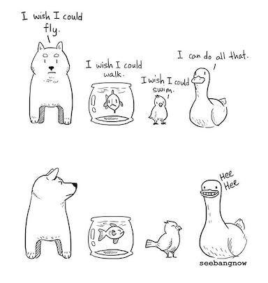

<h1 style='text-align: center;'> F. New Year and the Mallard Expedition</h1>

<h5 style='text-align: center;'>time limit per test: 1 second</h5>
<h5 style='text-align: center;'>memory limit per test: 256 megabytes</h5>

Bob is a duck. He wants to get to Alice's nest, so that those two can duck!

  Duck is the ultimate animal! (Image courtesy of See Bang) The journey can be represented as a straight line, consisting of $n$ segments. Bob is located to the left of the first segment, while Alice's nest is on the right of the last segment. Each segment has a length in meters, and also terrain type: grass, water or lava. 

Bob has three movement types: swimming, walking and flying. He can switch between them or change his direction at any point in time (even when he is located at a non-integer coordinate), and doing so doesn't require any extra time. Bob can swim only on the water, walk only on the grass and fly over any terrain. Flying one meter takes $1$ second, swimming one meter takes $3$ seconds, and finally walking one meter takes $5$ seconds.

Bob has a finite amount of energy, called stamina. Swimming and walking is relaxing for him, so he gains $1$ stamina for every meter he walks or swims. On the other hand, flying is quite tiring, and he spends $1$ stamina for every meter flown. Staying in place does not influence his stamina at all. Of course, his stamina can never become negative. Initially, his stamina is zero.

What is the shortest possible time in which he can reach Alice's nest? 

###### Input

The first line contains a single integer $n$ ($1 \leq n \leq 10^5$) — the number of segments of terrain. 

The second line contains $n$ integers $l_1, l_2, \dots, l_n$ ($1 \leq l_i \leq 10^{12}$). The $l_i$ represents the length of the $i$-th terrain segment in meters.

The third line contains a string $s$ consisting of $n$ characters "G", "W", "L", representing Grass, Water and Lava, respectively. 

It is guaranteed that the first segment is not Lava.

###### Output

###### Output

 a single integer $t$ — the minimum time Bob needs to reach Alice. 

## Examples

###### Input


```text
1
10
G
```
###### Output


```text
30
```
###### Input


```text
2
10 10
WL
```
###### Output


```text
40
```
###### Input


```text
2
1 2
WL
```
###### Output


```text
8
```
###### Input


```text
3
10 10 10
GLW
```
###### Output


```text
80
```
## Note

In the first sample, Bob first walks $5$ meters in $25$ seconds. Then he flies the remaining $5$ meters in $5$ seconds.

In the second sample, Bob first swims $10$ meters in $30$ seconds. Then he flies over the patch of lava for $10$ seconds.

In the third sample, the water pond is much smaller. Bob first swims over the water pond, taking him $3$ seconds. However, he cannot fly over the lava just yet, as he only has one stamina while he needs two. So he swims back for half a meter, and then half a meter forward, taking him $3$ seconds in total. Now he has $2$ stamina, so he can spend $2$ seconds flying over the lava.

In the fourth sample, he walks for $50$ seconds, flies for $10$ seconds, swims for $15$ seconds, and finally flies for $5$ seconds.


#### Tags 

#2600 #NOT OK #constructive_algorithms #greedy 

## Blogs
- [All Contest Problems](../Good_Bye_2018.md)
- [Good Bye 2018 (en)](../blogs/Good_Bye_2018_(en).md)
- [Editorial (en)](../blogs/Editorial_(en).md)
