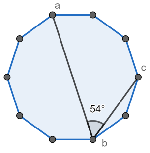

<h1 style='text-align: center;'> C. Polygon for the Angle</h1>

<h5 style='text-align: center;'>time limit per test: 2 seconds</h5>
<h5 style='text-align: center;'>memory limit per test: 256 megabytes</h5>

You are given an angle $\text{ang}$. 

The Jury asks You to find such regular $n$-gon (regular polygon with $n$ vertices) that it has three vertices $a$, $b$ and $c$ (they can be non-consecutive) with $\angle{abc} = \text{ang}$ or report that there is no such $n$-gon.

  If there are several answers, print the minimal one. It is guarantied that if answer exists then it doesn't exceed $998244353$.

### Input

The first line contains single integer $T$ ($1 \le T \le 180$) — the number of queries. 

Each of the next $T$ lines contains one integer $\text{ang}$ ($1 \le \text{ang} < 180$) — the angle measured in degrees. 

### Output

For each query print single integer $n$ ($3 \le n \le 998244353$) — minimal possible number of vertices in the regular $n$-gon or $-1$ if there is no such $n$.

## Example

### Input


```text
4
54
50
2
178
```
### Output


```text
10
18
90
180
```
## Note

The answer for the first query is on the picture above.

The answer for the second query is reached on a regular $18$-gon. For example, $\angle{v_2 v_1 v_6} = 50^{\circ}$.

The example angle for the third query is $\angle{v_{11} v_{10} v_{12}} = 2^{\circ}$.

In the fourth query, minimal possible $n$ is $180$ (not $90$).


#### Tags 

#1600 #NOT OK #brute_force #geometry 

## Blogs
- [All Contest Problems](../Educational_Codeforces_Round_57_(Rated_for_Div._2).md)
- [Announcement (ru)](../blogs/Announcement_(ru).md)
- [Tutorial (ru)](../blogs/Tutorial_(ru).md)
