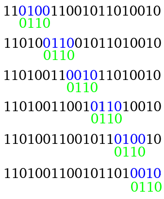

<h1 style='text-align: center;'> H. Mateusz and an Infinite Sequence</h1>

<h5 style='text-align: center;'>time limit per test: 7 seconds</h5>
<h5 style='text-align: center;'>memory limit per test: 512 megabytes</h5>

A Thue-Morse-Radecki-Mateusz sequence (Thorse-Radewoosh sequence in short) is an infinite sequence constructed from a finite sequence $\mathrm{gen}$ of length $d$ and an integer $m$, obtained in the following sequence of steps:

* In the beginning, we define the one-element sequence $M_0=(0)$.
* In the $k$-th step, $k \geq 1$, we define the sequence $M_k$ to be the concatenation of the $d$ copies of $M_{k-1}$. However, each of them is altered slightly — in the $i$-th of them ($1 \leq i \leq d$), each element $x$ is changed to $(x+\mathrm{gen}_i) \pmod{m}$.

For instance, if we pick $\mathrm{gen} = (0, \color{blue}{1}, \color{green}{2})$ and $m = 4$: 

* $M_0 = (0)$,
* $M_1 = (0, \color{blue}{1}, \color{green}{2})$,
* $M_2 = (0, 1, 2, \color{blue}{1, 2, 3}, \color{green}{2, 3, 0})$,
* $M_3 = (0, 1, 2, 1, 2, 3, 2, 3, 0, \color{blue}{1, 2, 3, 2, 3, 0, 3, 0, 1}, \color{green}{2, 3, 0, 3, 0, 1, 0, 1, 2})$, and so on.

As you can see, as long as the first element of $\mathrm{gen}$ is $0$, each consecutive step produces a sequence whose prefix is the sequence generated in the previous step. Therefore, we can define the infinite Thorse-Radewoosh sequence $M_\infty$ as the sequence obtained by applying the step above indefinitely. For the parameters above, $M_\infty = (0, 1, 2, 1, 2, 3, 2, 3, 0, 1, 2, 3, 2, 3, 0, 3, 0, 1, \dots)$.

Mateusz picked a sequence $\mathrm{gen}$ and an integer $m$, and used them to obtain a Thorse-Radewoosh sequence $M_\infty$. He then picked two integers $l$, $r$, and wrote down a subsequence of this sequence $A := ((M_\infty)_l, (M_\infty)_{l+1}, \dots, (M_\infty)_r)$.

## Note

 that we use the $1$-based indexing both for $M_\infty$ and $A$.

Mateusz has his favorite sequence $B$ with length $n$, and would like to see how large it is compared to $A$. Let's say that $B$ majorizes sequence $X$ of length $n$ (let's denote it as $B \geq X$) if and only if for all $i \in \{1, 2, \dots, n\}$, we have $B_i \geq X_i$.

He now asks himself how many integers $x$ in the range $[1, |A| - n + 1]$ there are such that $B \geq (A_x, A_{x+1}, A_{x+2}, \dots, A_{x+n-1})$. As both sequences were huge, answering the question using only his pen and paper turned out to be too time-consuming. Can you help him automate his research?

#### Input

The first line contains two integers $d$ and $m$ ($2 \leq d \leq 20$, $2 \leq m \leq 60$) — the length of the sequence $\mathrm{gen}$ and an integer used to perform the modular operations. The second line contains $d$ integers $\mathrm{gen}_i$ ($0 \leq \mathrm{gen}_i < m$). It's guaranteed that the first element of the sequence $\mathrm{gen}$ is equal to zero.

The third line contains one integer $n$ ($1 \leq n \leq 30000$) — the length of the sequence $B$. The fourth line contains $n$ integers $B_i$ ($0 \leq B_i < m$). The fifth line contains two integers $l$ and $r$ ($1 \leq l \leq r \leq 10^{18}$, $r-l+1 \geq n$).

#### Output

Print a single integer — the answer to the problem.

## Examples

#### Input


```text
2 2
0 1
4
0 1 1 0
2 21
```
#### Output


```text
6
```
#### Input


```text
3 4
0 1 2
2
0 2
6 11
```
#### Output


```text
1
```
## Note

Thorse-Radewoosh sequence in the first example is the standard Thue-Morse sequence, so the sequence $A$ is as follows: $11010011001011010010$. Here are the places where the sequence $B$ majorizes $A$:

  

#### Tags 

#3400 #NOT OK #bitmasks #brute_force #dp #strings 

## Blogs
- [All Contest Problems](../Hello_2019.md)
- [a (en)](../blogs/a_(en).md)
- [Tutorial (en)](../blogs/Tutorial_(en).md)
