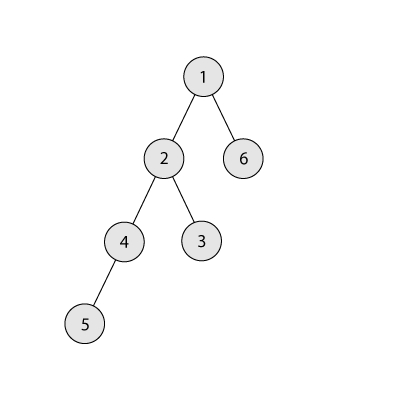
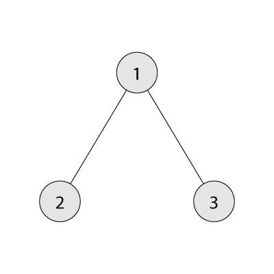
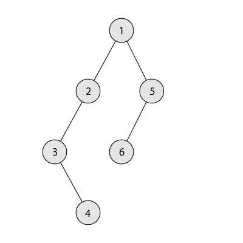

<h1 style='text-align: center;'> C. Construct a tree</h1>

<h5 style='text-align: center;'>time limit per test: 1 second</h5>
<h5 style='text-align: center;'>memory limit per test: 256 megabytes</h5>

Misha walked through the snowy forest and he was so fascinated by the trees to decide to draw his own tree!

Misha would like to construct a rooted tree with $n$ vertices, indexed from 1 to $n$, where the root has index 1. Every other vertex has a parent $p_i$, and $i$ is called a child of vertex $p_i$. Vertex $u$ belongs to the subtree of vertex $v$ iff $v$ is reachable from $u$ while iterating over the parents ($u$, $p_{u}$, $p_{p_{u}}$, ...). Clearly, $v$ belongs to its own subtree, and the number of vertices in the subtree is called the size of the subtree. Misha is only interested in trees where every vertex belongs to the subtree of vertex $1$.

Below there is a tree with $6$ vertices. The subtree of vertex $2$ contains vertices $2$, $3$, $4$, $5$. Hence the size of its subtree is $4$. 

  The branching coefficient of the tree is defined as the maximum number of children in any vertex. For example, for the tree above the branching coefficient equals $2$. Your task is to construct a tree with $n$ vertices such that the sum of the subtree sizes for all vertices equals $s$, and the branching coefficient is minimum possible.

##### Input

The only input line contains two integers $n$ and $s$ — the number of vertices in the tree and the desired sum of the subtree sizes ($2 \le n \le 10^5$; $1 \le s \le 10^{10}$).

##### Output

If the required tree does not exist, output «No». Otherwise output «Yes» on the first line, and in the next one output integers $p_2$, $p_3$, ..., $p_n$, where $p_i$ denotes the parent of vertex $i$.

## Examples

##### Input


```text
3 5
```
##### Output


```text
Yes
1 1 
```
##### Input


```text
4 42
```
##### Output


```text
No
```
##### Input


```text
6 15
```
##### Output


```text
Yes
1 2 3 1 5 
```
## Note

Below one can find one of the possible solutions for the first sample case. The sum of subtree sizes equals $3 + 1 + 1 = 5$, and the branching coefficient equals $2$.

  Below one can find one of the possible solutions for the third sample case. The sum of subtree sizes equals $6 + 3 + 2 + 1 + 2 + 1 = 15$, and the branching coefficient equals $2$.

  

#### Tags 

#2400 #NOT OK #binary_search #constructive_algorithms #dfs_and_similar #graphs #greedy #trees 

## Blogs
- [All Contest Problems](../Codeforces_Round_530_(Div._1).md)
- [Announcement (en)](../blogs/Announcement_(en).md)
- [Tutorial (en)](../blogs/Tutorial_(en).md)
