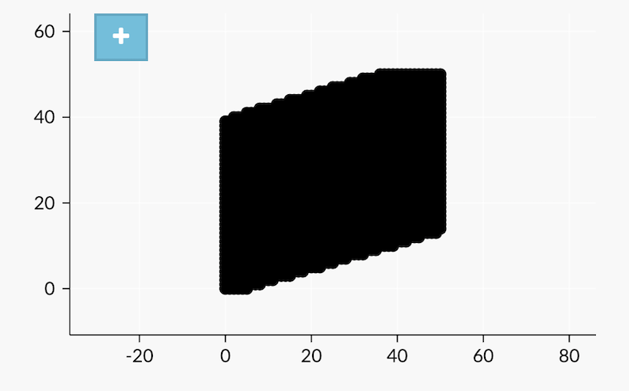

# E_(en)

Tutorial is loading... 
### [1099B - Squares and Segments](../problems/B._Squares_and_Segments.md "Codeforces Round 530 (Div. 2)")

Consider any resulting configuration of the squares. We can safely assume that a set of non-empty rows and non-empty columns are connected (otherwise just move the disconnected part a bit closer to any other). Clearly, in every column and every row we can «for free» extend it to have all the squares in the bounding box — minimum rectangle containing the resulting figure. From this we can conclude that we can search for the optimal answer among the rectangles.

The answer for a rectangle $a \times b$ equals $a+b$ (just draw the first row and the first column), so we need to find two values $a$ and $b$ such that $a \times b \ge n$ and $a + b$ is minimum possible. It's easy to see that the answer is not optimal if $|a-b| \ge 2$: by moving the numbers towards each other we get the same sum, but greater product. This observation leads to the following solution: if $s=[\sqrt n]$, then the answer is either a rectangle $s \times s$, or a rectangle $s \times (s+1)$, or a rectangle $(s+1) \times (s+1)$ (because of the rounding). We just need to check which one is better.

 Tutorial is loading... 
### [1099D - Sum in the tree](https://codeforces.com/contest/1099/problem/D "Codeforces Round 530 (Div. 2)")

To achieve the minimum possible sum of values in the tree, for vertices with even depth we need to put 0 for leaves and the maximum value possible for other vertices, because increasing the value does not make the resulting sum worse — our children would compensate for it. Since $a_v \ge 0$, it's obvious that ${s_p}_v \le {s_p}_v + a_v = s_v$. For every child $u$ of vertex $v$ it's also true that $s_v \le s_u$, hence ${s_p}_v \le s_v \le s_u$. From this one can derive that the maximum possible $a_v$ for vertices with even $h_v$ equals $\min\limits_{u\ -\ child\ v}s_{u} - s_{p_v}$.

Given the values $a_v$ in the vertices of even depth, we can restore the values in the vertices of odd depth using the formula $a_v = s_v - s_{p_v}$. This requires a simple DFS (which translated to a for-loop given the tree representation in the problem statement).

 
### [1099E - Nice table](https://codeforces.com/contest/1099/problem/E "Codeforces Round 530 (Div. 2)")

Key idea:

In a good matrix, either each row contain at most two different characters, or each column contain at most two different characters.

Proof: (it will be here, but for now the editorial fields are too narrow to contain it).

In other words, the field looks either like (up to a permutation of «AGCT»):

«AGAGAG»

«CTCTCT»

«AGAGAG» (or «GAGAGA»)

«CTCTCT» (or «TCTCTC»)

«AGAGAG» (or «GAGAGA»)

«CTCTCT» (or «TCTCTC»)

(and so on)

or similarly by columns.

So, the solution is to say that we have this alternation by rows, iterate over the permutation of letters, for each row choose from the row and its inversion the one that differs from the row of the original matrix in the minimum number of characters. Then rotate the matrix, and solve similarly again, and take a more optimal one.

 
### [1099F - Cookies](../problems/F._Cookies.md "Codeforces Round 530 (Div. 2)")

If Mitya moves the chip to vertex $i$ during the game and then moves it back to the root, he will have exactly $T - 2 \cdot (\text{time to reach vertex $i$ from the root})$ time to eat cookies. Let's denote the maximum number of cookies he can eat during this time by $f[i]$.

Let's first focus on what to do next, assuming we have already computed $f[i]$. We can use DFS to compute $dp[i]$ — the maximum number of cookies Mitya can eat if he finishes the game in the subtree of vertex $i$ (vertex $i$ itself included). Let $m1[i]$ and $m2[i]$ be the indices of two children of vertex $i$ with maximum value $dp[j]$ among its children. It's simple to compute $dp[i]$:

* In case vertex $i$ is a leaf, $dp[i] = f[i]$, since we can not move any further.
* In case vertex $i$ is a root of the tree, we have two choices: either stop the game, or go to the child with the maximum value of $dp$, which means $dp[i] = \max(f[i],\ dp[m1[i]])$ in this case.
* Otherwise, if we're in the vertex $i$, Vasya can remove an edge to any child $j$ of vertex $i$, and clearly he would remove the one with maximum value of $dp$, meaning he would remove the edge from $i$ to $m1[i]$. This means $dp[i] = \max(f[i],\ dp[m2[i]])$, because we can also decide to stop the game in vertex $i$.

The only thing left now is how to compute values $f[i]$ efficiently. We can do it with another DFS: while traversing the tree, for vertex $i$ we maintain the pairs $(t_j,\ x_j)$ for all vertices on the path from the root to vertex $i$. Clearly Mitya would prefer to eat the cookies that he can eat quickly, so we maintain these vertices ordered by $t_j$ in increasing order, and to compute the answer for vertex $i$, we just eat the cookies from "fastest" to "slowest" until we run out of time. To do it efficiently, one can use their favourite data structure (BIT / Segment Tree / Treap) while traversing the tree, which leads to $O(n \log n)$ solution.

 
### [1098C - Construct a tree](https://codeforces.com/contest/1098/problem/C "Codeforces Round 530 (Div. 1)")

Note, that vertex belongs to subtrees of vertexes, which lay on its way to root. So, sum of sizes of subtrees is equal to $p + n$, where $p$ is sum of lengths of ways from root to vertexes. Let's consider which sum of sizes of subtrees can be in tree with branching coefficient less or equal than $k$.

Minimal sum can be achieved in $k$-nary tree (it consists of root, $k$ vertexes on distance $1$, $k^2$ on distance $2$, etc, the last level can be filled not completely).

Maximal sum can be achieved in bamboo — tree, which consists of only one way with length $n$. If $s$ is bigger than sum in this tree, the answer will be «No».

Let's find minimal $k$, such that $s$ is not smaller than sum of sizes of subtrees in $k$-nary tree (using binary search). Now $s$ is between minimal and maximal sum of sizes of subtrees in tree with branching coefficient, which is not bigger than $k$.

Let's show how to build tree with the given sum, which is between these two borders. Let's start with $k$-nary tree.

Let's realize recursive function, which rebuilds tree. Let we are in a subtree, and want to increase sum of sizes of subtrees by $x$ (in this subtree). We can change this subtree to bamboo with same number of vertexes (if the sum of sizeof of subtrees won't be too big). Otherwise, we run this function from subtrees in some order. If we reach needed sum, we will terminate the process. Otherwise, every subtree of child is bamboo now, current sum of sizes is smaller than needed, but if we merged bamboos, it would be bigger than it. Let's move vertexes to the end of the first bamboo from others. Over time, after next moving, sum of sizes will increase too much. We can move it to the another position in the first bamboo, in order to make sum equal to $s$, and terminate the process.

But if we believe that every tree with sum of sizes of subtrees between maximal and minimal can be built, there is another solution with $O(n \log n)$ complexity, which is easier to realize.

The sum of subtree sizes is influenced only by the number of vertices at each distance, and not by their mutual arrangement. Sum of sizes of subtrees is equal to $n + i \cdot d_{i}$, where $d_{i}$ — number of vertexes on distance $i$ from the root. Let's built this array of counts. These conditions must be satisfied:

* If the $i$-th element is bigger than $0$ ($i > 0$), than $i - 1$-th element must be bigger than $0$.
* If the $i$-th element is equal to $t$, $i + 1$-th mustn't be bigger than $t \cdot k$.
* Sum of elements must be equal to $n$.

Let we have recovered some prefix of this array (i.e we know that we can fill rest, and sum of sizes of subtrees will be equal to $s$). Let's try to put some value to the next element.

We know that the tree can be rebuilt so that the sum is any between maximum and minimum, so there are two conditions, which are satisfied (we want to put value $x$ to position $i$).

* $x$ must be big enough, so if we fill suffix with numbers $x$, $x \cdot k$, $x \cdot k^2$, ... (the last non-zero number can be smaller, sum of numbers is $n$) sum of sizes of subtrees will be not greater to $s$.
* $x$ must be small enough, so if we fill suffix with $1$, sum of sizes of subtrees will be not less than $s$.

Both borders form some segment of values, which could be put to this position. We haven't to look for the left border, just find the right border by binsearch, and put number, which is equal to it. We can easily restore the tree, using array $d$.

 
### [1098D - Eels](https://codeforces.com/contest/1098/problem/D "Codeforces Round 530 (Div. 1)")

Let's consider a set of fishes of size $k$ and sort it in non-decreasing order: $a_1 \le a_2 \le \ldots \le a_k$. Let's call a fish fat if its weight is greater than twice the sum of all fishes with smaller indices: fish $a_i$ is fat iff $a_i > 2 \sum_{j < i} a_j$.

Key fact. Let $t$ be the total number of fat fishes. We'll prove that in this case the set of fishes has danger $k-t$.

Observation 1. A fat fish can't dangerously eat a fish with smaller weight. Indeed, even if all the smaller fishes eat each other, the resulting fish would be too small. We can conclude that the danger is not greater $k-t$.

Observation 2. Let's use the following strategy: at every moment fishes with two smallest weights fight with each other. If a battle between fishes with masses $a$ and $b$ is not dangerous, it's clear that fish $b$ has not eaten any other fish yet — otherwise this fish is a sum of two smaller fishes $c+d=b$, where $c \le d$, but in this case $d \ge b/2 > a$, hence according to the strategy there must have been a fight between two fishes $a$ and $c$ before. This indicates that fish $b$ has not eaten any other fish yet, and fish $a$ is a result of battles between all smaller fishes. In this case $b$ is a fat fish by definition, which completes the proof that this strategy guarantees exactly $k-t$ dangerous battles.

Algorithm. Clearly now we need a data structure that allows us to perform three types of operations:

* add element $x$
* remove element $x$
* find all elements that are greater than the sum of all smaller elements

Let's split the allowed values range into half-intervals $[1,2)$, $[2,4)$, $[4,8)$, ..., $[2^{30}, 2^{31})$.

Observation 3. Every half-interval contains at most 1 fat fish, and if there is one, it's the on with the minimum value. Indeed, every single half-interval does not contain two values $x$ and $y$ where $y > 2x$.

Now for each half-interval we can maintain the sum of all fishes in this half-interval, the sum of weights of fishes in this half-interval, and the minimum fish in the half-interval (one could use set / PriorityQueue or a similar data structure). In this case we can determine the count of fat fishes simply by iterating over all half-intervals. The resulting complexity is $O(\log_2 n)$ per query.

 
### [1098E - Fedya the Potter](https://codeforces.com/contest/1098/problem/E "Codeforces Round 530 (Div. 1)")

There are $O(N\cdot logN)$ different values of gcd, because if we fix the left bound of a segment and iterate right bound from left bound to the end, the gcd stays unchanged or decreases in two or more times. We can get a compressed version of array $b$ if we compress equal consecutive elements in to pair $(value, countOfValue)$. We can use segment tree to find all segments of equal elements.

Let's estimate how many segments in array $b$ have sum less or equals some $M$. If size of array $b$ had been small, we could have done the 2 pointers technique to do that. Unfortunately, size of array $b$ is $O(N^2)$. However, array $b$ has a lot of equal elements. So, the solution is to process a group of equal elements in a fast way. Let's fix bounds $L$ and $R$ in array $b$, assume $T$ - is a sum of elements beetwen $L$ and $R$, after $L$ we have a group of elements $X$, with size $xcnt$, after $R$ we have a group of elements $Y$, with size $ycnt$. Then, it is easy to see that our task is to find out how many pairs of integers $(a, b)$ satisfy the condition: $0 < b \cdot Y - a \cdot X + T \le M$.This is a standard task where we need to calculate all integer points under a line that can be done with the euclidean algorithm. Here the example of a plot of this function: 

   To find the median element, we can use a binary search with the above function. 
### [1098F - Ж-function](https://codeforces.com/contest/1098/problem/F "Codeforces Round 530 (Div. 1)")

Answer for query $l$, $r$ is equal to $\sum^{r}_{i=l}{\min(lcp(l,i), r - i + 1)}$. $lcp(i, l)$ is the length of longest common preffix of $i$-th and $l$-th suffixes. Let $\min(lcp(l,i), r - i + 1)$ be denoted by «cutted $lcp$» of two suffixes. Now we can use another approach to calculate the answer. For each $k = 1 \ldots r - l + 1$ let's count number of suffixes $i = l \ldots r$ with «cutted $lcp$» $\geq k$, it is equal to number of suffixes $i = l \ldots r - k + 1$ with $lcp$ $\geq k$. The sum of these values will be an answer.

Let's build the suffix tree of our string.

To count this value for fixed $k$ and $l$, let's consider an ancestor of $l$-th suffix with depth equal to $k$, number of sought for suffixes is equal to a number of suffixes with numbers from $l$ to $r - k + 1$ in the subtree of our vertex. 

So let's suppose that for each vertex $v$ there is a data structre, which can count number of leaves with numbers from $l$ to $r-h_v+1$ ($h_v$ is the depth of $v$) in subtree of $v$ for fixed $l$ and $r$.

Now to get an answer for query we should find sum of these sums for given $l$ and $r$ for all ancestors with depth $\leq r - l + 1$ of vertex which corresponds the substring of request.

Now we can just divide the request into two parts! We should count the number of leaves with numbers $\leq r - h_v + 1$ and number of leaves with numbers $< l$.

The first part is similar to counting number of leaves (in subtree) with numbers $x$, that $x + h_v \leq r + 1$.

Now we should use Heavy-light decompositin of our suffix tree to find sum on way. Let's consider all $\mathcal{O}(\log n)$ heavy ways which are above the fixed leaf. Our vertex appears in some prefixes of these ways, and its values are $x+h_v, x+h_v + 1, \ldots, x+h_v+len$. So on each way there are some leaves determined by ($x + h_v, len$) which should be considered. Lets denote these pairs by ($x_i, y_i$). Now we just need to count number of $(i, j)$, that $0 \leq j \leq y_i$ and $x_i + j \leq r + 1$. I.e. for each query we should calculate $\sum{\max(0, \min(r + 1 - x_i, y_j))}$ on prefixes of considered heavy ways.

Now we can use scaning line and Fenwick tree for each way to process all queries. It would be easy for you to find out how to do it if you understood everything before ;).

The second part can be done similary, but in this case each leaf corresponds a point, not linear function.

The complexity is $\mathcal{O}(n \log^2 n)$, which easily passes TL.

