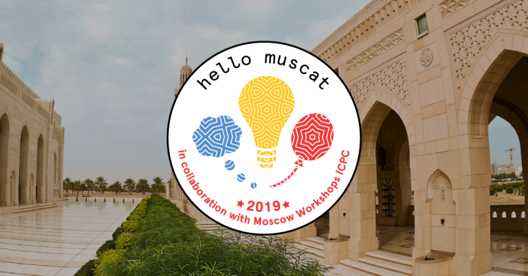

# Announcement

Hello Codeforces!

On [Saturday, January 26, 2019 at 21:35UTC+6](https://codeforces.com/https://www.timeanddate.com/worldclock/fixedtime.html?day=26&month=1&year=2019&hour=18&min=35&sec=0&p1=166) [Educational Codeforces Round 59 (Rated for Div. 2)](https://codeforces.com/contest/1107 "Educational Codeforces Round 59 (Rated for Div. 2)") will start.

Series of Educational Rounds continue being held as [Harbour.Space University](https://codeforces.com/https://harbour.space/) initiative! You can read the details about the cooperation between [Harbour.Space University](https://codeforces.com/https://harbour.space/) and Codeforces in the [blog post](//codeforces.com/blog/entry/51208).

This round will be **rated for the participants with rating lower than 2100**. It will be held on extented ACM ICPC rules. The penalty for each incorrect submission until the submission with a full solution is 10 minutes. After the end of the contest you will have 12 hours to hack any solution you want. You will have access to copy any solution and test it locally.

You will be given **7 problems** and **2 hours** to solve them.

The problems were invented and prepared by Roman [Roms](https://codeforces.com/profile/Roms "Master Roms") Glazov, Adilbek [adedalic](https://codeforces.com/profile/adedalic "International Master adedalic") Dalabaev, Vladimir [vovuh](https://codeforces.com/profile/vovuh "Candidate Master vovuh") Petrov, Ivan [BledDest](https://codeforces.com/profile/BledDest "Grandmaster BledDest") Androsov and me.

Good luck to all participants!

**UPD:** You can discuss the problems after the contest on a [local Discord server](https://codeforces.com/blog/entry/52778).

Our friends at Harbour.Space also have a message for you:

Hello Codeforces!

A quick reminder to check out the [Hello Muscat Programming Bootcamp](https://in.harbour.space/icpc/icpc-hello-muscat-bootcamp-2019/?utm_source=codeforces)!

Every day, both the Hello Programming Bootcamp and the Moscow ICPC Workshop will be competing simultaneously, 4,000 kilometers from each other — our camp will take place in Oman, from March 9th to March 15th, 2019 — registration is still open for this unique opportunity, so be sure to give it a look, we would love to see you there with us!

  [REGISTER FOR THE BOOTCAMP](https://in.harbour.space/icpc/icpc-hello-muscat-bootcamp-2019/?utm_source=codeforces) And, don’t forget that Harbour.Space University’s opportunity for a fully funded [Master’s in Robotics programme scholarship](https://in.harbour.space/remy-robotics-scholarship/?utm_source=codeforces) is still open! Head over to their website to see the details, and apply before the registration date closes.

  [APPLY HERE](https://in.harbour.space/remy-robotics-scholarship/?utm_source=codeforces) Congratulations to the winners: 

| Rank | Competitor | Problems Solved | Penalty |
| --- | --- | --- | --- |
| 1 | [vintage_Vlad_Makeev](https://codeforces.com/profile/vintage_Vlad_Makeev "Master vintage_Vlad_Makeev") | 7 | 198 |
| 2 | [Radewoosh](https://codeforces.com/profile/Radewoosh "Legendary Grandmaster Radewoosh") | 7 | 358 |
| 3 | [Rzepa](https://codeforces.com/profile/Rzepa "Grandmaster Rzepa") | 7 | 396 |
| 4 | [eddy1021](https://codeforces.com/profile/eddy1021 "International Grandmaster eddy1021") | 6 | 170 |
| 5 | [spacewanker](https://codeforces.com/profile/spacewanker "Expert spacewanker") | 6 | 175 |

Congratulations to the best hackers: 

| Rank | Competitor | Hack Count |
| --- | --- | --- |
| 1 | [_bacali](https://codeforces.com/profile/_bacali "Expert _bacali") | **39****:-44** |
| 2 | [Kiri8128](https://codeforces.com/profile/Kiri8128 "Expert Kiri8128") | **8** |
| 3 | [tymo](https://codeforces.com/profile/tymo "Expert tymo") | **5****:-1** |
| 4 | [Osamaa](https://codeforces.com/profile/Osamaa "Pupil Osamaa") | **4** |
| 5 | [sevlll777](https://codeforces.com/profile/sevlll777 "Expert sevlll777") | **5****:-4** |

 121 successful hacks and 527 unsuccessful hacks were made in total!And finally people who were the first to solve each problem: 

| Problem | Competitor | Penalty |
| --- | --- | --- |
| A | [vintage_Vlad_Makeev](https://codeforces.com/profile/vintage_Vlad_Makeev "Master vintage_Vlad_Makeev") | 0:01 |
| B | [neal](https://codeforces.com/profile/neal "International Grandmaster neal") | 0:02 |
| C | [neal](https://codeforces.com/profile/neal "International Grandmaster neal") | 0:05 |
| D | [vintage_Vlad_Makeev](https://codeforces.com/profile/vintage_Vlad_Makeev "Master vintage_Vlad_Makeev") | 0:10 |
| E | [Fake.Puppet](https://codeforces.com/profile/Fake.Puppet "Candidate Master Fake.Puppet") | 0:10 |
| F | [vintage_Vlad_Makeev](https://codeforces.com/profile/vintage_Vlad_Makeev "Master vintage_Vlad_Makeev") | 0:44 |
| G | [Kalam](https://codeforces.com/profile/Kalam "International Master Kalam") | 0:17 |

**UPD2**: [The editorial is out](Tutorial_2.md)

