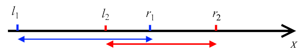

<h1 style='text-align: center;'> A. Two distinct points</h1>

<h5 style='text-align: center;'>time limit per test: 1 second</h5>
<h5 style='text-align: center;'>memory limit per test: 256 megabytes</h5>

You are given two segments $[l_1; r_1]$ and $[l_2; r_2]$ on the $x$-axis. It is guaranteed that $l_1 < r_1$ and $l_2 < r_2$. Segments may intersect, overlap or even coincide with each other.

  The example of two segments on the $x$-axis. Your problem is to find two integers $a$ and $b$ such that $l_1 \le a \le r_1$, $l_2 \le b \le r_2$ and $a \ne b$. In other words, you have to choose two distinct integer points in such a way that the first point belongs to the segment $[l_1; r_1]$ and the second one belongs to the segment $[l_2; r_2]$.

It is guaranteed that the answer exists. If there are multiple answers, you can print any of them.

You have to answer $q$ independent queries.

### Input

The first line of the input contains one integer $q$ ($1 \le q \le 500$) — the number of queries.

Each of the next $q$ lines contains four integers $l_{1_i}, r_{1_i}, l_{2_i}$ and $r_{2_i}$ ($1 \le l_{1_i}, r_{1_i}, l_{2_i}, r_{2_i} \le 10^9, l_{1_i} < r_{1_i}, l_{2_i} < r_{2_i}$) — the ends of the segments in the $i$-th query.

### Output

Print $2q$ integers. For the $i$-th query print two integers $a_i$ and $b_i$ — such numbers that $l_{1_i} \le a_i \le r_{1_i}$, $l_{2_i} \le b_i \le r_{2_i}$ and $a_i \ne b_i$. Queries are numbered in order of the input.

It is guaranteed that the answer exists. If there are multiple answers, you can print any.

## Example

### Input


```text
5
1 2 1 2
2 6 3 4
2 4 1 3
1 2 1 3
1 4 5 8
```
### Output


```text
2 1
3 4
3 2
1 2
3 7
```


#### Tags 

#800 #NOT OK #implementation 

## Blogs
- [All Contest Problems](../Codeforces_Round_535_(Div._3).md)
- [Announcement (en)](../blogs/Announcement_(en).md)
- [Tutorial (en)](../blogs/Tutorial_(en).md)
