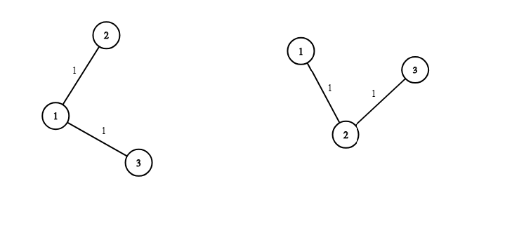

<h1 style='text-align: center;'> D. Sasha and Interesting Fact from Graph Theory</h1>

<h5 style='text-align: center;'>time limit per test: 2.5 seconds</h5>
<h5 style='text-align: center;'>memory limit per test: 256 megabytes</h5>

Once, during a lesson, Sasha got bored and decided to talk with his friends. Suddenly, he saw Kefa. Since we can talk endlessly about Kefa, we won't even start doing that. The conversation turned to graphs. Kefa promised Sasha to tell him about one interesting fact from graph theory if Sasha helps Kefa to count the number of beautiful trees. 

In this task, a tree is a weighted connected graph, consisting of $n$ vertices and $n-1$ edges, and weights of edges are integers from $1$ to $m$. Kefa determines the beauty of a tree as follows: he finds in the tree his two favorite vertices — vertices with numbers $a$ and $b$, and counts the distance between them. The distance between two vertices $x$ and $y$ is the sum of weights of edges on the simple path from $x$ to $y$. If the distance between two vertices $a$ and $b$ is equal to $m$, then the tree is beautiful.

Sasha likes graph theory, and even more, Sasha likes interesting facts, that's why he agreed to help Kefa. Luckily, Sasha is familiar with you the best programmer in Byteland. Help Sasha to count the number of beautiful trees for Kefa. Two trees are considered to be distinct if there is an edge that occurs in one of them and doesn't occur in the other one. Edge's weight matters.

Kefa warned Sasha, that there can be too many beautiful trees, so it will be enough to count the number modulo $10^9 + 7$.

##### Input

The first line contains four integers $n$, $m$, $a$, $b$ ($2 \le n \le 10^6$, $1 \le m \le 10^6$, $1 \le a, b \le n$, $a \neq b$) — the number of vertices in the tree, the maximum weight of an edge and two Kefa's favorite vertices.

##### Output

Print one integer — the number of beautiful trees modulo $10^9+7$.

## Examples

##### Input


```text
3 2 1 3
```
##### Output


```text
5
```
##### Input


```text
3 1 1 2
```
##### Output


```text
2
```
##### Input


```text
5 15 1 5
```
##### Output


```text
345444
```
## Note

There are $5$ beautiful trees in the first example:


In the second example the following trees are beautiful:




#### Tags 

#2400 #NOT OK #brute_force #combinatorics #dp #math #trees 

## Blogs
- [All Contest Problems](../Codeforces_Round_539_(Div._1).md)
- [Announcement](../blogs/Announcement.md)
- [Tutorial](../blogs/Tutorial.md)
