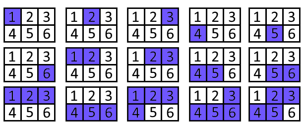

<h1 style='text-align: center;'> F. Sasha and Algorithm of Silence's Sounds</h1>

<h5 style='text-align: center;'>time limit per test: 1.5 seconds</h5>
<h5 style='text-align: center;'>memory limit per test: 256 megabytes</h5>

One fine day Sasha went to the park for a walk. In the park, he saw that his favorite bench is occupied, and he had to sit down on the neighboring one. He sat down and began to listen to the silence. Suddenly, he got a question: what if in different parts of the park, the silence sounds in different ways? So it was. Let's divide the park into $1 \times 1$ meter squares and call them cells, and numerate rows from $1$ to $n$ from up to down, and columns from $1$ to $m$ from left to right. And now, every cell can be described with a pair of two integers $(x, y)$, where $x$ — the number of the row, and $y$ — the number of the column. Sasha knows that the level of silence in the cell $(i, j)$ equals to $f_{i,j}$, and all $f_{i,j}$ form a permutation of numbers from $1$ to $n \cdot m$. Sasha decided to count, how many are there pleasant segments of silence?

Let's take some segment $[l \ldots r]$. Denote $S$ as the set of cells $(i, j)$ that $l \le f_{i,j} \le r$. Then, the segment of silence $[l \ldots r]$ is pleasant if there is only one simple path between every pair of cells from $S$ (path can't contain cells, which are not in $S$). In other words, set $S$ should look like a tree on a plain. Sasha has done this task pretty quickly, and called the algorithm — "algorithm of silence's sounds".

Time passed, and the only thing left from the algorithm is a legend. To prove the truthfulness of this story, you have to help Sasha and to find the number of different pleasant segments of silence. Two segments $[l_1 \ldots r_1]$, $[l_2 \ldots r_2]$ are different, if $l_1 \neq l_2$ or $r_1 \neq r_2$ or both at the same time.

##### Input

The first line contains two integers $n$ and $m$ ($1 \le n, m \le 1000$, $1 \le n \cdot m \le 2 \cdot 10^5$) — the size of the park.

Each from next $n$ lines contains $m$ integers $f_{i,j}$ ($1 \le f_{i,j} \le n \cdot m$) — the level of silence in the cell with number $(i, j)$.

It is guaranteed, that all $f_{i,j}$ are different.

##### Output

Print one integer — the number of pleasant segments of silence.

## Examples

##### Input


```text
1 5  
1 2 3 4 5  

```
##### Output


```text
15
```
##### Input


```text
2 3  
1 2 3  
4 5 6  

```
##### Output


```text
15
```
##### Input


```text
4 4  
4 3 2 16  
1 13 14 15  
5 7 8 12  
6 11 9 10  

```
##### Output


```text
50
```
## Note

In the first example, all segments of silence are pleasant.

In the second example, pleasant segments of silence are the following:




#### Tags 

#3200 #NOT OK #data_structures #trees 

## Blogs
- [All Contest Problems](../Codeforces_Round_539_(Div._1).md)
- [Announcement](../blogs/Announcement.md)
- [Tutorial](../blogs/Tutorial.md)
