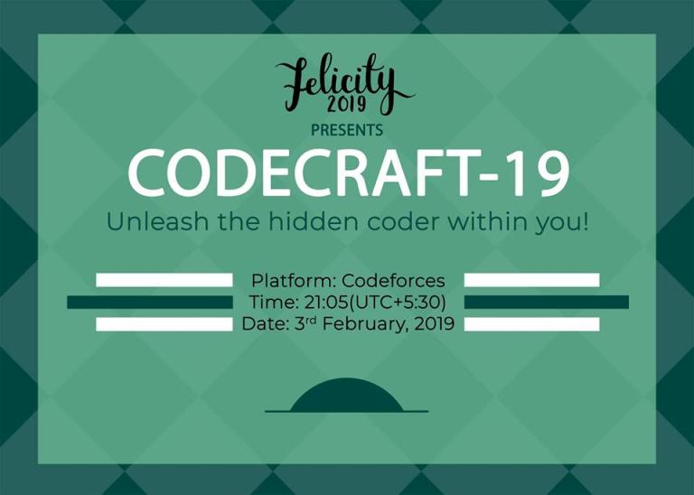

# CodeCraft-19_(en)

Hello Everyone!

I would like to invite you to CodeCraft-19, which is a part of [Felicity](https://codeforces.com/https://www.facebook.com/felicity.iiith), the annual techno-cultural fest of IIIT Hyderabad. It will take place on [Sunday, February 3, 2019 at 21:35UTC+6](https://codeforces.com/https://www.timeanddate.com/worldclock/fixedtime.html?day=3&month=2&year=2019&hour=18&min=35&sec=0&p1=166). 

The round will be **rated for Div 2 participants (whose ratings are lower than 2100)**. As usual, participants from the first division can participate in the contest out of the competition. You will be given **5** problems, all of which are based on the theme of our fest, "Superheroes".

I would like to thank the CodeCraft team -- [nir123](https://codeforces.com/profile/nir123 "Candidate Master nir123"), [additya1998](https://codeforces.com/profile/additya1998 "Candidate Master additya1998"), [devanshg27](https://codeforces.com/profile/devanshg27 "Master devanshg27"), [gaurav172](https://codeforces.com/profile/gaurav172 "Candidate Master gaurav172"), [night_fury208](https://codeforces.com/profile/night_fury208 "Candidate Master night_fury208"), [shaanknight](https://codeforces.com/profile/shaanknight "Candidate Master shaanknight"), [psaini](https://codeforces.com/profile/psaini "Expert psaini"), [sharmaritvik60](https://codeforces.com/profile/sharmaritvik60 "Expert sharmaritvik60"), [swetanjal](https://codeforces.com/profile/swetanjal "Expert swetanjal") and [vivace_jr](https://codeforces.com/profile/vivace_jr "Candidate Master vivace_jr") -- for helping in preparation of the problemset. I would also like to thank [KAN](https://codeforces.com/profile/KAN "Grandmaster KAN") and [300iq](https://codeforces.com/profile/300iq "Legendary Grandmaster 300iq") for round coordination, [----------](https://codeforces.com/profile/---------- "Master ----------"), [Aleks5d](https://codeforces.com/profile/Aleks5d "Master Aleks5d") and [mohammedehab2002](https://codeforces.com/profile/mohammedehab2002 "Master mohammedehab2002") for testing the round and [MikeMirzayanov](https://codeforces.com/profile/MikeMirzayanov "Headquarters, MikeMirzayanov") for the great Codeforces and Polygon platforms.

Following the convention, score distribution will be announced shortly before the contest.

Good luck to all the participants!

**UPD1:** 500-1000-1500-2000-2500

**UPD2** [Editorial](Tutorial_(en).md) is published! We sincerely apologize for the weak pretests in B and for the difficulty gap from C to D which turned out to be harder than what we expected.

**UPD3 Congratulations to the winners!**

 1. [prodakcin](https://codeforces.com/profile/prodakcin "Unrated, prodakcin")
2. [Taiyaki](https://codeforces.com/profile/Taiyaki "Candidate Master Taiyaki")
3. [yww_AFO](https://codeforces.com/profile/yww_AFO "Unrated, yww_AFO")
4. [Mindstorm](https://codeforces.com/profile/Mindstorm "Candidate Master Mindstorm")
5. [ThankGodItsFriday](https://codeforces.com/profile/ThankGodItsFriday "Expert ThankGodItsFriday")
6. [Issh](https://codeforces.com/profile/Issh "Expert Issh")
7. [hfctf0210](https://codeforces.com/profile/hfctf0210 "Expert hfctf0210")
8. [Y.nnnnnnn](https://codeforces.com/profile/Y.nnnnnnn "Candidate Master Y.nnnnnnn")
9. [kirillbogatiy](https://codeforces.com/profile/kirillbogatiy "Expert kirillbogatiy")
10. [PedyD](https://codeforces.com/profile/PedyD "Candidate Master PedyD")
