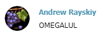

# Announcement_(en)

**TREMBLE BEFORE THE MIGHTY OMEGALULGRAPE**

Hello Codeforces!

We are honored to invite you to Codeforces Round #538 (Div. 2), which will take place at [Sunday, February 10, 2019 at 20:05UTC+6](https://codeforces.com/https://www.timeanddate.com/worldclock/fixedtime.html?day=10&month=2&year=2019&hour=17&min=5&sec=0&p1=166). The round will be rated for all Division 2 participants **(with rating less than 2100)**. Still, we warmly welcome Division 1 participants to join us out of competition.

You will be given **6** problems to solve in **2 hours.** The round's problems were initially prepared by Duy-Bach [AkiLotus](https://codeforces.com/profile/AkiLotus "Master AkiLotus") Le, Xuan-Tung [neko_nyaaaaaaaaaaaaaaaaa](https://codeforces.com/profile/neko_nyaaaaaaaaaaaaaaaaa "Master neko_nyaaaaaaaaaaaaaaaaa") Nguyen and Xuan-Quang [xuanquang1999](https://codeforces.com/profile/xuanquang1999 "Grandmaster xuanquang1999") D. Nguyen.

**There will be an interactive problem in this round.** Learn more about interactive problems [here](https://codeforces.com/blog/entry/45307).

This is our first attempt in making a Codeforces round, so suggestions are much welcome to help us improve ourselves. ;)

We also want to thanks many friends for making this round possible:

 * Dmitry [cdkrot](https://codeforces.com/profile/cdkrot "Grandmaster cdkrot") Sayutin for coordinating the round, providing a neat idea on one problem and some Russian translations.
* Andrew [GreenGrape](https://codeforces.com/profile/GreenGrape "Master GreenGrape") Rayskiy for various suggestions on the problems, some other Russian translations, **and most importantly, peacefully submitted himself to be quarantined from pretests.** ;)
* Michal [majk](https://codeforces.com/profile/majk "International Grandmaster majk") Svagerka for testing the round.
* And last but not least, Mike [MikeMirzayanov](https://codeforces.com/profile/MikeMirzayanov "Headquarters, MikeMirzayanov") Mirzayanov for the amazing Codeforces and Polygon platform, without which this round would never be possible :D

P/s: I will be at the [Discord CP Community](https://codeforces.com/blog/entry/52778) to discuss the problems after the coding phase. However, please follow the rules and don't discuss the problems during the contest by any means.

*Wish everyone good luck and high rating!*

**UPD1:** Score distribution: 500-1250-1500-2000-2000-2750

**UPD2:** [Editorial is published.](Tutorial_(ru).md)

**UPD3:** The contest is finished. I apologized for the "somewhat" weak pretests at here and there. Anyway, time to celebrate our winners ;)

**Official participants:**

 1. [xlk200](https://codeforces.com/profile/xlk200 "Candidate Master xlk200")
2. [vasilescu_mihai](https://codeforces.com/profile/vasilescu_mihai "Candidate Master vasilescu_mihai")
3. [Cirno_9baka](https://codeforces.com/profile/Cirno_9baka "Unrated, Cirno_9baka")
4. [africamonkey](https://codeforces.com/profile/africamonkey "Candidate Master africamonkey")
5. [2019_BecameMaster](https://codeforces.com/profile/2019_BecameMaster "Expert 2019_BecameMaster")
6. [cdsfcesf](https://codeforces.com/profile/cdsfcesf "Candidate Master cdsfcesf")
7. [yww_AFO](https://codeforces.com/profile/yww_AFO "Candidate Master yww_AFO")
8. [hr_tian_xia_di_2](https://codeforces.com/profile/hr_tian_xia_di_2 "Expert hr_tian_xia_di_2")
9. [JZmster](https://codeforces.com/profile/JZmster "Candidate Master JZmster")
10. [chinmay0906](https://codeforces.com/profile/chinmay0906 "Expert chinmay0906")

**Div.1 + Div.2 participants:**

 1. [Hazyknight](https://codeforces.com/profile/Hazyknight "Grandmaster Hazyknight")
2. [tfg](https://codeforces.com/profile/tfg "Grandmaster tfg")
3. [tempura0224](https://codeforces.com/profile/tempura0224 "Master tempura0224")
4. [xlk200](https://codeforces.com/profile/xlk200 "Candidate Master xlk200")
5. [sava-cska](https://codeforces.com/profile/sava-cska "Master sava-cska")
6. [mango_lassi](https://codeforces.com/profile/mango_lassi "Grandmaster mango_lassi")
7. [I_love_Tanya_Romanova](https://codeforces.com/profile/I_love_Tanya_Romanova "International Grandmaster I_love_Tanya_Romanova")
8. [ec24](https://codeforces.com/profile/ec24 "Master ec24")
9. [vasilescu_mihai](https://codeforces.com/profile/vasilescu_mihai "Candidate Master vasilescu_mihai")
10. [Cirno_9baka](https://codeforces.com/profile/Cirno_9baka "Unrated, Cirno_9baka")
