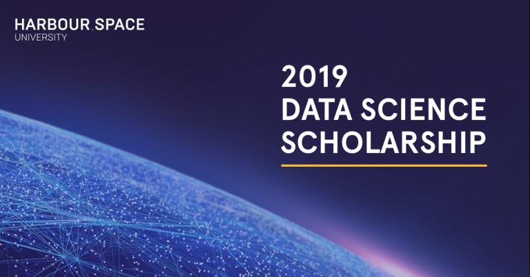

# Announcement

Hello Codeforces!

On [Monday, February 18, 2019 at 21:40UTC+6](https://codeforces.com/https://www.timeanddate.com/worldclock/fixedtime.html?day=18&month=2&year=2019&hour=18&min=40&sec=0&p1=166) [Educational Codeforces Round 60 (Rated for Div. 2)](https://codeforces.com/contest/1117 "Educational Codeforces Round 60 (Rated for Div. 2)") will start.

Series of Educational Rounds continue being held as [Harbour.Space University](https://codeforces.com/https://harbour.space/) initiative! You can read the details about the cooperation between [Harbour.Space University](https://codeforces.com/https://harbour.space/) and Codeforces in the [blog post](//codeforces.com/blog/entry/51208).

This round will be **rated for the participants with rating lower than 2100**. It will be held on extented ICPC rules. The penalty for each incorrect submission until the submission with a full solution is 10 minutes. After the end of the contest you will have 12 hours to hack any solution you want. You will have access to copy any solution and test it locally.

You will be given **7 problems** and **2 hours** to solve them.

The problems were invented and prepared by Roman [Roms](https://codeforces.com/profile/Roms "Master Roms") Glazov, Adilbek [adedalic](https://codeforces.com/profile/adedalic "International Master adedalic") Dalabaev, Vladimir [vovuh](https://codeforces.com/profile/vovuh "Candidate Master vovuh") Petrov, Ivan [BledDest](https://codeforces.com/profile/BledDest "Grandmaster BledDest") Androsov, Abizer [Reziba](https://codeforces.com/profile/Reziba "Expert Reziba") Lokhandwala and me.

Good luck to all participants!

Our friends at Harbour.Space also have a message for you:

Attention tech specialists! 

Harbour.Space Barcelona is proud to announce a collaboration with one of our industrial partners to offer a fully funded scholarship for our one year Master’s in Data Science Programme at HSU Barcelona. 

The Scholarship includes: 

 * **Full coverage** of the Programme’s tuition fee (€23,000 value)
* 3 hours of study a day at Harbour.Space University
* 4 hours of internship a day with one of our industrial partners
* €12,000 euros a year (living allowance)

Our data science programme will feature super star teachers like Mike Mirzayanov (Advanced Algorithms and Data Structures), Alexey Dral (Big Data: Map Reduce, Spark, BigTable/HBase) and Alex Dainiak (Discrete Optimisation), plus many more. 

**Harbour.Space is unique because**: 

 1. **We don’t play by the rules**. We bring practicing professionals, not only academic teachers, who come teach for intense, 3 week modules. HSU students are encouraged to experiment, fail, and try again, until they succeed.
2. **We are your home**. Harbour.Space is a community of over 40 nationalities, and we're still growing.
3. **We provide an experience**. Harbour.Space University is located in Barcelona, one of the most vibrant cities of our time.

If you are interested in the scholarship, fill out the form below and we will contact you about the next steps. 

  [FILL OUT FORM](https://codeforces.com/https://harbourspace.typeform.com/to/Zn4j4I) Congratulations to the winners: 

| Rank | Competitor | Problems Solved | Penalty |
| --- | --- | --- | --- |
| 1 | [kmjp](https://codeforces.com/profile/kmjp "International Grandmaster kmjp") | 7 | 258 |
| 2 | [dreamoon_love_AA](https://codeforces.com/profile/dreamoon_love_AA "Grandmaster dreamoon_love_AA") | 7 | 269 |
| 3 | [BigBag](https://codeforces.com/profile/BigBag "International Grandmaster BigBag") | 7 | 376 |
| 4 | [Benq](https://codeforces.com/profile/Benq "Legendary Grandmaster Benq") | 7 | 573 |
| 5 | [step_by_step](https://codeforces.com/profile/step_by_step "International Grandmaster step_by_step") | 6 | 178 |

Congratulations to the best hackers: 

| Rank | Competitor | Hack Count |
| --- | --- | --- |
| 1 | [LiM_256](https://codeforces.com/profile/LiM_256 "Expert LiM_256") | **65****:-8** |
| 2 | [stefdasca](https://codeforces.com/profile/stefdasca "Candidate Master stefdasca") | **23****:-5** |
| 3 | [Orion](https://codeforces.com/profile/Orion "Specialist Orion") | **11** |
| 4 | [prohor.b](https://codeforces.com/profile/prohor.b "Specialist prohor.b") | **10** |
| 5 | [parasocial](https://codeforces.com/profile/parasocial "Specialist parasocial") | **9** |

 344 successful hacks and 480 unsuccessful hacks were made in total!And finally people who were the first to solve each problem: 

| Problem | Competitor | Penalty |
| --- | --- | --- |
| A | [tataky](https://codeforces.com/profile/tataky "International Master tataky") | 0:01 |
| B | [KieranHorgan](https://codeforces.com/profile/KieranHorgan "Candidate Master KieranHorgan") | 0:03 |
| C | [step_by_step](https://codeforces.com/profile/step_by_step "International Grandmaster step_by_step") | 0:11 |
| D | [Gloid](https://codeforces.com/profile/Gloid "Master Gloid") | 0:11 |
| E | [Benq](https://codeforces.com/profile/Benq "Legendary Grandmaster Benq") | 0:10 |
| F | [TripleM5da](https://codeforces.com/profile/TripleM5da "International Master TripleM5da") | 0:34 |
| G | [tfg](https://codeforces.com/profile/tfg "Grandmaster tfg") | 0:16 |

UPD: [The editorial is out](Tutorial.md)

