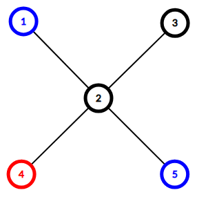
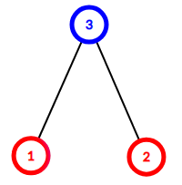

<h1 style='text-align: center;'> F1. Tree Cutting (Easy Version)</h1>

<h5 style='text-align: center;'>time limit per test: 2 seconds</h5>
<h5 style='text-align: center;'>memory limit per test: 256 megabytes</h5>

You are given an undirected tree of $n$ vertices. 

Some vertices are colored blue, some are colored red and some are uncolored. It is guaranteed that the tree contains at least one red vertex and at least one blue vertex.

You choose an edge and remove it from the tree. Tree falls apart into two connected components. Let's call an edge nice if neither of the resulting components contain vertices of both red and blue colors.

How many nice edges are there in the given tree?

##### Input

The first line contains a single integer $n$ ($2 \le n \le 3 \cdot 10^5$) — the number of vertices in the tree.

The second line contains $n$ integers $a_1, a_2, \dots, a_n$ ($0 \le a_i \le 2$) — the colors of the vertices. $a_i = 1$ means that vertex $i$ is colored red, $a_i = 2$ means that vertex $i$ is colored blue and $a_i = 0$ means that vertex $i$ is uncolored.

The $i$-th of the next $n - 1$ lines contains two integers $v_i$ and $u_i$ ($1 \le v_i, u_i \le n$, $v_i \ne u_i$) — the edges of the tree. It is guaranteed that the given edges form a tree. It is guaranteed that the tree contains at least one red vertex and at least one blue vertex.

##### Output

Print a single integer — the number of nice edges in the given tree.

## Examples

##### Input


```text
5
2 0 0 1 2
1 2
2 3
2 4
2 5
```
##### Output


```text
1
```
##### Input


```text
5
1 0 0 0 2
1 2
2 3
3 4
4 5
```
##### Output


```text
4
```
##### Input


```text
3
1 1 2
2 3
1 3
```
##### Output


```text
0
```
## Note

Here is the tree from the first example:

  The only nice edge is edge $(2, 4)$. Removing it makes the tree fall apart into components $\{4\}$ and $\{1, 2, 3, 5\}$. The first component only includes a red vertex and the second component includes blue vertices and uncolored vertices.

Here is the tree from the second example:

  Every edge is nice in it.

Here is the tree from the third example:

  Edge $(1, 3)$ splits the into components $\{1\}$ and $\{3, 2\}$, the latter one includes both red and blue vertex, thus the edge isn't nice. Edge $(2, 3)$ splits the into components $\{1, 3\}$ and $\{2\}$, the former one includes both red and blue vertex, thus the edge also isn't nice. So the answer is 0.


#### Tags 

#1800 #NOT OK #dfs_and_similar #trees 

## Blogs
- [All Contest Problems](../Codeforces_Round_540_(Div._3).md)
- [Announcement (en)](../blogs/Announcement_(en).md)
- [Tutorial (en)](../blogs/Tutorial_(en).md)
