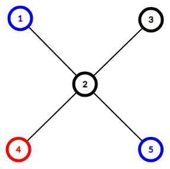
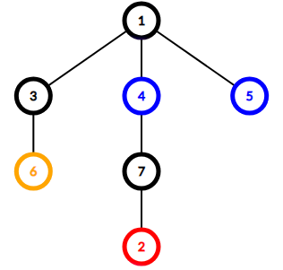

<h1 style='text-align: center;'> F2. Tree Cutting (Hard Version)</h1>

<h5 style='text-align: center;'>time limit per test: 2 seconds</h5>
<h5 style='text-align: center;'>memory limit per test: 256 megabytes</h5>

You are given an undirected tree of $n$ vertices. 

Some vertices are colored one of the $k$ colors, some are uncolored. It is guaranteed that the tree contains at least one vertex of each of the $k$ colors. There might be no uncolored vertices.

You choose a subset of exactly $k - 1$ edges and remove it from the tree. Tree falls apart into $k$ connected components. Let's call this subset of edges nice if none of the resulting components contain vertices of different colors.

How many nice subsets of edges are there in the given tree? Two subsets are considered different if there is some edge that is present in one subset and absent in the other.

The answer may be large, so print it modulo $998244353$.

#### Input

The first line contains two integers $n$ and $k$ ($2 \le n \le 3 \cdot 10^5$, $2 \le k \le n$) — the number of vertices in the tree and the number of colors, respectively.

The second line contains $n$ integers $a_1, a_2, \dots, a_n$ ($0 \le a_i \le k$) — the colors of the vertices. $a_i = 0$ means that vertex $i$ is uncolored, any other value means the vertex $i$ is colored that color.

The $i$-th of the next $n - 1$ lines contains two integers $v_i$ and $u_i$ ($1 \le v_i, u_i \le n$, $v_i \ne u_i$) — the edges of the tree. It is guaranteed that the given edges form a tree. It is guaranteed that the tree contains at least one vertex of each of the $k$ colors. There might be no uncolored vertices.

#### Output

Print a single integer — the number of nice subsets of edges in the given tree. Two subsets are considered different if there is some edge that is present in one subset and absent in the other.

The answer may be large, so print it modulo $998244353$.

## Examples

#### Input


```text
5 2
2 0 0 1 2
1 2
2 3
2 4
2 5
```
#### Output


```text
1
```
#### Input


```text
7 3
0 1 0 2 2 3 0
1 3
1 4
1 5
2 7
3 6
4 7
```
#### Output


```text
4
```
## Note

Here is the tree from the first example:

  The only nice subset is edge $(2, 4)$. Removing it makes the tree fall apart into components $\{4\}$ and $\{1, 2, 3, 5\}$. The first component only includes a vertex of color $1$ and the second component includes only vertices of color $2$ and uncolored vertices.

Here is the tree from the second example:

  The nice subsets are $\{(1, 3), (4, 7)\}$, $\{(1, 3), (7, 2)\}$, $\{(3, 6), (4, 7)\}$ and $\{(3, 6), (7, 2)\}$.


#### Tags 

#2700 #NOT OK #combinatorics #dfs_and_similar #dp #trees 

## Blogs
- [All Contest Problems](../Codeforces_Round_540_(Div._3).md)
- [Announcement (en)](../blogs/Announcement_(en).md)
- [Tutorial (en)](../blogs/Tutorial_(en).md)
