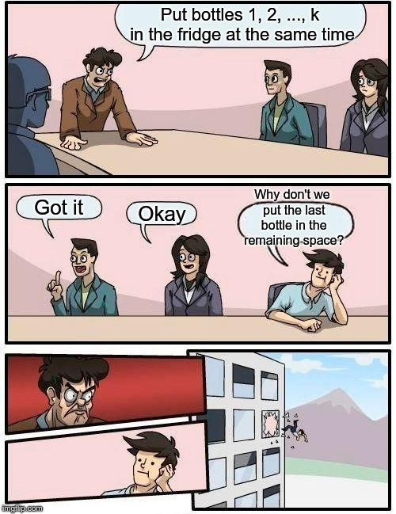

# Tutorial

[1119A - Ilya and a Colorful Walk](../problems/A._Ilya_and_a_Colorful_Walk.md "Codeforces Global Round 2")

Author, preparation: [300iq](https://codeforces.com/profile/300iq "International Grandmaster 300iq").

 **Editorial**
### [1119A - Ilya and a Colorful Walk](../problems/A._Ilya_and_a_Colorful_Walk.md "Codeforces Global Round 2")

It is enough to find the last color different from the $c_1$ and the first color different from $c_n$ and print the maximum of the two distances.

[1119B - Alyona and a Narrow Fridge](../problems/B._Alyona_and_a_Narrow_Fridge.md "Codeforces Global Round 2")

Author, preparation: [KAN](https://codeforces.com/profile/KAN "Grandmaster KAN").

 **Editorial with bonuses**Tutorial is loading...[Aleks5d](https://codeforces.com/profile/Aleks5d "Master Aleks5d") invites you to compete in the shortest solution challenge for this problem. His code (155 bytes):

 **Code**
```cpp
[n, k], arr = [int(i) for i in input().split()], [int(i) for i in input().split()]
print([i for i in range(n + 1) if sum(sorted(arr[0:i])[::-2]) <= k][-1])
```
 **Authors during the contest**

[1119C - Ramesses and Corner Inversion](../problems/C._Ramesses_and_Corner_Inversion.md "Codeforces Global Round 2")

Author, preparation: [300iq](https://codeforces.com/profile/300iq "International Grandmaster 300iq").

 **Editorial**
### [1119C - Ramesses and Corner Inversion](../problems/C._Ramesses_and_Corner_Inversion.md "Codeforces Global Round 2")

One can notice that the operation does not change the total parity of the matrix. So, if the total parity of $A$ and $B$ do not match, then the answer is No. However, this is not the only case when the answer is no.

You can also notice that the operation does not change the total parity of each row/column independently. Thus, if in at least one row or column the parity of $A$ and $B$ do not match, then the answer is No. It turns out that if all these parities match, then the answer is Yes.

We will prove this constructing a sequence of operations that transforms $A$ to $B$ whenever parities in all rows and column match. Let's perform an operation $(1, 1, x, y)$ for all such $x > 1$ and $y > 1$ that $A_{xy} \ne B_{xy}$. After all these operations the whole matrices except maybe the first column and the first row match. But the first column and the first row also match because of the parity! So $A$ is now $B$.

[1119D - Frets On Fire](../problems/D._Frets_On_Fire.md "Codeforces Global Round 2")

Author, preparation: [cyand1317](https://codeforces.com/profile/cyand1317 "Grandmaster cyand1317").

 **Editorial**
### [1119D - Frets On Fire](../problems/D._Frets_On_Fire.md "Codeforces Global Round 2")

Let's sort all $s_i$'s in ascending order.

This does not affect the answers, but now we notice that for some $i$, as soon as $r - l$ exceeds $s_{i+1} - s_i$ we don't need to consider row $i$ any more. This is because from then on, any integer that appears in row $i$ also appears in row $i + 1$.

Taking this observation one step further, we approach the problem considering the contribution of row $i$, i.e. the number of integers that appear in the queried range in row $i$, but not row $i + 1$. The answer to a query is the sum of contributions of all rows.

From this definition we know that the contribution of row $i$ is $\min\{s_{i+1} - s_i, r - l + 1\}$ for $1 \leq i < n$ and $r - l + 1$ for $i = n$. In other words, it is $\min\{d_i, w\}$, where $d_i = s_{i+1} - s_i$, $d_n = +\infty$ and $w = r - l + 1$.

Now come the queries. Given a fixed value of $w$, we need to quickly compute $\left(\sum_{i=1}^{n=1} \min\{d_i, w\}\right) + w$. From another perspective, this equals the sum of value times the number of occurrences, namely $\left(\sum_{k=0}^w k \cdot \mathrm{count}(k)\right) + \left(\sum_{k=w+1}^\infty w \cdot \mathrm{count}(k)\right) + w$, where $\mathrm{count}(k)$ denotes the number of times that integer $k$ occurs in $d_{1 \ldots n-1}$.

This problem can be solved by representing $\mathrm{count}(*)$ values with an array, combined with partial sums. However, as $d_i$ (and thus the size of such array) can be as large as $10^{18}$, it's required to compress the coordinates (discretize) and find desired indices with binary search. Please refer to the model solution attached below.

The overall time complexity is $\mathcal O((n + q) \log n)$.

 **Code**
```cpp
#include <cstdio>
#include <algorithm>

static const int MAXN = 1e5;

static int n, q;
static long long s[MAXN];
static long long t[MAXN];

int main()
{
    scanf("%d", &n);
    for (int i = 0; i < n; ++i) scanf("%lld", &s[i]);

    std::sort(s, s + n);
    for (int i = 0; i < n - 1; ++i) s[i] = s[i + 1] - s[i];
    std::sort(s, s + n - 1);
    for (int i = n - 1; i >= 1; --i) s[i] = s[i - 1];
    s[0] = 0;
    for (int i = 1; i < n; ++i)
        t[i] = t[i - 1] + (s[i] - s[i - 1]) * (n + 1 - i);

    scanf("%d", &q);
    for (int i = 0; i < q; ++i) {
        long long l, r;
        scanf("%lld%lld", &l, &r);
        l = r - l + 1;
        int p = std::lower_bound(s, s + n, l) - &s[0] - 1;
        printf("%lld%c", t[p] + (l - s[p]) * (n - p), i == q - 1 ? 'n' : ' ');
    }

    return 0;
}
```
[1119E - Pavel and Triangles](../problems/E._Pavel_and_Triangles.md "Codeforces Global Round 2")

Author: [gen](https://codeforces.com/profile/gen "Master gen"), preparation: [300iq](https://codeforces.com/profile/300iq "International Grandmaster 300iq").

 **Editorial**
### [1119E - Pavel and Triangles](../problems/E._Pavel_and_Triangles.md "Codeforces Global Round 2")

First, possible triangles have sides $(2^i, 2^j, 2^j)$ where $i \le j$.

There are several correct greedies to finish the solution, let's discuss one of them.

The greedy is to loop through the values of $j$ in increasing order, then first try to match as many pairs $(j, j)$ to some unmatched $i$ as possible, after that create as many triples $(j, j, j)$ as possible and continue to the next $j$.

To prove correctness, let's take our solution and one of the optimal solutions. Let's find the first difference in them if we consider the triples in the same order as our solutions considers them. There can be only one type of difference: we take some triple while the optimal solution skippes it. It can't be be the other way around because we always take a triple if there is one. So there are a few cases now: 

* the triple is $(i, j, j)$ where $i < j$. Let's see where the corresponding $i$, $j$ and $j$ are used in the optimal solution:
	+ all three are used in different triples: $(t_1, k_1, k_1)$, $(t_2, k_2, k_2)$, $(t_3, k_3, k_3)$, $\{t_1, t_2, t_3\} = \{i, j, j\}$, $j \le k_1 \le k_2 \le k_3$. Remove these triples and replace them with $(i, j, j)$, $(k_1, k_2, k_2)$, $(k_1, k_3, k_3)$.
	+ two are used in the same triple, one in another: the only case is $(i, k, k)$, $(j, j, j)$, $j < k$. Remove these, add $(i, j, j)$ and $(j, k, k)$.
	+ two of them are used in different triples, one not used: $(t_1, k_1, k_1)$, $(t_2, k_2, k_2)$, $\{t_1, t_2\} \subset \{i, j, j\}$, $j \le k_1 \le k_2$. Remove these triples, replace with $(i, j, j)$ and $(k_1, k_2, k_2)$.
	+ two of them are used in the same triple, one not used: the only case is $(j, j, j)$. Remove this, add $(i, j, j)$.
	+ one of them in used in some triple, two are not used: $(t, k, k)$, $t \in \{i, j, j\}$, $j \le k$. Remove this, add $(i, j, j)$.
	+ none of them is used. This is not possible because it is the optimal solution.
* the triple is $(j, j, j)$. Let's see where these $j$s are used. They can only be used in three different triples $(j, k_1, k_1)$, $(j, k_2, k_2)$, $(j, k_3, k_3)$, $j \le k_1 \le k_2 \le k_3$. Remove these triples and replace them with $(j, j, j)$, $(k_1, k_2, k_2)$, $(k_1, k_3, k_3)$.

 The optimal solution is still optimal, but it shares a longer prefix with our solution. We can continue this process until there are no differences, this shows that our solution is also optimal.[1119F - Niyaz and Small Degrees](../problems/F._Niyaz_and_Small_Degrees.md "Codeforces Global Round 2")

Author, preparation: [300iq](https://codeforces.com/profile/300iq "International Grandmaster 300iq").

 **Editorial**
### [1119F - Niyaz and Small Degrees](../problems/F._Niyaz_and_Small_Degrees.md "Codeforces Global Round 2")

First, let's learn how to solve for a fixed $x$ in $O(n \log n)$.

We can calculate the dp on subtrees, $dp_{v, flag}$, denoting the minimum total weight of edges to be removed, if we consider the subtree of the vertex $v$, and $flag$ is zero, if the vertex has the degree $\leq x$, and one, if $\leq x+1$.

Then to recalculate it you need to sort the children by $dp_{to, 1} - dp_{to, 0}$, and add to the sum $dp_{to, 0}$ $(deg_v - (x + flag))$ minimum values, depending on $flag$ which we consider for the dp answer for the vertex $v$.

Then, it is obvious that the sum of degrees in the tree is equal to twice the number of edges, which is $2(n-1)$.

It follows that the sum of all $x$ values «number of vertices, with degree $\geq x$», equal to the sum of degrees, is also $2(n-1)$. 

Therefore, if for each $x$ we will know how to answer the query, for the time of the order of the number of vertices with a sufficiently large degree, we will solve the problem.

Let's call a vertex interesting if its degree is $> x$.

We will support the forest only on interesting vertices, and also in some data structure (for example, two heaps perfectly fit this) for each interesting vertex of the weight of edges to the uninteresting.

Then, to calculate the same dynamics for each vertex in the forest, it is enough to iterate over how many edges from it down to interesting vertices we will take (in the forest $\leq$ «number of interesting vertices» $- 1$ edges, so we can iterate over it).

And also add to the answer the sum of a sufficient number of edges in uninteresting vertices from the data structure.

This solution works for «number of interesting vertices» $\cdot \log$, and all necessary data structures can also be maintained as $x$ increases.

In total, we got the solution for $O(n \log n)$.

[1119G - Get Ready for the Battle](../problems/G._Get_Ready_for_the_Battle.md "Codeforces Global Round 2")

Authors: [Aleks5d](https://codeforces.com/profile/Aleks5d "Master Aleks5d"), [KAN](https://codeforces.com/profile/KAN "Grandmaster KAN"); preparation: [Aleks5d](https://codeforces.com/profile/Aleks5d "Master Aleks5d").

 **Editorial**
### [1119G - Get Ready for the Battle](../problems/G._Get_Ready_for_the_Battle.md "Codeforces Global Round 2")

Note that on each turn the total health of enemy groups decreases by $n$. When all groups are destroyed, their health does not exceed $0$, and thus the answer is at least $\left\lceil{\frac{\sum_{i=1}^n hp_i}{n}}\right\rceil$.

Now let's construct a way to win in this number of steps. Let's emulate the battle and split the soldiers in groups at the same time. Let's start with one group $n$, and attack the first enemy on each step. Once its health becomes less than $n$, say $k_1$, let's assume that some of our groups have total size exactly $k_1$ and they attack the first enemy on this step, while all the other groups start attacking the second enemy. After that let's attack the second enemy with all $n$ soldiers until its health is $k_2 < n$. Let's assume that some of our groups have total size $k_2$ and they attack the second soldier on this step, while the other groups start attacking the third.

Continue with this process until all enemies are destroyed. We won't add the constraint on $k_n$, we will just assume that all soldiers attack the last enemy on the last step. Note that the total number of steps is exactly $\left\lceil{\frac{\sum_{i=1}^n hp_i}{n}}\right\rceil$, because we have "extra" hits only on the very last step.

Now we have $m - 1$ assumptions of type "some of our groups have total size $k_i$". It's easy to satisfy them by sorting $k_i$ and stating that the $i$-th groups has size $k_i - k_{i - 1}$. This way the first $i$ groups will have size $k_i$ (after sorting). In order to reconstruct the attacks we have to simulate the process again.

[1119H - Triple](../problems/H._Triple.md "Codeforces Global Round 2")

Author, preparation: [RDDCCD](https://codeforces.com/profile/RDDCCD "Grandmaster RDDCCD").

 **Editorial**
### [1119H - Triple](../problems/H._Triple.md "Codeforces Global Round 2")

If we form $n$ arrays, $i$-th of them is $F_{i}$, and set $F_{i,A_{i}}=a$, $F_{i,B_{i}}=b$, $F_{i,C_{i}}=c$ and others zero. It's easy to find that the xor-convolution of all the arrays is the answer we want.

Implementation with the Fast Walsh-Hadamard Transform works in $O(n \times 2^{k} \times k)$, this is too slow.

To make it easier, we set $A_{i} = 0$, $B_{i} = B_{i} xor A_{i}$, $C_{i} = C_{i} xor A_{i}$. The answer won't change if we xor all $x$ by the xor sum of all $A_{i}$.

That is $F_{i,0}=a$, $F_{i,B_{i} xor A_{i}}=b$, $F_{i,C_{i} xor A_{i}}=c$.

Note we only have $4$ values in each array after FWHT of the array: $a+b+c$, $a+b-c$, $a-b+c$, $a-b-c$. Let's fix some position, let the occurrences of them in all $n$ arrays be $x,y,z,w$. Obviously, $x+y+z+w = n$. For each position, if we can figure out the values of $x,y,z,w$, it's easy to count the final answer by FWHT.

If we add all arrays together and make a FWHT, we can form a new equation. $(a+b+c) \cdot x + (a+b-c) \cdot y + (a-b+c) \cdot z + (a-b-c) \cdot w = p$, where $p$ is the value we get in this position. 

Take two different $(a,b,c)$ to form 2 equations. Now we have 3 equations in total, including $(x+y+z+w=n)$ .

More equations formed by this operation (take $a,b,c$ and compute FWHT) are useless because the equation $x,y,z,w$ lies in the same linear span, so we already have three equations. 

However, if we set up a new array, $F_{i,B_{i} xor C_{i}} += 1$, other is zero, and do the FWHT (add them together of course). We can get a new equation $x - y - z + w = p$. The equation can be easily proved.

Now we can solve a system of $4$ equations to calculate $x,y,z,w$ for each position and get the final array. Then do the reverse FWHT and get the answer.

