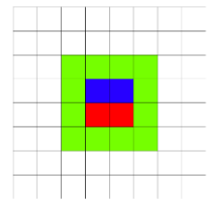
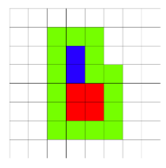

<h1 style='text-align: center;'> A. Sea Battle</h1>

<h5 style='text-align: center;'>time limit per test: 1 second</h5>
<h5 style='text-align: center;'>memory limit per test: 256 megabytes</h5>

In order to make the "Sea Battle" game more interesting, Boris decided to add a new ship type to it. The ship consists of two rectangles. The first rectangle has a width of $w_1$ and a height of $h_1$, while the second rectangle has a width of $w_2$ and a height of $h_2$, where $w_1 \ge w_2$. In this game, exactly one ship is used, made up of two rectangles. There are no other ships on the field.

The rectangles are placed on field in the following way:

* the second rectangle is on top the first rectangle;
* they are aligned to the left, i.e. their left sides are on the same line;
* the rectangles are adjacent to each other without a gap.

See the pictures in the notes: the first rectangle is colored red, the second rectangle is colored blue.

Formally, let's introduce a coordinate system. Then, the leftmost bottom cell of the first rectangle has coordinates $(1, 1)$, the rightmost top cell of the first rectangle has coordinates $(w_1, h_1)$, the leftmost bottom cell of the second rectangle has coordinates $(1, h_1 + 1)$ and the rightmost top cell of the second rectangle has coordinates $(w_2, h_1 + h_2)$.

After the ship is completely destroyed, all cells neighboring by side or a corner with the ship are marked. Of course, only cells, which don't belong to the ship are marked. On the pictures in the notes such cells are colored green.

Find out how many cells should be marked after the ship is destroyed. The field of the game is infinite in any direction.

#### Input

Four lines contain integers $w_1, h_1, w_2$ and $h_2$ ($1 \leq w_1, h_1, w_2, h_2 \leq 10^8$, $w_1 \ge w_2$) — the width of the first rectangle, the height of the first rectangle, the width of the second rectangle and the height of the second rectangle. You can't rotate the rectangles.

#### Output

Print exactly one integer — the number of cells, which should be marked after the ship is destroyed.

## Examples

#### Input


```text
2 1 2 1
```
#### Output


```text
12
```
#### Input


```text
2 2 1 2
```
#### Output


```text
16
```
## Note

In the first example the field looks as follows (the first rectangle is red, the second rectangle is blue, green shows the marked squares):

  In the second example the field looks as:

  

#### Tags 

#800 #NOT OK #math 

## Blogs
- [All Contest Problems](../Codeforces_Round_541_(Div._2).md)
- [Announcement #1 (ru)](../blogs/Announcement_1_(ru).md)
- [A (en)](../blogs/A_(en).md)
- [Tutorial](../blogs/Tutorial.md)
