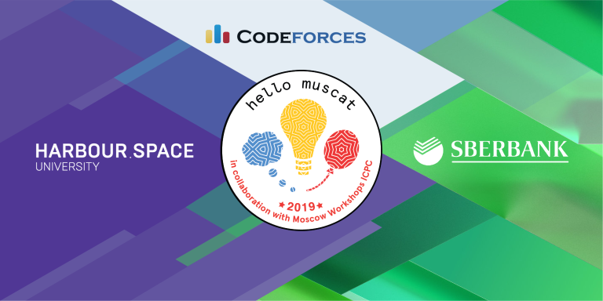

# Announcement

Hello Codeforces!

On [Tuesday, March 5, 2019 at 21:05UTC+6](https://codeforces.com/https://www.timeanddate.com/worldclock/fixedtime.html?day=5&month=3&year=2019&hour=18&min=5&sec=0&p1=166) [Educational Codeforces Round 61 (Rated for Div. 2)](https://codeforces.com/contest/1132 "Educational Codeforces Round 61 (Rated for Div. 2)") will start.

This round is organised in collaboration with Hello Muscat Programming Bootcamp and supported by Sberbank, General Partner of the boot camp and one of the largest banking leaders of Eastern Europe, providing thousands of jobs and innovation in the financial industry.

As the Hello Muscat Programming Bootcamp’s General Partner, Sberbank made it possible for students from some of the world’s top universities to attend the bootcamp, by sponsoring their participation. This includes students from Saint-Petersburg State University, Moscow Institute of Physics and Technology (MIPT), Penza State University, National Research Mordovia State University; MRSU, ITMO, Higher School of Economics / Moscow, Volgograd State Technical University, Lobachevsky State University of Nizhni Novgorod, Moscow Aviation Institute, Tyumen industrial University, University of Haifa, Northern (Arctic) Federal University, Saratov State University, Ural Federal University.

Hello Muscat Bootcamp will take place from 9th to 15th of March, and 120 students from 24 universities, including MIPT, Saint Petersburg State University and University of Tokyo will compete and practice side-by-side, smoothing the road towards the April World Finals in Porto.

This round will be **rated for the participants with rating lower than 2100**. It will be held on extended ICPC rules. The penalty for each incorrect submission until the submission with a full solution is 10 minutes. After the end of the contest you will have 12 hours to hack any solution you want. You will have access to copy any solution and test it locally.

You will be given **7 problems** and **2 hours** to solve them.

The problems were invented and prepared by Roman [Roms](https://codeforces.com/profile/Roms "Master Roms") Glazov, Adilbek [adedalic](https://codeforces.com/profile/adedalic "International Master adedalic") Dalabaev, Vladimir [vovuh](https://codeforces.com/profile/vovuh "Candidate Master vovuh") Petrov, Ivan [BledDest](https://codeforces.com/profile/BledDest "Grandmaster BledDest") Androsov, Maksim [Neon](https://codeforces.com/profile/Neon "Candidate Master Neon") Mescheryakov and me. Also huge thanks to Mike [MikeMirzayanov](https://codeforces.com/profile/MikeMirzayanov "Headquarters, MikeMirzayanov") Mirzayanov for great systems Polygon and Codeforces.

Good luck to all participants!

Congratulations to the winners: 

| Rank | Competitor | Problems Solved | Penalty |
| --- | --- | --- | --- |
| 1 | [vintage_Vlad_Makeev](https://codeforces.com/profile/vintage_Vlad_Makeev "Grandmaster vintage_Vlad_Makeev") | 7 | 321 |
| 2 | [kmjp](https://codeforces.com/profile/kmjp "Grandmaster kmjp") | 7 | 380 |
| 3 | [Kilani](https://codeforces.com/profile/Kilani "Master Kilani") | 7 | 452 |
| 4 | [neal](https://codeforces.com/profile/neal "International Grandmaster neal") | 7 | 721 |
| 5 | [I_love_Tanya_Romanova](https://codeforces.com/profile/I_love_Tanya_Romanova "International Grandmaster I_love_Tanya_Romanova") | 6 | 204 |

Congratulations to the best hackers: 

| Rank | Competitor | Hack Count |
| --- | --- | --- |
| 1 | [algmyr](https://codeforces.com/profile/algmyr "Candidate Master algmyr") | **121** |
| 2 | [MarcosK](https://codeforces.com/profile/MarcosK "Expert MarcosK") | **119****:-6** |
| 3 | [Mohammad.H915](https://codeforces.com/profile/Mohammad.H915 "Expert Mohammad.H915") | **60****:-1** |
| 4 | [Bakry](https://codeforces.com/profile/Bakry "Expert Bakry") | **50** |
| 5 | [AhmedMaherAli](https://codeforces.com/profile/AhmedMaherAli "Pupil AhmedMaherAli") | **45****:-1** |

 1837 successful hacks and 1117 unsuccessful hacks were made in total!And finally people who were the first to solve each problem: 

| Problem | Competitor | Penalty |
| --- | --- | --- |
| A | [vintage_Vlad_Makeev](https://codeforces.com/profile/vintage_Vlad_Makeev "Grandmaster vintage_Vlad_Makeev") | 0:01 |
| B | [1021869](https://codeforces.com/profile/1021869 "Expert 1021869") | 0:03 |
| C | [vintage_Vlad_Makeev](https://codeforces.com/profile/vintage_Vlad_Makeev "Grandmaster vintage_Vlad_Makeev") | 0:08 |
| D | [vintage_Vlad_Makeev](https://codeforces.com/profile/vintage_Vlad_Makeev "Grandmaster vintage_Vlad_Makeev") | 0:24 |
| E | [TripleM5da](https://codeforces.com/profile/TripleM5da "Master TripleM5da") | 0:20 |
| F | [_Ash__](https://codeforces.com/profile/_Ash__ "Master _Ash__") | 0:06 |
| G | [road_to_9k_mmr](https://codeforces.com/profile/road_to_9k_mmr "Candidate Master road_to_9k_mmr") | 0:25 |

UPD: [Editorial is out](T_(en).md)

