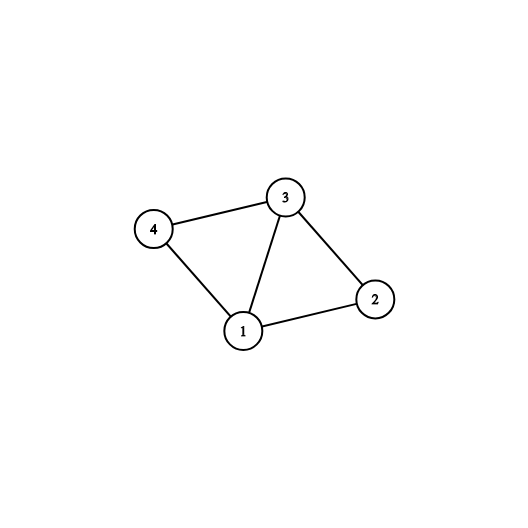
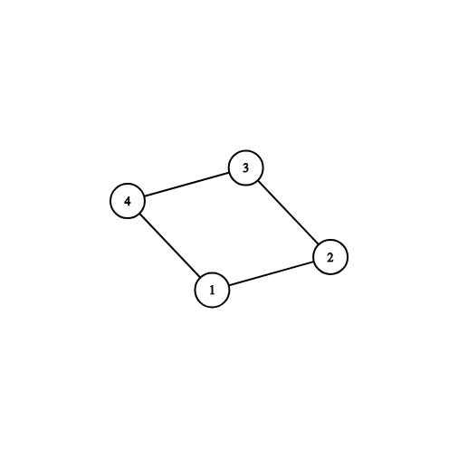

<h1 style='text-align: center;'> F2. Spanning Tree with One Fixed Degree</h1>

<h5 style='text-align: center;'>time limit per test: 3 seconds</h5>
<h5 style='text-align: center;'>memory limit per test: 256 megabytes</h5>

You are given an undirected unweighted connected graph consisting of $n$ vertices and $m$ edges. It is guaranteed that there are no self-loops or multiple edges in the given graph.

Your task is to find any spanning tree of this graph such that the degree of the first vertex (vertex with label $1$ on it) is equal to $D$ (or say that there are no such spanning trees). Recall that the degree of a vertex is the number of edges incident to it.

##### Input

The first line contains three integers $n$, $m$ and $D$ ($2 \le n \le 2 \cdot 10^5$, $n - 1 \le m \le min(2 \cdot 10^5, \frac{n(n-1)}{2}), 1 \le D < n$) — the number of vertices, the number of edges and required degree of the first vertex, respectively.

The following $m$ lines denote edges: edge $i$ is represented by a pair of integers $v_i$, $u_i$ ($1 \le v_i, u_i \le n$, $u_i \ne v_i$), which are the indices of vertices connected by the edge. There are no loops or multiple edges in the given graph, i. e. for each pair ($v_i, u_i$) there are no other pairs ($v_i, u_i$) or ($u_i, v_i$) in the list of edges, and for each pair $(v_i, u_i)$ the condition $v_i \ne u_i$ is satisfied.

##### Output

If there is no spanning tree satisfying the condition from the problem statement, print "NO" in the first line.

Otherwise print "YES" in the first line and then print $n-1$ lines describing the edges of a spanning tree such that the degree of the first vertex (vertex with label $1$ on it) is equal to $D$. Make sure that the edges of the printed spanning tree form some subset of the input edges (order doesn't matter and edge $(v, u)$ is considered the same as the edge $(u, v)$).

If there are multiple possible answers, print any of them.

## Examples

##### Input


```text
4 5 1
1 2
1 3
1 4
2 3
3 4
```
##### Output


```text
YES
2 1
2 3
3 4
```
##### Input


```text
4 5 3
1 2
1 3
1 4
2 3
3 4
```
##### Output


```text
YES
1 2
1 3
4 1
```
##### Input


```text
4 4 3
1 2
1 4
2 3
3 4
```
##### Output


```text
NO
```
## Note

The picture corresponding to the first and second examples: 

The picture corresponding to the third example: 


#### Tags 

#1900 #NOT OK #constructive_algorithms #dfs_and_similar #dsu #graphs #greedy 

## Blogs
- [All Contest Problems](../Codeforces_Round_544_(Div._3).md)
- [Announcement](../blogs/Announcement.md)
- [Tutorial](../blogs/Tutorial.md)
