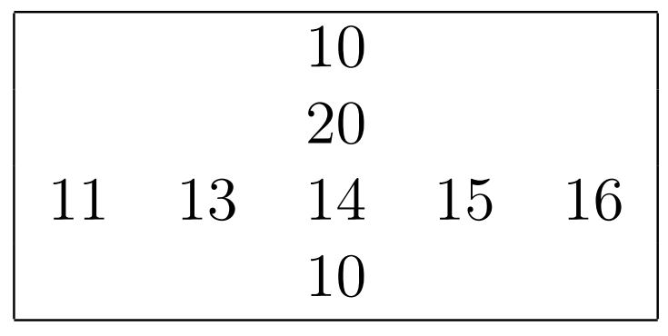
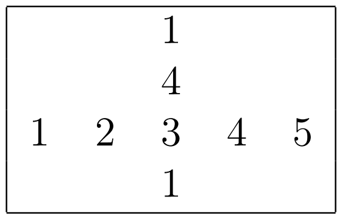
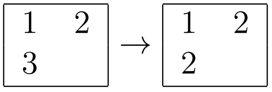
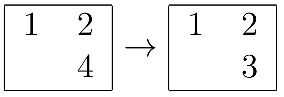
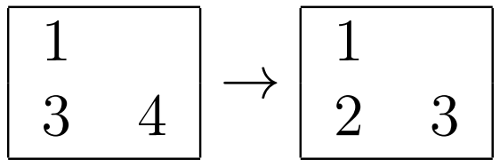
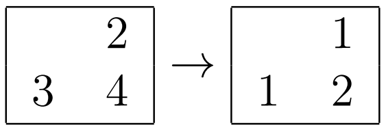

<h1 style='text-align: center;'> A. Skyscrapers</h1>

<h5 style='text-align: center;'>time limit per test: 2 seconds</h5>
<h5 style='text-align: center;'>memory limit per test: 512 megabytes</h5>

Dora loves adventures quite a lot. During some journey she encountered an amazing city, which is formed by $n$ streets along the Eastern direction and $m$ streets across the Southern direction. Naturally, this city has $nm$ intersections. At any intersection of $i$-th Eastern street and $j$-th Southern street there is a monumental skyscraper. Dora instantly became curious and decided to explore the heights of the city buildings.

When Dora passes through the intersection of the $i$-th Eastern and $j$-th Southern street she examines those two streets. After Dora learns the heights of all the skyscrapers on those two streets she wonders: how one should reassign heights to the skyscrapers on those two streets, so that the maximum height would be as small as possible and the result of comparing the heights of any two skyscrapers on one street wouldn't change.

Formally, on every of $nm$ intersections Dora solves an independent problem. She sees $n + m - 1$ skyscrapers and for each of them she knows its real height. Moreover, any two heights can be compared to get a result "greater", "smaller" or "equal". Now Dora wants to select some integer $x$ and assign every skyscraper a height from $1$ to $x$. When assigning heights, Dora wants to preserve the relative order of the skyscrapers in both streets. That is, the result of any comparison of heights of two skyscrapers in the current Eastern street shouldn't change and the result of any comparison of heights of two skyscrapers in current Southern street shouldn't change as well. 
## Note

 that skyscrapers located on the Southern street are not compared with skyscrapers located on the Eastern street only. However, the skyscraper located at the streets intersection can be compared with both Southern and Eastern skyscrapers. For every intersection Dora wants to independently calculate the minimum possible $x$.

For example, if the intersection and the two streets corresponding to it look as follows:

  Then it is optimal to replace the heights of the skyscrapers as follows (note that all comparisons "less", "equal", "greater" inside the Eastern street and inside the Southern street are preserved)

  The largest used number is $5$, hence the answer for this intersection would be $5$.

Help Dora to compute the answers for each intersection.

#### Input

The first line contains two integers $n$ and $m$ ($1 \le n, m \le 1000$) — the number of streets going in the Eastern direction and the number of the streets going in Southern direction.

Each of the following $n$ lines contains $m$ integers $a_{i,1}$, $a_{i,2}$, ..., $a_{i,m}$ ($1 \le a_{i,j} \le 10^9$). The integer $a_{i,j}$, located on $j$-th position in the $i$-th line denotes the height of the skyscraper at the intersection of the $i$-th Eastern street and $j$-th Southern direction.

#### Output

Print $n$ lines containing $m$ integers each. The integer $x_{i,j}$, located on $j$-th position inside the $i$-th line is an answer for the problem at the intersection of $i$-th Eastern street and $j$-th Southern street.

## Examples

#### Input


```text
2 3
1 2 1
2 1 2
```
#### Output


```text
2 2 2 
2 2 2 
```
#### Input


```text
2 2
1 2
3 4
```
#### Output


```text
2 3 
3 2 
```
## Note

In the first example, it's not possible to decrease the maximum used height for the problem at any intersection, hence we don't have to change any heights.

In the second example, the answers are as follows: 

* For the intersection of the first line and the first column 
* For the intersection of the first line and the second column 
* For the intersection of the second line and the first column 
* For the intersection of the second line and the second column 


#### Tags 

#1600 #NOT OK #implementation #sortings 

## Blogs
- [All Contest Problems](../Codeforces_Round_545_(Div._1).md)
- [Announcement #1 (ru)](../blogs/Announcement_1_(ru).md)
- [Announcement #2 (en)](../blogs/Announcement_2_(en).md)
- [Tutorial (en)](../blogs/Tutorial_(en).md)
- [Tutorial #2 (ru)](../blogs/Tutorial_2_(ru).md)
