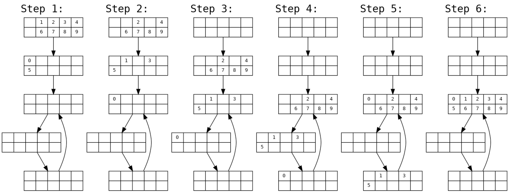

<h1 style='text-align: center;'> D. Cooperative Game</h1>

<h5 style='text-align: center;'>time limit per test: 1 second</h5>
<h5 style='text-align: center;'>memory limit per test: 512 megabytes</h5>

This is an interactive problem.

Misha likes to play cooperative games with incomplete information. Today he suggested ten his friends to play a cooperative game "Lake".

Misha has already come up with a field for the upcoming game. The field for this game is a directed graph consisting of two parts. The first part is a road along the coast of the lake which is a cycle of $c$ vertices. The second part is a path from home to the lake which is a chain of $t$ vertices, and there is an edge from the last vertex of this chain to the vertex of the road along the coast which has the most beautiful view of the lake, also known as the finish vertex. Misha decided to keep the field secret, so nobody knows neither $t$ nor $c$.

  
## Note

 that each vertex of the field has exactly one outgoing edge and all the vertices except the home vertex and the finish vertex have exactly one ingoing edge. The home vertex has no incoming edges, the finish vertex has two incoming edges.

At the beginning of the game pieces of all the ten players, indexed with consecutive integers from $0$ to $9$, are at the home vertex. After that on each turn some of the players can ask Misha to simultaneously move their pieces along the corresponding edges. Misha will not answer more than $q$ such queries. After each move Misha will tell players whose pieces are at the same vertices and whose pieces are at different vertices.

The goal of the game is to move all the pieces to the finish vertex. Misha's friends have no idea how to win in such a game without knowledge of $c$, $t$ and $q$, but luckily they are your friends. Help them: coordinate their actions to win the game. 

Misha has drawn such a field that $1 \le t, c$, $(t+c) \leq 1000$ and $q = 3 \cdot (t+c)$.

### Input

There is no input — go to the interaction part straight away.

### Output

After all friends gather at the finish vertex, print "done" and terminate your program.

## Interaction

To give a command to move the friends, print "next" and then space-separated indices of the friends you want to move. For example, to give the command to move the friends with indices $0$, $2$, $5$ and $9$ print "next 0 2 5 9". At each turn, you must move at least one of your friends.

As an answer, first read an integer $k$, and then $10$ digits divided into $k$ space-separated groups. The friends that correspond to the indices in the same group are in the same vertex. The friends that correspond to indices in different groups are in different vertices. The indices in each group follow in ascending order.

For example, the answer "2 05 12346789" means that the friends with indices $0$ and $5$ are in one vertex, and all other friends are in the same but different vertex. The answer "4 01 567 234 89" means that Misha's friends are in four different vertices: the friends with indices $0$ and $1$ are in the first, the friends with indices $5$, $6$ and $7$ are in the second, the friends with indices $2$, $3$ and $4$ are in the third, and the friends with indices $8$ and $9$ are in the fourth.

After printing a query do not forget to output end of line and flush the output. Otherwise you will get Idleness limit exceeded. To do this, use:

* fflush(stdout) or cout.flush() in C++;
* System.out.flush() in Java;
* flush(output) in Pascal;
* stdout.flush() in Python;
* see documentation for other languages.

Answer "stop" instead of a valid one means that you made an invalid query. Exit immediately after receiving "stop" and you will see Wrong answer verdict. Otherwise you can get an arbitrary verdict because your solution will continue to read from a closed stream.

Hacks

In order to hack, print two integers $t$ and $c$ in a single line ($1 \le t, c$, $(t+c) \leq 1000$).

## Example

### Input


```text
2 05 12346789

3 246789 135 0

3 246789 0 135

3 246789 0 135

2 135 0246789

1 0123456789
```
### Output


```text

next 0 5

next 0 1 3

next 2 3 0 1 4 5 6 7 8 9

next 9 8 7 6 5 4 3 2 1 0

next 0 1 3 5

next 1 3 5

done
```
## Note

In the sample input and output values are aligned only for simplicity of interpreting them chronologically. In real interaction no "extra" line breaks should appear.

In the example, the friends move as follows:

  

#### Tags 

#2400 #NOT OK #constructive_algorithms #interactive #number_theory 

## Blogs
- [All Contest Problems](../Codeforces_Round_545_(Div._1).md)
- [Announcement #1 (ru)](../blogs/Announcement_1_(ru).md)
- [Announcement #2 (en)](../blogs/Announcement_2_(en).md)
- [Tutorial (en)](../blogs/Tutorial_(en).md)
- [Tutorial #2 (ru)](../blogs/Tutorial_2_(ru).md)
