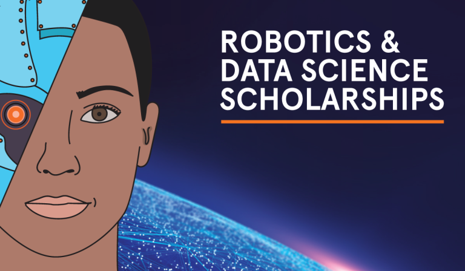

# Announcement

Hello Codeforces!

On [Friday, March 22, 2019 at 21:05UTC+6](https://codeforces.com/https://www.timeanddate.com/worldclock/fixedtime.html?day=22&month=3&year=2019&hour=18&min=5&sec=0&p1=166) [Educational Codeforces Round 62 (Rated for Div. 2)](https://codeforces.com/contest/1140 "Educational Codeforces Round 62 (Rated for Div. 2)") will start.

Series of Educational Rounds continue being held as [Harbour.Space University](https://codeforces.com/https://harbour.space/) initiative! You can read the details about the cooperation between [Harbour.Space University](https://codeforces.com/https://harbour.space/) and Codeforces in the [blog post](//codeforces.com/blog/entry/51208).

This round will be **rated for the participants with rating lower than 2100**. It will be held on extended ICPC rules. The penalty for each incorrect submission until the submission with a full solution is 10 minutes. After the end of the contest you will have 12 hours to hack any solution you want. You will have access to copy any solution and test it locally.

You will be given **7 problems** and **2 hours** to solve them.

The problems were invented and prepared by Roman [Roms](https://codeforces.com/profile/Roms "Master Roms") Glazov, Adilbek [adedalic](https://codeforces.com/profile/adedalic "International Master adedalic") Dalabaev, Vladimir [vovuh](https://codeforces.com/profile/vovuh "Candidate Master vovuh") Petrov, Ivan [BledDest](https://codeforces.com/profile/BledDest "Grandmaster BledDest") Androsov, Maksim [Neon](https://codeforces.com/profile/Neon "Candidate Master Neon") Mescheryakov and me. Also huge thanks to Mike [MikeMirzayanov](https://codeforces.com/profile/MikeMirzayanov "Headquarters, MikeMirzayanov") Mirzayanov for great systems Polygon and Codeforces.

Good luck to all participants!

Our friends at Harbour.Space also have a message for you:

Hello Codeforces!

We want to remind you about the two fully funded scholarships we currently have available: 

Master’s in Data Science Scholarship & Master’s in Robotics Scholarship

Both scholarship opportunities include: - Full coverage of the Programme’s tuition fee (€23,000 value) - 3 hours of study a day at Harbour.Space University - 4 hours of internship a day with one of our industrial partners - €12,000 euros a year (living allowance)

If you’re interested in applying for the Robotics Scholarship, [apply here](https://in.harbour.space/remy-robotics-scholarship/?utm_source=codeforces). 

If you want to apply for the Data Science Scholarship, fill out the form below and we will contact you about the next steps.

  [GO TO FORM](https://codeforces.com/https://harbourspace.typeform.com/to/Zn4j4I) If you need more information about either, please contact us at [hello@harbour.space](https://codeforces.com/mailto:hello@harbour.space) 

Congratulations to the winners: 

| Rank | Competitor | Problems Solved | Penalty |
| --- | --- | --- | --- |
| 1 | [QDEZ604](https://codeforces.com/profile/QDEZ604 "Candidate Master QDEZ604") | 7 | 250 |
| 2 | [dotorya](https://codeforces.com/profile/dotorya "Legendary Grandmaster dotorya") | 7 | 254 |
| 3 | [300iq](https://codeforces.com/profile/300iq "Legendary Grandmaster 300iq") | 7 | 586 |
| 4 | [dreamoon_love_AA](https://codeforces.com/profile/dreamoon_love_AA "Grandmaster dreamoon_love_AA") | 6 | 165 |
| 5 | [Hazyknight](https://codeforces.com/profile/Hazyknight "Grandmaster Hazyknight") | 6 | 169 |

Congratulations to the best hackers: 

| Rank | Competitor | Hack Count |
| --- | --- | --- |
| 1 | [Haunted_Cpp](https://codeforces.com/profile/Haunted_Cpp "Pupil Haunted_Cpp") | **8** |
| 2 | [Tqk](https://codeforces.com/profile/Tqk "Specialist Tqk") | **4** |
| 3 | [Jobaidul](https://codeforces.com/profile/Jobaidul "Pupil Jobaidul") | **3** |
| 4 | [Abu_Musa_99](https://codeforces.com/profile/Abu_Musa_99 "Unrated, Abu_Musa_99") | **3** |
| 5 | [yahia](https://codeforces.com/profile/yahia "Pupil yahia") | **2** |

 37 successful hacks and 149 unsuccessful hacks were made in total!And finally people who were the first to solve each problem: 

| Problem | Competitor | Penalty |
| --- | --- | --- |
| A | [Sonechko](https://codeforces.com/profile/Sonechko "International Master Sonechko") | 0:01 |
| B | [usertab34](https://codeforces.com/profile/usertab34 "Candidate Master usertab34") | 0:04 |
| C | [KhaleD_](https://codeforces.com/profile/KhaleD_ "Master KhaleD_") | 0:04 |
| D | [edisonhello](https://codeforces.com/profile/edisonhello "Master edisonhello") | 0:02 |
| E | [Roundgod](https://codeforces.com/profile/Roundgod "Grandmaster Roundgod") | 0:23 |
| F | [QDEZ604](https://codeforces.com/profile/QDEZ604 "Candidate Master QDEZ604") | 0:38 |
| G | [300iq](https://codeforces.com/profile/300iq "Legendary Grandmaster 300iq") | 0:44 |

UPD: [Editorial is out](Tutorial.md)

