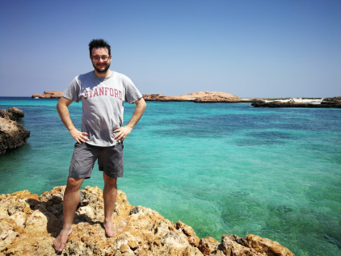

# Announcement

Hello, Codeforces!

I am pleased to invite you to [Codeforces Round 547 (Div. 3)](https://codeforces.com/contest/1141 "Codeforces Round 547 (Div. 3)"), which will start on [Tuesday, March 19, 2019 at 20:35UTC+6](https://codeforces.com/https://www.timeanddate.com/worldclock/fixedtime.html?day=19&month=3&year=2019&hour=17&min=35&sec=0&p1=166). Everyone whose current rating is strictly less than 1600 is invited to participate officially. All others can take part out of the competition.

It so happened that the schedule of this month is not replete with rounds (coordinators, we hope for you!). Therefore I decided to partially correct the situation. All the problems of this round were invented and prepared by me on the last day of [Hello Muscat Programming Bootcamp 2019](https://codeforces.com/blog/entry/63298) and on flights from Muscat to St. Petersburg. I even specially noted the time for preparation: for the current moment (the problems are ready for testing) I spent about 6 hours on their preparation, including inventing some of the problems. I really like working on problems, this is something at the intersection of creativity and programming. I really hope you enjoy the result of my work.

    
    
 I am in Oman while writing the problems for the round. The round will be hosted by rules of educational rounds (extended ICPC). Thus, during the round, solutions will be judged on preliminary tests, and after the round it will be a 12-hour phase of open hacks. I tried to make strong tests — just like you will be upset if many solutions fail after the contest is over. You will be given 6-8 problems for 2 hours to solve them.

Note that **the penalty** for incorrect submissions in this round is **10 minutes**.

[Remember](https://codeforces.com/blog/entry/59228) that only the *trusted participants of the third division* will be included in the official standings table. As it is written by link, this is a compulsory measure for combating unsporting behavior. To qualify as a *trusted participants of the third division*, you must:

 * take part in at least two rated rounds (and solve at least one problem in each of them),
* do not have a point of 1900 or higher in the rating.

**Regardless of whether you are a *trusted participant of the third division* or not, if your rating is less than 1600, then the round will be rated for you.**

~~I hope a little later a list of thanks to testers will appear instead of this paragraph. So far I only plan to give the round to testing.~~ Many thanks to the testers [ivan100sic](https://codeforces.com/profile/ivan100sic "Grandmaster ivan100sic"), [KrK](https://codeforces.com/profile/KrK "International Grandmaster KrK"), [Benq](https://codeforces.com/profile/Benq "Legendary Grandmaster Benq"), [I_love_Tanya_Romanova](https://codeforces.com/profile/I_love_Tanya_Romanova "International Grandmaster I_love_Tanya_Romanova"), [nhho](https://codeforces.com/profile/nhho "International Grandmaster nhho")! **UPD:** And extra thanks to more testers [Pavs](https://codeforces.com/profile/Pavs "Expert Pavs"), [awoo](https://codeforces.com/profile/awoo "Master awoo"), [Narts](https://codeforces.com/profile/Narts "Expert Narts"), [anon20016](https://codeforces.com/profile/anon20016 "Specialist anon20016"), [Stresshoover](https://codeforces.com/profile/Stresshoover "Expert Stresshoover"), [Ivan19981305](https://codeforces.com/profile/Ivan19981305 "Pupil Ivan19981305"). 

Good luck on the round   
 — [MikeMirzayanov](https://codeforces.com/profile/MikeMirzayanov "Headquarters, MikeMirzayanov")

