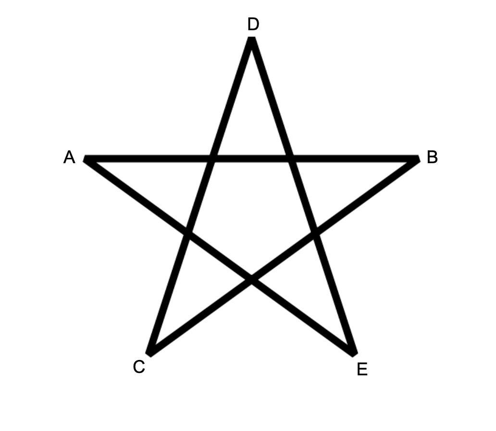

<h1 style='text-align: center;'> H. Satanic Panic</h1>

<h5 style='text-align: center;'>time limit per test: 4 seconds</h5>
<h5 style='text-align: center;'>memory limit per test: 256 megabytes</h5>

You are given a set of $n$ points in a 2D plane. No three points are collinear.

A pentagram is a set of $5$ points $A,B,C,D,E$ that can be arranged as follows.  
## Note

 the length of the line segments don't matter, only that those particular intersections exist.

Count the number of ways to choose $5$ points from the given set that form a pentagram.

##### Input

The first line contains an integer $n$ ($5 \leq n \leq 300$) — the number of points.

Each of the next $n$ lines contains two integers $x_i, y_i$ ($-10^6 \leq x_i,y_i \leq 10^6$) — the coordinates of the $i$-th point. It is guaranteed that no three points are collinear.

##### Output

Print a single integer, the number of sets of $5$ points that form a pentagram.

## Examples

##### Input


```text
5
0 0
0 2
2 0
2 2
1 3
```
##### Output


```text
1
```
##### Input


```text
5
0 0
4 0
0 4
4 4
2 3
```
##### Output


```text
0
```
##### Input


```text
10
841746 527518
595261 331297
-946901 129987
670374 -140388
-684770 309555
-302589 415564
-387435 613331
-624940 -95922
945847 -199224
24636 -565799
```
##### Output


```text
85
```
## Note

A picture of the first sample:  A picture of the second sample:  A picture of the third sample: 


#### Tags 

#2900 #NOT OK #dp #geometry 

## Blogs
- [All Contest Problems](../Forethought_Future_Cup_-_Elimination_Round.md)
- [Forethought Future Cup (en)](../blogs/Forethought_Future_Cup_(en).md)
- [Tutorial (en)](../blogs/Tutorial_(en).md)
