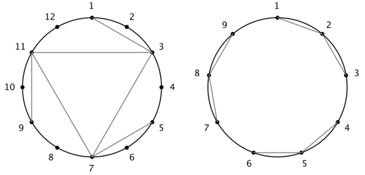

<h1 style='text-align: center;'> B. Chladni Figure</h1>

<h5 style='text-align: center;'>time limit per test: 3 seconds</h5>
<h5 style='text-align: center;'>memory limit per test: 256 megabytes</h5>

Inaka has a disc, the circumference of which is $n$ units. The circumference is equally divided by $n$ points numbered clockwise from $1$ to $n$, such that points $i$ and $i + 1$ ($1 \leq i < n$) are adjacent, and so are points $n$ and $1$.

There are $m$ straight segments on the disc, the endpoints of which are all among the aforementioned $n$ points.

Inaka wants to know if her image is rotationally symmetrical, i.e. if there is an integer $k$ ($1 \leq k < n$), such that if all segments are rotated clockwise around the center of the circle by $k$ units, the new image will be the same as the original one.

###### Input

The first line contains two space-separated integers $n$ and $m$ ($2 \leq n \leq 100\,000$, $1 \leq m \leq 200\,000$) — the number of points and the number of segments, respectively.

The $i$-th of the following $m$ lines contains two space-separated integers $a_i$ and $b_i$ ($1 \leq a_i, b_i \leq n$, $a_i \neq b_i$) that describe a segment connecting points $a_i$ and $b_i$.

It is guaranteed that no segments coincide.

###### Output

###### Output

 one line — "Yes" if the image is rotationally symmetrical, and "No" otherwise (both excluding quotation marks).

You can output each letter in any case (upper or lower).

## Examples

###### Input


```text
12 6
1 3
3 7
5 7
7 11
9 11
11 3
```
###### Output


```text
Yes
```
###### Input


```text
9 6
4 5
5 6
7 8
8 9
1 2
2 3
```
###### Output


```text
Yes
```
###### Input


```text
10 3
1 2
3 2
7 2
```
###### Output


```text
No
```
###### Input


```text
10 2
1 6
2 7
```
###### Output


```text
Yes
```
## Note

The first two examples are illustrated below. Both images become the same as their respective original ones after a clockwise rotation of $120$ degrees around the center.

  

#### Tags 

#1900 #NOT OK #brute_force #strings 

## Blogs
- [All Contest Problems](../Forethought_Future_Cup_-_Final_Round_(Onsite_Finalists_Only).md)
- [Announcement (en)](../blogs/Announcement_(en).md)
- [Tutorial (en)](../blogs/Tutorial_(en).md)
