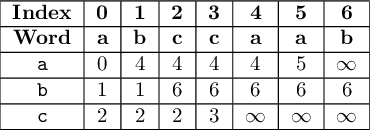

# Tutorial_(en)

This is the preliminary version of editorial. Expect bugs. Some changes might happen!

 

---

[1150A. Stock Arbitraging](https://codeforces.com/contest/1150/problem/A)

 **Tutorial**
### [1150A - Stock Arbitraging](https://codeforces.com/contest/1150/problem/A "Codeforces Round 556 (Div. 2)")

The main observation is that we always want to buy shares as cheaply as possible, and sell them as expensively as possible. Therefore, we should pick the lowest price at which we can buy shares smin=min(s1,s2,…,sn), and the highest price at which we can sell the shares bmax=max(b1,b2,…,bm). Now, we have two cases:

* If smin<bmax, it's optimal to buy as many shares and possible in the morning and sell them all in the evening. We can buy as many as ⌊rsmin⌋ shares and gain bmax−smin bourles profit on each of them. Therefore, the final balance is r+⌊rsmin⌋(bmax−smin).
* If smin≥bmax, we're not gaining any profit on the shares and therefore we shouldn't care about trading stocks at all. The final balance is then r.

The solution can be therefore implemented in O(n+m) time. However, the constraints even allowed brute-forcing the seller, the buyer and the amount of stock we're buying in O(nmr) time.

Note that many programming languages have routines for finding the minima/maxima of the collections of integers: e.g. min_element in C++, Collections.min in Java, or min in Python. This should make the code shorter and quicker to write.

 **Code**[53560020](https://codeforces.com/problemset/submission/1150/53560020)

 

---

[1150B. Tiling Challenge](https://codeforces.com/contest/1150/problem/B)

 **Tutorial**
### [1150B - Tiling Challenge](https://codeforces.com/contest/1150/problem/B "Codeforces Round 556 (Div. 2)")

Notice that there is only one orientation of the wooden piece (and this is the orientation depicted in the statement). Moreover, we can notice the following fact:

Take any (untiled) topmost cell of the board. If there is any correct tiling of the board, this cell must be covered by the topmost tile of the piece.

The fact is pretty obvious — there is simply no other way to cover the cell.

Having that, it's straightforward to implement an O(n4) solution: while the board isn't fully covered, take any topmost untiled cell and try to cover it with a piece. If it's impossible, declare the failure. If it's possible, lay the piece and repeat the procedure. We can lay at most O(n2) pieces, and we're looking for the topmost cell in O(n2) time. This gives us O(n4) running time.

While this is enough to solve the task, one can also notice that we don't have to seek the whole board in search of the cell. In fact, we can do a single scan through the board in row-major order, and as soon as we find any uncovered cell, we try to cover it by a wooden piece. This allows us to implement the solution in O(n2) time.

 **Code**[53560074](https://codeforces.com/problemset/submission/1150/53560074)

 

---

[1150C](https://codeforces.com/contest/1150/problem/C) / [1149A. Prefix Sum Primes](../problems/A._Prefix_Sum_Primes.md)

 **Tutorial**
### [1150C - Prefix Sum Primes](https://codeforces.com/contest/1150/problem/C "Codeforces Round 556 (Div. 2)")

There are at least a couple of correct solutions I had in mind. Let me present the one I find the most straightforward, which doesn't even require implementing any sieve.

If all the numbers on the tiles are equal, we have no choice but to output the only possible permutation. In the remaining cases, we'll show that the following solution is optimal:

* Start with 2 and 1.
* Use all remaining 2s.
* Finish with all remaining 1s.

 It's easy to see that we generate 2 and all odd numbers between 3 and ∑ni=1ai as the prefix sums. Notice now that each prime is either 2 or an odd number greater than or equal to 3. Therefore, using the construction above we construct all possible prime prefix sums we possibly can — and so the construction is optimal. The solution can be implemented easily in O(n) time. **Code**[53560113](https://codeforces.com/problemset/submission/1150/53560113)

 

---

[1150D](https://codeforces.com/contest/1150/problem/D) / [1149B. Three Religions](../problems/B._Three_Religions.md)

 **Tutorial**
### [1150D - Three Religions](https://codeforces.com/contest/1150/problem/D "Codeforces Round 556 (Div. 2)")

For our convenience, construct a two-dimensional helper array N where N(i,c) is the location of the first occurrence of character c in the Word of Universe on position i or later (or ∞ if no such character exists). This array can be created in a straightforward in O(26⋅n) time, by iterating the word from the end to the beginning.

Example. Consider the Word of Uniwerse equal to abccaab. The helper array looks as follows:

  Actually, for our purposes it's easier to set ∞=n (in our example, n=7) and also consider additional links from indices n and n+1 to index ∞=n. Why? We'll later need the index of the first occurrence of some character after some location p. If this p already happens to be ∞ (n, as we already established), we can easily see that no requested occurrence exists:

  Let's now try to answer each query in O(2503) time. We can do it using dynamic programming: let D(n1,n2,n3) be the length of the shortest prefix of the Word of Universe that contains the disjoint occurrences of the prefix of length n1 of the first religion's description, the prefix of length n2 of the second religion's description, and the prefix of length n3 of the third religion's description. Each state can be evaluated in constant time by checking for each religion i∈{1,2,3}, what the prefix length would be if the last character of the prefix is a part of the i-th religion's description. (We use the helper array N to speed up the search.)

How to write the state transitions? For each i∈{1,2,3}: chop the last character of the i-th description's prefix, find the shortest prefix of the Word of Universe containing all three descriptions, and then reappend this last character. We can do that using our helper array:

D(n1,n2,n3)=min{N(D(n1−1,n2,n3)+1,description1[n1])if n1≥1,N(D(n1,n2−1,n3)+1,description2[n2])if n2≥1,N(D(n1,n2,n3−1)+1,description3[n3])if n3≥1.

Now, if the lengths of the descriptions are ℓ1, ℓ2, and ℓ3, respectively, then the embedding of these descriptions as distinct subsequences exists if and only if D(ℓ1,ℓ2,ℓ3)<∞=n.

However, due to the nature of queries, we can do a single update in O(2502) time: if we drop a character, we don't need to recompute any states; if we add a character to the i-th description, we only need to recompute the states with ni equal to the length of the description — and there are at most 2512 of them! This allows us to solve the problem in O(q⋅2502) time.

 **Code**[53560195](https://codeforces.com/problemset/submission/1150/53560195)

 

---

[1150E](https://codeforces.com/contest/1150/problem/E) / [1149C. Tree Generator™](../problems/C._Tree_Generator™.md)

 **Tutorial**
### [1150E - Tree Generator™](https://codeforces.com/contest/1150/problem/E "Codeforces Round 556 (Div. 2)")

Take any rooted tree and its description. For any vertices u, v, let h(v) be its depth in the tree, and d(u,v)=h(u)+h(v)−2h(lca(u,v)) be the distance between u and v.

Consider the traversal of the tree represented by the description. Let's say we're processing the parentheses one by one each second, and let's set μ(t) be the current depth after t seconds. Moreover, let tu and tv be the moments of time when we're in vertices u,v, respectively (there might be multiple such moments; pick any). Therefore, h(u)=μ(tu) and h(v)=μ(tv).

Assume without the loss of generality that tu<tv and consider the part of the description between the tu-th and tv-th second. What is the shallowest vertex we visit during such traversal? As the description represents a depth-first search of the tree, it must be lca(u,v). Therefore, h(lca(u,v))=mintl∈[tu,tv]μ(tl). It follows that d(u,v)=maxtl∈[tu,tv](μ(tu)+μ(tv)−2μ(tl)).

Eventually, the diameter is equal to maxu,vd(u,v)=maxtu≤tl≤tv(μ(tu)−2μ(tl)+μ(tv)). This leads to a slow O(n) solution for computing a single diameter without constructing the tree: consider the parentheses one by one, and maintain the current depth and maximum values of μ(a), μ(a)−2μ(b) and μ(a)−2μ(b)+μ(c) for a≤b≤c on the prefix. However, we still need to be able to process the updates quicker than in linear time.

It turns out we can maintain a segment tree. Each node will maintain some information about the substring of the description. Note that such substring doesn't have to describe the whole tree, and so the number of opening and closing parentheses doesn't have to match and it can happen that we're at a negative depth when following the description.

We'll hold the following information about the substring. We assume everywhere that a≤b≤c: 

* δ (the final depth, might be non-zero),
* maxμ(a), max(−2μ(b)), max(μ(a)−2μ(b)), max(−2μ(b)+μ(c)), max(μ(a)−2μ(b)+μ(c)).

 Note that the values in the second point describe all the contiguous parts of the formula μ(a)−2μ(b)+μ(c).It's now pretty straightforward to combine the informations about two neighboring substrings into a single information about the concatenation of the substrings. Note for example that δ=δL+δR and maxμ(a)=max{maxLμ(a), maxRμ(a)+δL}. This allows to maintain the segment tree over the description and process the single character replacement in O(logn) time. Therefore, we can process each query in O(logn) time, and solve the whole task in O(n+qlogn) time.

Notably, square-root decomposition isn't much slower in this task; O(√n) per query should pass if you aren't deliberately trying to write as slow code as possible.

 **Code**[53560424](https://codeforces.com/problemset/submission/1150/53560424)

 

---

[1149D. Abandoning Roads](../problems/D._Abandoning_Roads.md)

 **Tutorial**
### [1149D - Abandoning Roads](../problems/D._Abandoning_Roads.md "Codeforces Round 556 (Div. 1)")

Let's partition the edges of the graph into two classes: light (weight a) and heavy (weight b). Let's now fix a single settlement p as the location of the parliament house, and consider how the path between settlements 1 and p could look like.

Lemma 1. If there is a path between two settlements u, v consisting of light edges only, then they will be connected using the light edges only in any minimum spanning tree.

Proof. Consider the Kruskal minimum spanning tree algorithm (which can produce any minimum spanning tree depending on the order we consider the edges with equal weight). After we process all light edges, settlements u and v will be connected.

Lemma 2. Consider the connected components in the graph with heavy edges removed. In the original graph, a path can be a part of the minimum spanning tree if and only if there is we don't leave and then reenter any of the components.

Proof. If we leave and then reenter any connected component, there are two vertices u, v in a single connected component (that is, connected by a light path in the original graph) that has at least one heavy edge on the path in between. Lemma 1 asserts that it's impossible. However, if no such situation happens, it's straightforward to extend the selected path to a minimum spanning tree — first add all possible light edges, then all possible heavy edges so that the graph becomes a spanning tree.

This leads us to an (inefficient) O(2nmlog(2nm)) solution: find the connected components in the graph with light edges only. We want now to find the shortest path between 1 and all other vertices that doesn't revisit any component multiple times. In order to do so, create a graph where each state is of the following format (mask of components visited so far,current vertex). This information allows us to check if we don't reenter any previously visited component. After we do that, we run Dijkstra's shortest path algorithm from vertex 1. The shortest path between vertices 1 and p can be found in the state first visiting vertex p. 

The beautiful thing now is that the algorithm can be sped up by the following greedy observation:

Lemma 3. Consider any component of size 3 or less. It's not optimal to leave and then reenter this component even if we don't explicitly forbid this.

Proof. We need to use at least two heavy edges to leave and then reenter the component, and this costs us 2b or more. However, as the component has at most three vertices, the path between any pair of vertices costs at most 2a. As a<b, it's always more optimal to take the path inside the component.

Therefore, we can simply ignore all components of size 3 or less. As we now need to remember the components having at least 4 vertices, the number of states drops down to O(2n/4m). This immediately allows us to finish the solution in a number of ways:

* Implement the vanilla Dijkstra algorithm on the state graph — time complexity O(2n/4mlog(2n/4m)).
* Notice that the edges of the graph have only two weights (a and b) and therefore the priority queue can be implemented using two queues — time complexity drops to O(2n/4m).
 **Code**[53560495](https://codeforces.com/problemset/submission/1149/53560495)

 **Challenges*** Prove that the (decision version of) the problem is NP-hard.
* Solve the problem in 2o(n)2o(n) time (where o(n)o(n) is any function growing asymptotically slower than nn).
 

---

[1149E. Election Promises](../problems/E._Election_Promises.md)

 **Tutorial**
### [1149E - Election Promises](../problems/E._Election_Promises.md "Codeforces Round 556 (Div. 1)")

Let's get straight to the main lemma:

Lemma. For any vertex v, let's define the level of v as M(v)=mex{M(u)∣v→uis an edge} where mex is the [minimum-excluded](https://codeforces.com/https://en.wikipedia.org/wiki/Mex_(mathematics)) function. Moreover, for any t∈N, let X(t) be the xor-sum of the taxes in all cities v fulfilling M(v)=t; that is, X(t)=⨁{hv∣M(v)=t}. The starting party loses if and only if X(t)=0 for all t's; that is, if all xor-sums are equal to 0.

Proof. Let's consider any move from the position in which all xor-sums are zero. If we're holding the convention in the city v, then we must decrease the amount of taxes in this city. Note however that there is no direct connection from v to any other city u having the same level as v, as M(v) is the smallest integer outside of the set {M(u)∣v→uis an edge}. Therefore, there is exactly one tax value changing at level M(v), and thus the value X(M(v)) must change. As it was zero before, it must become non-zero.

Now consider any configuration where some xor-sums are non-zero. Let t be the highest level at which X(t)>0. We want to hold the election in a selected city at level t. Which one? Notice that no city at a single level is connected to each other, and therefore we can only afford to pick one city and strictly decrease its tax. This is equivalent to the game of Nim where each city corresponds to a single stack of stones. We perform a single optimal move in this game: pick a city and decrease the tax in the city by a non-zero amount of bourles, leading to the position where the new xor-sum of the taxes at this level X′(t) is equal to zero. We also need to take care of zeroing all X(l)'s for l<t. This is however straightforward: for each l<t, pick a single city vl fulfilling at level l directly reachable from v (there must be one from the definition of M(v)), and alter the value of tax in order to nullify X(l).

The proof above is actually constructive and allows us to compute a single winning move in O(n+m) time.

As a small bonus: if you're into advanced game theory, you can come up with the lemma above without much guesswork. One can compute the [nimbers](https://codeforces.com/https://en.wikipedia.org/wiki/Nimber) for the state where there are no taxes anywhere except a single city v where the tax is equal to hv, and it turns out to be equal to ωM(v)⋅hv where ω is the smallest infinite [ordinal number](https://codeforces.com/https://en.wikipedia.org/wiki/Ordinal_number). Moreover, it's not that hard to see that the nimber for the state where there are more taxed cities is a nim-sum of the nimbers corresponding to the states with only one taxed city. This all should quite naturally lead to the lemma above.

 **Code**[53560654](https://codeforces.com/problemset/submission/1149/53560654)

