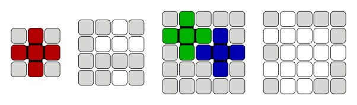

<h1 style='text-align: center;'> B. Tiling Challenge</h1>

<h5 style='text-align: center;'>time limit per test: 2 seconds</h5>
<h5 style='text-align: center;'>memory limit per test: 256 megabytes</h5>

One day Alice was cleaning up her basement when she noticed something very curious: an infinite set of wooden pieces! Each piece was made of five square tiles, with four tiles adjacent to the fifth center tile: 

   By the pieces lay a large square wooden board. The board is divided into $n^2$ cells arranged into $n$ rows and $n$ columns. Some of the cells are already occupied by single tiles stuck to it. The remaining cells are free.Alice started wondering whether she could fill the board completely using the pieces she had found. Of course, each piece has to cover exactly five distinct cells of the board, no two pieces can overlap and every piece should fit in the board entirely, without some parts laying outside the board borders. The board however was too large for Alice to do the tiling by hand. Can you help determine if it's possible to fully tile the board?

###### Input

The first line of the input contains a single integer $n$ ($3 \leq n \leq 50$) — the size of the board.

The following $n$ lines describe the board. The $i$-th line ($1 \leq i \leq n$) contains a single string of length $n$. Its $j$-th character ($1 \leq j \leq n$) is equal to "." if the cell in the $i$-th row and the $j$-th column is free; it is equal to "#" if it's occupied.

You can assume that the board contains at least one free cell.

###### Output

###### Output

 YES if the board can be tiled by Alice's pieces, or NO otherwise. You can print each letter in any case (upper or lower).

## Examples

###### Input


```text
3
#.#
...
#.#
```
###### Output


```text
YES
```
###### Input


```text
4
##.#
#...
####
##.#
```
###### Output


```text
NO
```
###### Input


```text
5
#.###
....#
#....
###.#
#####
```
###### Output


```text
YES
```
###### Input


```text
5
#.###
....#
#....
....#
#..##
```
###### Output


```text
NO
```
## Note

The following sketches show the example boards and their tilings if such tilings exist: 

  

#### Tags 

#900 #NOT OK #greedy #implementation 

## Blogs
- [All Contest Problems](../Codeforces_Round_556_(Div._2).md)
- [Codeforces Round #556 (en)](../blogs/Codeforces_Round_556_(en).md)
- [Tutorial (en)](../blogs/Tutorial_(en).md)
