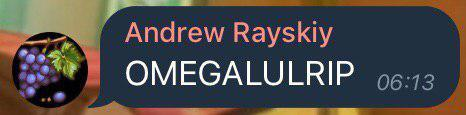

# Announcement_(en)

Once again, **TREMBLE BEFORE THE MIGHTY OMEGALULRIPGRAPE.**

 

*(He last walked the Earth in round [538](https://codeforces.com/blog/entry/65033) btw.)*

Hello Codeforces!

We are here to invite you to Codeforces Round #554 (Div. 2), which will take place at [Wednesday, April 24, 2019 at 20:35UTC+6](https://codeforces.com/https://www.timeanddate.com/worldclock/fixedtime.html?day=24&month=4&year=2019&hour=17&min=35&sec=0&p1=166).

The round will be rated for all Division 2 participants **(with rating less than 2100)**, yet any Division 1 participants are welcome to join us out of competition.

The round will be cat themed. Raise your paws and prepare your catnips!

*(Or even cat memes, while you're at it).*

You will be given **6+1** problems ( **6** problems, one of them has **2** subtasks ) to solve in **2 hours.** The round's problems were prepared by Xuan-Quang [xuanquang1999](https://codeforces.com/profile/xuanquang1999 "Grandmaster xuanquang1999") D. Nguyen, Duy-Bach [AkiLotus](https://codeforces.com/profile/AkiLotus "Expert AkiLotus") Le, Stefan [stefdasca](https://codeforces.com/profile/stefdasca "Candidate Master stefdasca") Dascalescu, Quang-Minh [MofK](https://codeforces.com/profile/MofK "Grandmaster MofK") D. Nguyen and our dear Codeforces coordinator Dmitry [cdkrot](https://codeforces.com/profile/cdkrot "Grandmaster cdkrot") Sayutin.

*Gladly (or sadly), no interactive problem tonight!*

Also, the tribute should be given to everyone within the team — we all make it possible:

 * Andrew [GreenGrape](https://codeforces.com/profile/GreenGrape "Master GreenGrape") Rayskiy for various problem suggestions **and the infamous OMEGALULRIP influence.** ;)
* Xuan-Tung [neko_nyaaaaaaaaaaaaaaaaa](https://codeforces.com/profile/neko_nyaaaaaaaaaaaaaaaaa "International Master neko_nyaaaaaaaaaaaaaaaaa") Nguyen for testing the rounds and various suggestions in the core theme idea. Nya~.

Last but not least, I want to give a huge appreciation to [MikeMirzayanov](https://codeforces.com/profile/MikeMirzayanov "Headquarters, MikeMirzayanov") for the awesome Codeforces and Polygon platform, which makes this contest possible.

P/s: I will be at the [Discord CP Community](https://codeforces.com/blog/entry/52778) to discuss the problems after the coding phase. However, please follow the rules and don't discuss the problems during the contest by any means.

*Wish everyone good luck and high rating!*

P/s(2): Commies united!

P/s(3): A dear thank-you to Grigory [vintage_Vlad_Makeev](https://codeforces.com/profile/vintage_Vlad_Makeev "Grandmaster vintage_Vlad_Makeev") Reznikov for the last-minute complete testing as well! ;)

**UPD1a:** Another comrade, Quang-Minh [MofK](https://codeforces.com/profile/MofK "Grandmaster MofK") D. Nguyen joined the fun! Kudos for the problem suggestion! ;)

**UPD1b:** The problemset contains **6+1** problems ( **6** problems, one of them has **2** subtasks ).

**UPD2:** Score distribution: **500-1000-1500-2000-2000-(2250+750)**.

**UPD3:** Editorial will be available tomorrow. Sorry for the waiting, we have quite a lot of things to polish. ;)

**UPD4:** The contest is finished. I hope that you're satisfied. And here come our winners ;)

**Official participants:**

 1. [hamzzq](https://codeforces.com/profile/hamzzq "Expert hamzzq")
2. [davidHernandes](https://codeforces.com/profile/davidHernandes "Expert davidHernandes")
3. [oiyoayao](https://codeforces.com/profile/oiyoayao "Expert oiyoayao")
4. [abandonedw1](https://codeforces.com/profile/abandonedw1 "Unrated, abandonedw1")
5. [OnionGod](https://codeforces.com/profile/OnionGod "Candidate Master OnionGod")
6. [IPL](https://codeforces.com/profile/IPL "Expert IPL")
7. [memset_inf](https://codeforces.com/profile/memset_inf "Candidate Master memset_inf")
8. [dsgsjk](https://codeforces.com/profile/dsgsjk "Candidate Master dsgsjk")
9. [FluffyT](https://codeforces.com/profile/FluffyT "Expert FluffyT") (the only official participants solved F1+F2, too bad she didn't solve E :<)
10. [_wxw_](https://codeforces.com/profile/_wxw_ "Candidate Master _wxw_")

**Div.1 + Div.2 participants:**

 1. [dreamoon_love_AA](https://codeforces.com/profile/dreamoon_love_AA "Grandmaster dreamoon_love_AA") (solved all problems!)
2. [pwild](https://codeforces.com/profile/pwild "Grandmaster pwild")
3. [Sugar_fan](https://codeforces.com/profile/Sugar_fan "Grandmaster Sugar_fan")
4. [hamzzq](https://codeforces.com/profile/hamzzq "Expert hamzzq")
5. [natsugiri](https://codeforces.com/profile/natsugiri "International Grandmaster natsugiri")
6. [kmjp](https://codeforces.com/profile/kmjp "Grandmaster kmjp")
7. [davidHernandes](https://codeforces.com/profile/davidHernandes "Expert davidHernandes")
8. [Jeffrey](https://codeforces.com/profile/Jeffrey "Master Jeffrey")
9. [betrue12](https://codeforces.com/profile/betrue12 "Master betrue12")
10. [KrK](https://codeforces.com/profile/KrK "International Grandmaster KrK")

**UPD5:** [Editorial blog post is available.](T_(en).md)

