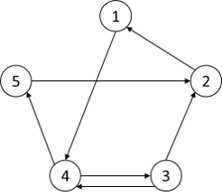

# T_(en)

[1152A - Neko Finds Grapes](../problems/A._Neko_Finds_Grapes.md "Codeforces Round 554 (Div. 2)")
-----------------------------------------------------------------------------------------------------------

Author: [xuanquang1999](https://codeforces.com/profile/xuanquang1999 "Grandmaster xuanquang1999")  
Development: [xuanquang1999](https://codeforces.com/profile/xuanquang1999 "Grandmaster xuanquang1999"), [AkiLotus](https://codeforces.com/profile/AkiLotus "Expert AkiLotus"), [GreenGrape](https://codeforces.com/profile/GreenGrape "Master GreenGrape")  
Theme development: [AkiLotus](https://codeforces.com/profile/AkiLotus "Expert AkiLotus"), [GreenGrape](https://codeforces.com/profile/GreenGrape "Master GreenGrape")  
Editorialist: [xuanquang1999](https://codeforces.com/profile/xuanquang1999 "Grandmaster xuanquang1999") 

 **Tutorial**
### [1152A - Neko Finds Grapes](../problems/A._Neko_Finds_Grapes.md "Codeforces Round 554 (Div. 2)")

The most important observation is that: 

* Key with odd id can only be used to unlock chest with even id
* Key with even id can only be used to unlock chest with odd id

Let: 

* $c_0, c_1$ be the number of chests with even and odd id, respectively
* $k_0, k_1$ be the number of keys with even and odd id, respectively

With $c_0$ even-id chests and $k_1$ odd-id keys, you can unlock at most $\min(c_0, k_1)$ chests.

With $c_1$ odd-id chests and $k_0$ even-id keys, you can unlock at most $\min(c_1, k_0)$ chests.

Therefore, the final answer is $\min(c_0, k_1) + \min(c_1, k_0)$.

Complexity: $O(n + m)$

 **Solution (xuanquang1999)**Submission link: [53259456](https://codeforces.com/contest/1152/submission/53259456 "Submission 53259456 by AkiLotus")

 **Source code in plain text**
```cpp
#include <bits/stdc++.h>

using namespace std;

int main(int argc, char* argv[])
{
    int n, m;
    scanf("%d%d", &n, &m);

    vector<int> a(n), b(m);
    for(int i = 0; i < n; ++i)
        scanf("%d", &a[i]);
    for(int i = 0; i < m; ++i)
        scanf("%d", &b[i]);

    int c0 = 0, c1 = 0;
    for(int i = 0; i < n; ++i)
        if (a[i]%2 == 0)
            ++c0;
        else
            ++c1;

    int k0 = 0, k1 = 0;
    for(int i = 0; i < m; ++i)
        if (b[i]%2 == 0)
            ++k0;
        else
            ++k1;

    int ans = min(c1, k0) + min(c0, k1);

    printf("%d", ans);

    return 0;
}
```
[1152B - Neko Performs Cat Furrier Transform](../problems/B._Neko_Performs_Cat_Furrier_Transform.md "Codeforces Round 554 (Div. 2)")
-----------------------------------------------------------------------------------------------------------------------------

Author: [AkiLotus](https://codeforces.com/profile/AkiLotus "Expert AkiLotus")  
Development: [AkiLotus](https://codeforces.com/profile/AkiLotus "Expert AkiLotus"), [xuanquang1999](https://codeforces.com/profile/xuanquang1999 "Grandmaster xuanquang1999")  
Theme development: [AkiLotus](https://codeforces.com/profile/AkiLotus "Expert AkiLotus")  
Editorialist: [AkiLotus](https://codeforces.com/profile/AkiLotus "Expert AkiLotus") 

 **Tutorial**
### [1152B - Neko Performs Cat Furrier Transform](../problems/B._Neko_Performs_Cat_Furrier_Transform.md "Codeforces Round 554 (Div. 2)")

There are various greedy solutions possible. I'll only cover one of them.

We'll perform a loop as follows:

* If $x \le 1$, stop the process (since it's already correct).
* If $x = 2^m$ ($m \ge 1$), perform operation A with $2^m-1$. Obviously, the resulting $x$ will be $2^{m+1}-1$, which satisfies the criteria, so we stop the process.
* Otherwise, let's denote $MSB(x)$ as the position/exponential of the most significant bit of $x$ (for example, $MSB(4) = MSB(7) = 2$). We'll perform operation A with $2^{MSB(x)+1} - 1$. If $x$ after this phase is not a valid number, we'll then perform operation B and return to the beginning of the loop.

This will never take more than $40$ queries, since each iteration removes the most significant bit (and it would never reappear after later steps), and $x$ can only have at most $20$ bits initially.

Also, it is possible to solve this problem by finding exactly shortest operation sequence by using a BFS. However, this was not required.

 **Solution 1 - Greedy (Akikaze)**Submission link: [53259692](https://codeforces.com/contest/1152/submission/53259692 "Submission 53259692 by AkiLotus")

 **Source code in plain text**
```cpp
#pragma comment(linker, "/stack:247474112")
#pragma GCC optimize("Ofast")

#include <bits/stdc++.h>
using namespace std;

#define endl 'n'

int x;

bool isCompletion(int z) {
	int bitval = 0;
	z += 1; while (z % 2 == 0) {z /= 2; bitval++;}
	return (z == 1);
}

int MSB(int z) {
	for (int i=20; i>=0; i--) {
		if ((z >> i) & 1) return i;
	}
	return -1;
}

void Input() {
	cin >> x;
}

void Solve() {
	int i = 0; vector<int> xorCmd;
	while (!isCompletion(x)) {
		i = i + 1;
		if (i % 2 == 0) {x++; continue;}
		int r = MSB(x);
		if ((1 << r) != x) r++;
		x = (x ^ ((1 << r) - 1)); xorCmd.push_back(r);
	}
	cout << i << endl;
	for (auto z: xorCmd) cout << z << " "; cout << endl;
}

int main(int argc, char* argv[]) {
	ios_base::sync_with_stdio(0);
	cin.tie(NULL); Input(); Solve();
	return 0;
}
```
 **Solution 2 - BFS (Akikaze)**Submission link: [53259743](https://codeforces.com/contest/1152/submission/53259743 "Submission 53259743 by AkiLotus")

 **Source code in plain text**
```cpp
#pragma comment(linker, "/stack:247474112")
#pragma GCC optimize("Ofast")

#include <bits/stdc++.h>
using namespace std;

#define endl 'n'

int x; vector<vector<int>> vis(2, vector<int>(1048576, INT_MAX));
vector<vector<pair<int, int>>> Last(2, vector<pair<int, int>>(1048576, {-1LL, -1LL}));

int isCompletion(int z) {
	int bitval = 0;
	z += 1; while (z % 2 == 0) {z /= 2; bitval++;}
	if (z != 1) return -1;
	return bitval;
}

void Input() {
	cin >> x;
}

void Solve() {
	queue<pair<int, int>> Q;
	vis[0][x] = 0; Q.push({0, x});
	int p1 = -1, p2 = -1;
	while (!Q.empty()) {
		pair<int, int> Token = Q.front();
		int p = Token.first, z = Token.second; Q.pop();
		if (isCompletion(z) != -1) {p1 = p; p2 = z; break;}
		if (p == 1) {
			if (vis[0][z+1] == INT_MAX) {
				vis[0][z+1] = vis[1][z] + 1;
				Last[0][z+1] = {1, z}; Q.push({0, z+1});
			}
		}
		else {
			for (int i=0; i<20; i++) {
				int t = (z ^ ((1 << i) - 1));
				if (vis[1][t] != INT_MAX) continue;
				vis[1][t] = vis[0][z] + 1;
				Last[1][t] = {0, z}; Q.push({1, t});
			}
		}
	}

	cout << vis[p1][p2] << endl;

	vector<int> xorCmd;
	while (Last[p1][p2] != make_pair(-1, -1)) {
		pair<int, int> Token = Last[p1][p2];
		int z = Token.first, t = Token.second;
		if (p1 == 1) xorCmd.push_back(isCompletion(p2 ^ t));
		p1 = z; p2 = t;
	}

	reverse(xorCmd.begin(), xorCmd.end());
	for (auto z: xorCmd) cout << z << " ";
}

int main(int argc, char* argv[]) {
	ios_base::sync_with_stdio(0);
	cin.tie(NULL); Input(); Solve();
	return 0;
}
```
[1152C - Neko does Maths](../problems/C._Neko_does_Maths.md "Codeforces Round 554 (Div. 2)")
---------------------------------------------------------------------------------------------------------

Author: [stefdasca](https://codeforces.com/profile/stefdasca "Candidate Master stefdasca")  
Development: [stefdasca](https://codeforces.com/profile/stefdasca "Candidate Master stefdasca"), [AkiLotus](https://codeforces.com/profile/AkiLotus "Expert AkiLotus")  
Theme development: [xuanquang1999](https://codeforces.com/profile/xuanquang1999 "Grandmaster xuanquang1999"), [neko_nyaaaaaaaaaaaaaaaaa](https://codeforces.com/profile/neko_nyaaaaaaaaaaaaaaaaa "International Master neko_nyaaaaaaaaaaaaaaaaa")  
Editorialist: [stefdasca](https://codeforces.com/profile/stefdasca "Candidate Master stefdasca") 

 **Tutorial**
### [1152C - Neko does Maths](../problems/C._Neko_does_Maths.md "Codeforces Round 554 (Div. 2)")

The $lcm(a + k, b + k)$ is equal to $\frac{(a + k) \cdot (b + k)}{\gcd(a + k, b + k)}$. In fact, there are not much possible values for the denominator of this fraction.

Without losing generality, let's assume $a \le b$. Applying one step of Euclid's algorithm we can see, that $\gcd(a + k, b + k) = \gcd(b - a, a + k)$.

So the $\gcd$ is a divisor of $b - a$. Let's iterate over all divisors $q$ of $b - a$. That also means that $a \pmod{q} = b \pmod{q}$. In case $a \pmod{q} = 0$, we can use $k = 0$. Otherwise, the corresponding $k$ should be $q - a \pmod{q}$. Lastly, we need to check whether the value of $lcm(a + k, b + k)$ is the smallest found so far.

Also, one has to be careful when dealing with $k = 0$ answer, which was the reason why many solutions got WA 63. 

The complexity is $O(\sqrt{b - a})$.

 **Solution (implemented by stefdasca)**Submission link: [53259956](https://codeforces.com/contest/1152/submission/53259956 "Submission 53259956 by AkiLotus")

 **Source code in plain text**
```cpp
#include<bits/stdc++.h>
#pragma GCC optimize("O3")
using namespace std;
mt19937 rng(chrono::steady_clock::now().time_since_epoch().count());
long long rand_seed()
{
	long long a = rng();
    return a;
}
long long a, b;
int main()
{
    ios_base::sync_with_stdio(false);
    cin.tie(NULL);
    cin >> a >> b;
    long long dif = abs(a - b);
    vector<int>v;
    for(int i = 1; i * i <= dif; ++i)
    {
        if(dif % i == 0)
        {
            v.push_back(i);
            if(i * i != dif)
                v.push_back(dif / i);
        }
    }
    long long ans = (1LL<<62);
    int vl = 0;
    sort(v.begin(), v.end());
    for(int i = 0; i < v.size(); ++i)
    {
        int nr = v[i];
        if(a % nr != b % nr)
            continue;
        if(a % nr == 0)
        {
            long long pans = (a * b)/__gcd(a, b);
            if(pans < ans)
                ans = pans, vl = 0;
        }
        else
        {
            long long pans = ((nr - a % nr + a) * (nr - b % nr + b))/__gcd((nr - a % nr + a), (nr - b % nr + b));
            if(pans < ans)
                ans = pans, vl = nr - a % nr;
        }
    }
    cout << vl;
    return 0;
}
```
 **Solution (implemented by Akikaze)**Submission link: [53270277](https://codeforces.com/contest/1152/submission/53270277 "Submission 53270277 by AkiLotus")

 **Source code in plain text**
```cpp
#pragma comment(linker, "/stack:247474112")
#pragma GCC optimize("Ofast")

#include <bits/stdc++.h>
using namespace std;

#define endl 'n'

int a, b;

void Input() {
	cin >> a >> b;
}

void Solve() {
	if (a == b) {cout << "0n"; return;}
	
	vector<int> Divisors;
	for (int i=1; i<=sqrt(max(a,b) - min(a,b)); i++) {
		if ((max(a,b) - min(a,b)) % i != 0) continue;
		int j = (max(a,b) - min(a,b)) / i;
		Divisors.push_back(i);
		if (i != j) Divisors.push_back(j);
	}
	
	pair<long long, int> Token = make_pair(LLONG_MAX, INT_MAX);
	for (auto d: Divisors) {
		int k = (d - a % d) % d;
		pair<long long, int> NewToken = make_pair(1LL * (0LL + a + k) / __gcd(0LL+a+k, 0LL+b+k) * (0LL + b + k), k);
		Token = min(Token, NewToken);
	}
	
	cout << Token.second << endl;
}

int main(int argc, char* argv[]) {
	ios_base::sync_with_stdio(0);
	cin.tie(NULL); Input(); Solve();
	return 0;
}
```
[1152D - Neko and Aki's Prank](../problems/D._Neko_and_Aki's_Prank.md "Codeforces Round 554 (Div. 2)")
--------------------------------------------------------------------------------------------------------------

Author: [cdkrot](https://codeforces.com/profile/cdkrot "Grandmaster cdkrot")  
Development: [cdkrot](https://codeforces.com/profile/cdkrot "Grandmaster cdkrot")  
Theme development: [xuanquang1999](https://codeforces.com/profile/xuanquang1999 "Grandmaster xuanquang1999")  
Editorialist: [cdkrot](https://codeforces.com/profile/cdkrot "Grandmaster cdkrot") 

 **Tutorial**
### [1152D - Neko and Aki's Prank](../problems/D._Neko_and_Aki's_Prank.md "Codeforces Round 554 (Div. 2)")

Note, that many subtrees of the trie are equal. Basically, if we consider two vertices on the same depth and having the same balance from root to them (that is, the number of opening brackets minus the number of closing brackets), than their subtrees will be entirely same. For example, the subtrees after following $((())$, $()()($ and $(())($ are all the same.

We will use this observation to consider the tree in "compressed" form. Clearly, this way there are only $O(n^2)$ different vertices types (basically a vertex is described by $(depth, balance)$).

Now let's get back to finding a maximum matching in the tree. There are two approaches to this problem. One of them is greedy. Basically if you find a matching in a tree you can always greedily take the edge between a leaf and its parent (since this adds one edge to the answer and destroys at most one edge you would've chosen).

This idea can transform into the following algorithm (for the problem of the maximum matching in the tree). Do a dynamic programming on the subtrees, the result of $dp[v]$ is a pair of "number of edges taken in subtree, whether the root of this subtree is free (so we can start a new edge upwards)".

Combining this with the idea that there are little ($n^2$) number of vertex types, we get a dp solution. 

 **Solution (_kun_)**Submission link: [53260068](https://codeforces.com/contest/1152/submission/53260068 "Submission 53260068 by AkiLotus")

 **Source code in plain text**
```cpp
// Dmitry _kun_ Sayutin (2019)

#include <bits/stdc++.h>

using std::cin;
using std::cout;
using std::cerr;

using std::vector;
using std::map;
using std::array;
using std::set;
using std::string;

using std::pair;
using std::make_pair;

using std::tuple;
using std::make_tuple;
using std::get;

using std::min;
using std::abs;
using std::max;
using std::swap;

using std::unique;
using std::sort;
using std::generate;
using std::reverse;
using std::min_element;
using std::max_element;

#ifdef LOCAL
#define LASSERT(X) assert(X)
#else
#define LASSERT(X) {}
#endif

template <typename T>
T input() {
    T res;
    cin >> res;
    LASSERT(cin);
    return res;
}

template <typename IT>
void input_seq(IT b, IT e) {
    std::generate(b, e, input<typename std::remove_reference<decltype(*b)>::type>);
}

#define SZ(vec)         int((vec).size())
#define ALL(data)       data.begin(),data.end()
#define RALL(data)      data.rbegin(),data.rend()
#define TYPEMAX(type)   std::numeric_limits<type>::max()
#define TYPEMIN(type)   std::numeric_limits<type>::min()

const int mod = 1000 * 1000 * 1000 + 7;
int add(int a, int b) {
    return (a + b >= mod ? a + b - mod : a + b);
}

const int max_n = 1001;
pair<int, bool> dp[2 * max_n][2 * max_n];

int main() {
    std::iostream::sync_with_stdio(false);
    cin.tie(nullptr);
    cout.tie(nullptr);

    // code here
    int n = input<int>();
    n *= 2;

    assert(n / 2 < max_n);
        
    
    dp[0][0] = make_pair(0, true);
    
    for (int len = 1; len <= n; ++len) {
        for (int bal = 0; bal <= n; ++bal) {
            // (len, bal) -> (len - 1, bal + 1)
            // (len, bal) -> (len - 1, bal - 1)

            int sum = 0;
            bool has = false;

            if (bal != 0) {
                sum = add(sum, dp[len - 1][bal - 1].first);
                has = has or dp[len - 1][bal - 1].second;
            }

            if (bal + 1 <= len - 1) {
                sum = add(sum, dp[len - 1][bal + 1].first);
                has = has or dp[len - 1][bal + 1].second;
            }

            if (has)
                dp[len][bal] = make_pair(add(sum, 1), false);
            else
                dp[len][bal] = make_pair(sum, true);
        }
    }
    
    cout << dp[n][0].first << "n";
    
    return 0;
}
```
[1152E - Neko and Flashback](../problems/E._Neko_and_Flashback.md "Codeforces Round 554 (Div. 2)")
------------------------------------------------------------------------------------------------------------

Author: [xuanquang1999](https://codeforces.com/profile/xuanquang1999 "Grandmaster xuanquang1999")  
Development: [xuanquang1999](https://codeforces.com/profile/xuanquang1999 "Grandmaster xuanquang1999")  
Theme development: [xuanquang1999](https://codeforces.com/profile/xuanquang1999 "Grandmaster xuanquang1999")  
Editorialist: [xuanquang1999](https://codeforces.com/profile/xuanquang1999 "Grandmaster xuanquang1999") 

 **Tutorial**
### [1152E - Neko and Flashback](../problems/E._Neko_and_Flashback.md "Codeforces Round 554 (Div. 2)")

Obviously, if $b'_i > c'_i$ for some $i$, then the answer is "-1".

From the statement, we have $b_i = \min(a_i, a_{i+1})$ and $c_i = \max(a_i, a_{i+1})$. For this to happen, either one of the following must happen:

* $a_i = b_i$ and $a_{i+1} = c_i$
* $a_i = c_i$ and $a_{i+1} = b_i$

In order word, one of the two following pairs — $(b_i, c_i)$ or $(c_i, b_i)$ — will match the pair $(a_i, a_{i+1})$. From the statement, we also have $b'_i = b_{p_i}$ and $c'_i = c_{p_i}$. Therefore, one of the two following pairs — $(b'_i, c'_i)$ or $(c'_i, b'_i)$ — will match the pair $(a_{p_i}, a_{p_{i+1}})$

Consider a graph $G$ with $10^9$ vertices. For each $i$ from $1$ to $n-1$, we will add an undirected edge between $b'_i$ and $c'_i$. The following figure show such graph $G$ for the third example.

  Consider the path $P = a_1 \rightarrow a_2 \rightarrow a_3 \rightarrow \ldots \rightarrow a_n$. Each edge $(b'_i, c'_i)$ will correspond to exactly one edge between $a_j$ and $a_{j+1}$ for some j. In other word, $P$ correspond to an Eulerian path on the graph $G$. The following figure show the path $P = 3 \rightarrow 4 \rightarrow 5 \rightarrow 2 \rightarrow 1 \rightarrow 4 \rightarrow 3 \rightarrow 2$ for the third example.

  For implementation, we need to do the following step:

* For all elements of $b'$ and $c'$, we need to replace them with corresponding value from $1$ to $k$ (where $k$ is the number of distinct value in $b'$ and $c'$). This part can be done using an balanced BST (C++ 'map' or Java 'TreeMap') or by sorting in $O(n \log n)$.
* Build the graph $G$ as above
* Finding an Eulerian path in $G$ using Hierholzer's_algorithm in $O(n)$, or detect that such path does not exists.

Complexity: $O(n \log n)$

 **Solution (xuanquang1999)**Submission link: [53260100](https://codeforces.com/contest/1152/submission/53260100 "Submission 53260100 by AkiLotus")

 **Source code in plain text**
```cpp
#include <bits/stdc++.h>

using namespace std;

typedef pair<int, int> pii;

class Indexer {
private:
    map<int, int> id;
    vector<int> num;

public:
    int getId(int x) {
        if (!id.count(x)) {
            id[x] = num.size();
            num.push_back(x);
        }
        return id[x];
    }

    int getNum(int id) {
        return num[id];
    }

    int size() {
        return id.size();
    }
};

struct Edge {
    int u, v;
    bool avail;
};

class Graph {
private:
    int n;
    vector<Edge> e;
    vector<vector<int> > adj;

    vector<int> pos;
    list<int> path;

    void dfs(list<int>::iterator it, int u) {
        for(; pos[u] < adj[u].size(); ++pos[u]) {
            int id = adj[u][pos[u]];
            if (e[id].avail) {
                e[id].avail = false;
                int v = e[id].u + e[id].v - u;
                dfs(path.insert(it, u), v);
            }
        }
    }

public:
    Graph(int n): n(n) {
        adj.assign(n, vector<int>());
    }

    void addEdge(int u, int v) {
        adj[u].push_back(e.size());
        adj[v].push_back(e.size());
        e.push_back({u, v, false});
    }

    vector<int> eulerPath() {
        for(Edge &p: e)
            p.avail = true;
        path.clear();
        pos.assign(n, 0);

        vector<int> odd;
        for(int u = 0; u < n; ++u)
            if (adj[u].size() % 2 == 1)
                odd.push_back(u);
        if (odd.empty()) {
            odd.push_back(0);
            odd.push_back(0);
        }

        if (odd.size() > 2)
            return vector<int>();
        dfs(path.begin(), odd[0]);
        path.insert(path.begin(), odd[1]);

        return vector<int>(path.begin(), path.end());
    }
};

int main() {
    int n;
    scanf("%d", &n);

    vector<int> bprime(n-1);
    for(int i = 0; i < n-1; ++i)
        scanf("%d", &bprime[i]);

    vector<int> cprime(n-1);
    for(int i = 0; i < n-1; ++i)
        scanf("%d", &cprime[i]);

    Indexer ind;
    for(int i = 0; i < n-1; ++i) {
        if (bprime[i] > cprime[i]) {
            puts("-1");
            return 0;
        }

        bprime[i] = ind.getId(bprime[i]);
        cprime[i] = ind.getId(cprime[i]);
    }

    int k = ind.size();
    Graph g(k);
    for(int i = 0; i < n-1; ++i)
        g.addEdge(bprime[i], cprime[i]);

    vector<int> a = g.eulerPath();

    if (a.size() < n)
        puts("-1");
    else {
        for(int i = 0; i < n; ++i)
            printf("%d ", ind.getNum(a[i]));
        puts("");
    }

    return 0;
}
```
[1152F1 - Neko Rules the Catniverse (Small Version)](../problems/F1._Neko_Rules_the_Catniverse_(Small_Version).md "Codeforces Round 554 (Div. 2)")
-------------------------------------------------------------------------------------------------------------------------------------

[1152F2 - Neko Rules the Catniverse (Large Version)](../problems/F2._Neko_Rules_the_Catniverse_(Large_Version).md "Codeforces Round 554 (Div. 2)")
-------------------------------------------------------------------------------------------------------------------------------------

Author: [MofK](https://codeforces.com/profile/MofK "Grandmaster MofK")  
Development: [MofK](https://codeforces.com/profile/MofK "Grandmaster MofK"), [xuanquang1999](https://codeforces.com/profile/xuanquang1999 "Grandmaster xuanquang1999"), [AkiLotus](https://codeforces.com/profile/AkiLotus "Expert AkiLotus")  
Theme development: [xuanquang1999](https://codeforces.com/profile/xuanquang1999 "Grandmaster xuanquang1999"), [AkiLotus](https://codeforces.com/profile/AkiLotus "Expert AkiLotus")  
Editorialist: [MofK](https://codeforces.com/profile/MofK "Grandmaster MofK"), [AkiLotus](https://codeforces.com/profile/AkiLotus "Expert AkiLotus") 

 **Tutorial - F1 (Small version)**
### [1152F1 - Neko Rules the Catniverse (Small Version)](../problems/F1._Neko_Rules_the_Catniverse_(Small_Version).md "Codeforces Round 554 (Div. 2)")

As the problem stated, from planet $x$ we can go backwards any to any planet $y$ such that $y < x$.

This implies an idea of considering the planets from $n$ to $1$, then deciding whether to insert each planet to the current path or not.

Formally, if our current path is $v_1, v_2, \dots, v_p$ and we are going to insert planet $x$ somewhere ($x < v_i$ for all $i$), we can either insert it into the back, or insert it before some planet $v_i$ such that $v_i \le x + m$.

Therefore, we can use dynamic programming with the parameters being: the planet being considered, the number of planets chosen so far, and the bitmask of the last $m$ planets (whether each of them is chosen or not).

The transition is straightforward: either we don't choose the planet, or we choose it and there are $1 + bitcount(mask)$ ways to insert the planet into the path.

Total complexity: $\mathcal{O} \left( nk \cdot 2^m \right)$.

 **Tutorial - F2 (Large version)**
### [1152F2 - Neko Rules the Catniverse (Large Version)](../problems/F2._Neko_Rules_the_Catniverse_(Large_Version).md "Codeforces Round 554 (Div. 2)")

The core idea is similar to F1, however there is one crucial observation.

We can see that all DP transitions are just linear transformations, thus we can construct a transition matrix of size $k \cdot 2^m$, then use fast matrix exponentiation as a replacement of the original DP transitions.

Total complexity: $\mathcal{O} \left( \log(n) \cdot {\left( k \cdot 2^m \right)}^3 \right)$.

 **Solution F1 (xuanquang1999)**Submission link: [53260139](https://codeforces.com/contest/1152/submission/53260139 "Submission 53260139 by AkiLotus")

 **Source code in plain text**
```cpp
#include <bits/stdc++.h>

using namespace std;

const int MOD = 1000000007;

void add(int &a, long long b) {
    a = (a + b) % MOD;
}

int main() {
    int n, k, m;
    scanf("%d%d%d", &n, &k, &m);

    vector<vector<vector<int>>> dp(n+1, vector<vector<int>>(k+1, vector<int>(1<<m, 0)));
    dp[0][0][0] = 1;

    for(int i = 0; i < n; ++i) {
        for(int j = 0; j <= k; ++j) {
            for(int mask = 0; mask < (1<<m); ++mask) {
                int newMask = (mask << 1) % (1<<m);

                // Not visit planet i+1
                add(dp[i+1][j][newMask], dp[i][j][mask]);

                // Visit planet i+1
                if (j < k) {
                    int insertWays = __builtin_popcount(mask) + 1;
                    add(dp[i+1][j+1][newMask|1], 1LL*insertWays*dp[i][j][mask]);
                }
            }
        }
    }

    int ans = 0;
    for(int mask = 0; mask < (1<<m); ++mask)
        add(ans, dp[n][k][mask]);

    printf("%d", ans);
}
```
 **Solution F2 (xuanquang1999)**Submission link: [53260164](https://codeforces.com/contest/1152/submission/53260164 "Submission 53260164 by AkiLotus")

 **Source code in plain text**
```cpp
#include <bits/stdc++.h>

using namespace std;

const int MOD = 1000000007;

void add(int &a, long long b) {
    a = (a + b) % MOD;
}

struct Matrix {
    vector<vector<int>> a;
    int n, m;

    Matrix(int n, int m): n(n), m(m) {
        a.assign(n, vector<int>(m, 0));
    }

    friend Matrix operator * (Matrix a, Matrix b) {
        Matrix c(a.n, b.m);
        for(int i = 0; i < a.n; ++i)
            for(int j = 0; j < b.m; ++j)
                for(int k = 0; k < a.m; ++k)
                    add(c.a[i][j], 1LL * a.a[i][k] * b.a[k][j]);
        return c;
    }
};

Matrix identity(int n) {
    Matrix res(n, n);
    for(int i = 0; i < n; ++i)
        res.a[i][i] = 1;
    return res;
}

void power(Matrix &a, int n, Matrix &b) {
    while (n > 0) {
        if (n&1) b = a * b;
        a = a * a;
        n >>= 1;
    }
}

int n, k, m;

int toId(int j, int mask) {
    return j * (1<<m) + mask;
}

int main() {
    scanf("%d%d%d", &n, &k, &m);

    Matrix dp((k+1) * (1<<m), 1);
    dp.a[0][0] = 1;

    Matrix f((k+1) * (1<<m), (k+1) * (1<<m));

    for(int j = 0; j <= k; ++j) {
        for(int mask = 0; mask < (1<<m); ++mask) {
            int newMask = (mask << 1) % (1<<m);
            int cur = toId(j, mask);

            f.a[toId(j, newMask)][cur] = 1;
            if (j < k)
                f.a[toId(j+1, newMask|1)][cur] = __builtin_popcount(mask) + 1;
        }
    }

    power(f, n, dp);

    int ans = 0;
    for(int mask = 0; mask < (1<<m); ++mask)
        add(ans, dp.a[toId(k, mask)][0]);

    printf("%d", ans);
}
```
 **Solution F2 (veryheckingfast by MofK)**Submission link: [53260183](https://codeforces.com/contest/1152/submission/53260183 "Submission 53260183 by AkiLotus")

 **Source code in plain text**
```cpp
#include <bits/stdc++.h>

using namespace std;

const int mod = 1e9 + 7;

void add(long long &a, long long b) {
    a = (a + b) % mod;
}

long long f[2][1005][1024];
int pc[1024];

long long solve(int n, int k, int m) {
    memset(f, 0, sizeof f);
    f[0][0][0] = 1;
    for (int i = 0; i < n; ++i) {
        int x = i & 1, y = 1 - x;
        memset(f[y], 0, sizeof f[y]);
        for (int j = 0; j <= k; ++j) {
            for (int mask = 0; mask < (1 << m); ++mask) {
                int new_mask = mask >> 1;
                add(f[y][j][new_mask], f[x][j][mask]);
                add(f[y][j+1][new_mask + (1<<m-1)], f[x][j][mask] * (pc[mask] + 1));
            }
        }
    }
    long long ret = 0;
    for (int mask = 0; mask < (1 << m); ++mask)
        add(ret, f[n&1][k][mask]);
    return ret;
}

typedef vector <vector <long long>> mat;
mat operator *(const mat &a, const mat &b) {
    mat c(a.size(), vector <long long>(b[0].size(), 0));
    for (int i = 0; i < a.size(); ++i)
        for (int j = 0; j < b.size(); ++j)
            for (int k = 0; k < b[0].size(); ++k)
                add(c[i][k], a[i][j] * b[j][k]);
    return c;
}
mat operator +(const mat &a, const mat &b) {
    mat c = a;
    for (int i = 0; i < a.size(); ++i)
        for (int j = 0; j < a[0].size(); ++j)
            add(c[i][j], b[i][j]);
    return c;
}

mat A(int m) {
    mat a(1 << m, vector <long long>(1 << m, 0));
    for (int i = 0; i < (1 << m - 1); ++i)
        a[i][i*2] = a[i][i*2 + 1] = 1;
    return a;
}
mat B(int m) {
    mat b(1 << m, vector <long long>(1 << m, 0));
    for (int i = 0; i < (1 << m - 1); ++i) {
        b[i + (1<<m-1)][i*2] = pc[i] + 1;
        b[i + (1<<m-1)][i*2 + 1] = pc[i] + 2;
    }
    return b;
}
mat U(int m) {
    mat u(1 << m, vector <long long>(1 << m, 0));
    for (int i = 0; i < (1 << m); ++i)
        u[i][i] = 1;
    return u;
}
mat O(int m) {
    return mat(1 << m, vector <long long>(1 << m, 0));
}

void convo(vector <mat> &a, vector <mat> b, int m, int k) {
    int sz = min(k + 1, (int)(a.size() + b.size() + 1));
    a.resize(sz, O(m));
    for (int i = sz - 1; i >= 0; --i) {
        a[i] = a[i] * b[0];
        for (int j = 1; j <= i && j < b.size(); ++j)
            a[i] = a[i] + a[i-j] * b[j];
    }
}
long long solve3(int n, int k, int m) {
    vector <mat> ans, mul;
    --n;
    ans = mul = {A(m), B(m)};
    while (n) {
        if (n & 1) convo(ans, mul, m, k);
        convo(mul, mul, m, k);
        n >>= 1;
    }
    long long ret = 0;
    for (int i = 0; i < (1 << m); ++i)
        add(ret, ans[k][i][0]);
    return ret;
}

int main(void) {
    ios_base::sync_with_stdio(0); cin.tie(NULL); cout.tie(NULL);
    int n, k, m;
    for (int i = 1; i < 1024; ++i) pc[i] = pc[i - (i&-i)] + 1;
    while (cin >> n >> k >> m)
        cout << solve3(n, k, m) << endl;
    return 0;
}
```
 **Bonus**Solve the problem in (or faster than) O(log(n)⋅k2⋅(2m)3).

 

---

 **Authors' logs (miscellaneous things during our preparations)****Log-1**[xuanquang1999](https://codeforces.com/profile/xuanquang1999 "Grandmaster xuanquang1999") actually proposed ~10 problems yet our dear [cdkrot](https://codeforces.com/profile/cdkrot "Grandmaster cdkrot") denied half of them.  
I also proposed 4 and got denied 3 first one as well :-P  


 **Log-2**Problem B is the last invented problem. I was walking around the computer labs, thinking of some photoshopped Catzilla cat memes, which led to me thinking of enlarging cute kittens, then coming up with this problem.

Ironicly though, my model greedy solution would actually shrink the cats instead.

Anyway, I forgot this picture about longcat:  


 **Log-3**[neko_nyaaaaaaaaaaaaaaaaa](https://codeforces.com/profile/neko_nyaaaaaaaaaaaaaaaaa "International Master neko_nyaaaaaaaaaaaaaaaaa") and I after I finished writing statements of B:  


 **Log-4**[MofK](https://codeforces.com/profile/MofK "Grandmaster MofK") went haywire after seeing first AC of problem F2 by [dreamoon_love_AA](https://codeforces.com/profile/dreamoon_love_AA "Grandmaster dreamoon_love_AA"). Poor MofK, he wrote a superbly veryheckingfast solution for F2 and was still outmatched. :<  
P/s: Funny, in Codeforces both solutions have the same max execution time :D 

