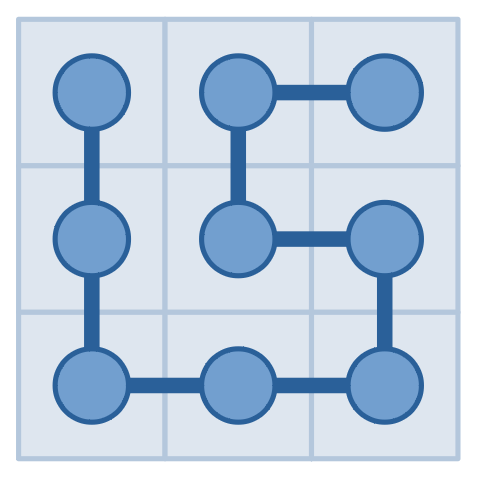
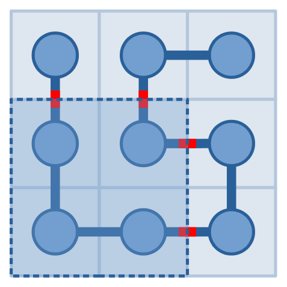
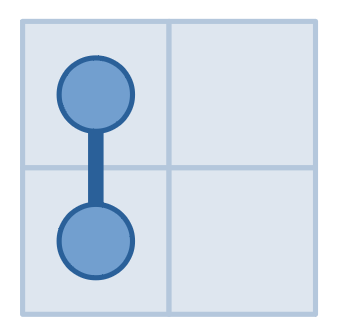
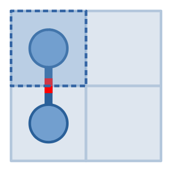
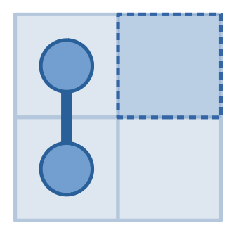
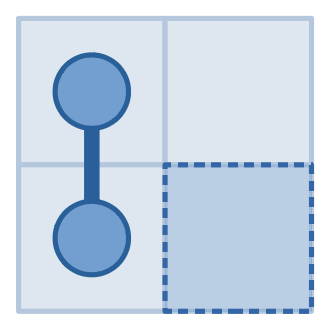
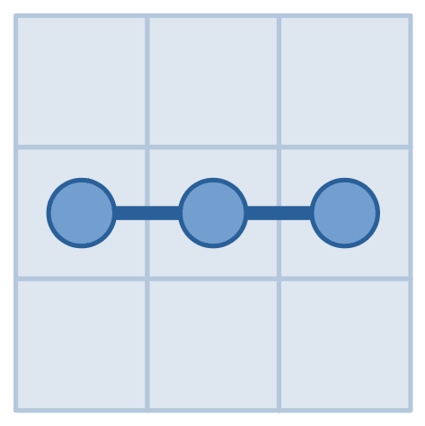
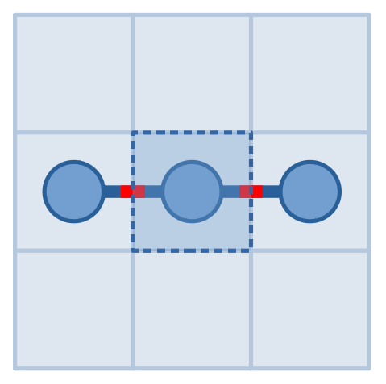
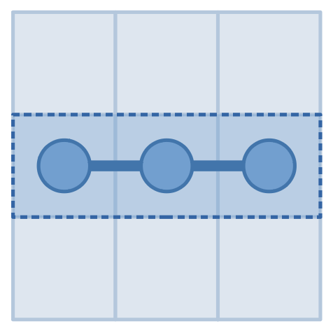

<h1 style='text-align: center;'> E. Serval and Snake</h1>

<h5 style='text-align: center;'>time limit per test: 1 second</h5>
<h5 style='text-align: center;'>memory limit per test: 256 megabytes</h5>

This is an interactive problem.

Now Serval is a senior high school student in Japari Middle School. However, on the way to the school, he must go across a pond, in which there is a dangerous snake. The pond can be represented as a $n \times n$ grid. The snake has a head and a tail in different cells, and its body is a series of adjacent cells connecting the head and the tail without self-intersecting. If Serval hits its head or tail, the snake will bite him and he will die.

Luckily, he has a special device which can answer the following question: you can pick a rectangle, it will tell you the number of times one needs to cross the border of the rectangle walking cell by cell along the snake from the head to the tail. The pictures below show a possible snake and a possible query to it, which will get an answer of $4$.

    Today Serval got up too late and only have time to make $2019$ queries. As his best friend, can you help him find the positions of the head and the tail?

## Note

 that two cells are adjacent if and only if they have a common edge in the grid, and a snake can have a body of length $0$, that means it only has adjacent head and tail.

Also note that the snake is sleeping, so it won't move while Serval using his device. And what's obvious is that the snake position does not depend on your queries.

#### Input

The first line contains a single integer $n$ ($2\leq n \leq 1000$) — the size of the grid.

#### Output

When you are ready to answer, you should print ! x1 y1 x2 y2, where $(x_1, y_1)$ represents the position of the head and $(x_2,y_2)$ represents the position of the tail. You can print head and tail in any order.

## Interaction

To make a query, you should print ? x1 y1 x2 y2 ($1 \leq x_1 \leq x_2 \leq n$, $1\leq y_1 \leq y_2 \leq n$), representing a rectangle consisting of all cells $(x,y)$ such that $x_1 \leq x \leq x_2$ and $y_1 \leq y \leq y_2$. You will get a single integer as the answer.

After printing a query, do not forget to output the end of line and flush the output, otherwise you will get Idleness limit exceeded. To do this, use:

* fflush(stdout) or cout.flush() in C++;
* System.out.flush() in Java;
* flush(output) in Pascal;
* stdout.flush() in Python;
* see documentation for other languages.

Answer $-1$ instead of a valid answer means that you made an invalid query or exceeded the maximum number of queries. Exit immediately after receiving $-1$ and you will see Wrong answer verdict. Otherwise you can get an arbitrary verdict because your solution will continue to read from a closed stream.

If your program cannot find out the head and tail of the snake correctly, you will also get a Wrong Answer verdict.

Hacks

To make a hack, print a single integer $n$ ($2 \leq n \leq 1000$) in the first line, indicating the size of the grid.

Then print an integer $k$ ($2 \leq k \leq n^2$) in the second line, indicating the length of the snake.

In the next $k$ lines, print $k$ pairs of integers $x_i, y_i$ ($1 \leq x_i, y_i \leq n$), each pair in a single line, indicating the $i$-th cell of snake, such that the adjacent pairs are adjacent, and all $k$ pairs are distinct.

## Examples

#### Input


```text
2

1

0

0
```
#### Output


```text

? 1 1 1 1

? 1 2 1 2

? 2 2 2 2

! 1 1 2 1
```
#### Input

```text

3

2

0

```
#### Output


```text


? 2 2 2 2

? 2 1 2 3

! 2 1 2 3
```
## Note

        The pictures above show our queries and the answers in the first example. We first made a query for $(1,1)$ and got an answer $1$, then found that it must be connected to exactly one other cell. Then we made a query for $(1,2)$ and got an answer of $0$, then knew that the snake never entered it. So the cell connected to $(1,1)$ must be $(2,1)$. Then we made a query for $(2,2)$ and got an answer $0$, then knew that it never entered $(2,2)$ as well. So the snake cannot leave $(2,1)$, which implies that the answer is $(1,1)$ and $(2,1)$.

      The pictures above show our queries and the answers in the second example. By making query to $(2,2)$ and receiving $2$, we found that the snake occupies $(2,2)$. And by making query to rectangle from $(2,1)$ to $(2,3)$ and receiving answer $0$, we knew that it never goes out of the rectangle from $(2,1)$ to $(2,3)$. Since the first answer is $2$, both $(2,1)$ and $(2,3)$ must be occupied but none of others, so the answer is $(2,1)$ and $(2,3)$.


#### Tags 

#2200 #NOT OK #binary_search #brute_force #interactive 

## Blogs
- [All Contest Problems](../Codeforces_Round_551_(Div._2).md)
- [Announcement (en)](../blogs/Announcement_(en).md)
- [Editorial (en)](../blogs/Editorial_(en).md)
