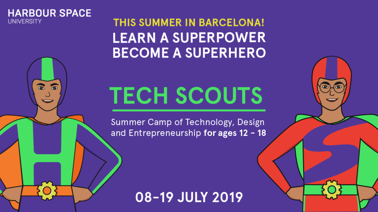

# Announcement

Hello Codeforces!

On [Monday, April 22, 2019 at 20:35UTC+6](https://codeforces.com/https://www.timeanddate.com/worldclock/fixedtime.html?day=22&month=4&year=2019&hour=17&min=35&sec=0&p1=166) [Educational Codeforces Round 63 (Rated for Div. 2)](https://codeforces.com/contest/1155 "Educational Codeforces Round 63 (Rated for Div. 2)") will start.

Series of Educational Rounds continue being held as [Harbour.Space University](https://codeforces.com/https://harbour.space/) initiative! You can read the details about the cooperation between [Harbour.Space University](https://codeforces.com/https://harbour.space/) and Codeforces in the [blog post](//codeforces.com/blog/entry/51208).

This round will be **rated for the participants with rating lower than 2100**. It will be held on extended ICPC rules. The penalty for each incorrect submission until the submission with a full solution is 10 minutes. After the end of the contest you will have 12 hours to hack any solution you want. You will have access to copy any solution and test it locally.

You will be given **6 problems** and **2 hours** to solve them.

The problems were invented and prepared by Roman [Roms](https://codeforces.com/profile/Roms "Master Roms") Glazov, Adilbek [adedalic](https://codeforces.com/profile/adedalic "International Master adedalic") Dalabaev, Vladimir [vovuh](https://codeforces.com/profile/vovuh "Candidate Master vovuh") Petrov, Ivan [BledDest](https://codeforces.com/profile/BledDest "Grandmaster BledDest") Androsov, Maksim [Neon](https://codeforces.com/profile/Neon "Candidate Master Neon") Mescheryakov and me. Also huge thanks to Mike [MikeMirzayanov](https://codeforces.com/profile/MikeMirzayanov "Headquarters, MikeMirzayanov") Mirzayanov for great systems Polygon and Codeforces.

Good luck to all participants!

Our friends at Harbour.Space also have a message for you:

Hi Codeforces!

This summer, we want to invite you to Tech Scouts, the two-week summer camp we run from the 8th-19th of July in one of Barcelona's leading international schools, St.Paul’s.

This camp, divided into Creative and Technical tracks, is designed to lay out the foundation of knowledge for high-school students in the fields of technology, mathematics, business and design. Both tracks are taught in English.

We would love to see you guys at our camp this year — if you’re interested in joining, or if you just want to know more, just head over to the [Tech Scouts website](https://codeforces.com/https://techscouts.harbour.space/). 

This camp is for anyone passionate about tech or design, so if you know someone who might be interested, be sure to let them know too!

Ps. Don’t wait too long — you still have an early bird discount, but only until May 20th

**UPD:** The round will contain 6 problems.

Congratulations to the winners: 

| Rank | Competitor | Problems Solved | Penalty |
| --- | --- | --- | --- |
| 1 | [Um_nik](https://codeforces.com/profile/Um_nik "Legendary Grandmaster Um_nik") | 6 | 111 |
| 2 | [Cirno_9baka](https://codeforces.com/profile/Cirno_9baka "Master Cirno_9baka") | 6 | 207 |
| 3 | [Ilovebxy](https://codeforces.com/profile/Ilovebxy "Candidate Master Ilovebxy") | 6 | 247 |
| 4 | [ivan100sic](https://codeforces.com/profile/ivan100sic "Grandmaster ivan100sic") | 6 | 249 |
| 5 | [ainta](https://codeforces.com/profile/ainta "Legendary Grandmaster ainta") | 6 | 411 |

Congratulations to the best hackers: 

| Rank | Competitor | Hack Count |
| --- | --- | --- |
| 1 | [halyavin](https://codeforces.com/profile/halyavin "Legendary Grandmaster halyavin") | **292****:-18** |
| 2 | [Haunted_Cpp](https://codeforces.com/profile/Haunted_Cpp "Specialist Haunted_Cpp") | **31** |
| 3 | [achaitanya.sai](https://codeforces.com/profile/achaitanya.sai "Expert achaitanya.sai") | **30****:-4** |
| 4 | [Disappointment](https://codeforces.com/profile/Disappointment "Specialist Disappointment") | **27****:-1** |
| 5 | [czasem_tak_trzeba](https://codeforces.com/profile/czasem_tak_trzeba "Candidate Master czasem_tak_trzeba") | **23** |

 790 successful hacks and 697 unsuccessful hacks were made in total!And finally people who were the first to solve each problem: 

| Problem | Competitor | Penalty |
| --- | --- | --- |
| A | [iaeyoayao](https://codeforces.com/profile/iaeyoayao "Expert iaeyoayao") | 0:01 |
| B | [MesyuraTheOldDumbGoblin](https://codeforces.com/profile/MesyuraTheOldDumbGoblin "Candidate Master MesyuraTheOldDumbGoblin") | 0:03 |
| C | [Nazikk](https://codeforces.com/profile/Nazikk "International Master Nazikk") | 0:07 |
| D | [JettyOller](https://codeforces.com/profile/JettyOller "Master JettyOller") | 0:07 |
| E | [Rezwan.Arefin01](https://codeforces.com/profile/Rezwan.Arefin01 "Candidate Master Rezwan.Arefin01") | 0:17 |
| F | [Um_nik](https://codeforces.com/profile/Um_nik "Legendary Grandmaster Um_nik") | 0:59 |

**UPD:** [The editorial is out](Tutorial_(en).md)

