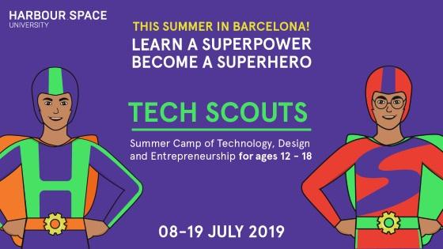

# Announcement

Hello Codeforces!

On [Wednesday, May 1, 2019 at 20:35UTC+6](https://codeforces.com/https://www.timeanddate.com/worldclock/fixedtime.html?day=1&month=5&year=2019&hour=17&min=35&sec=0&p1=166) [Educational Codeforces Round 64 (Rated for Div. 2)](https://codeforces.com/contest/1156 "Educational Codeforces Round 64 (Rated for Div. 2)") will start.

Series of Educational Rounds continue being held as [Harbour.Space University](https://codeforces.com/https://harbour.space/) initiative! You can read the details about the cooperation between [Harbour.Space University](https://codeforces.com/https://harbour.space/) and Codeforces in the [blog post](//codeforces.com/blog/entry/51208).

This round will be **rated for the participants with rating lower than 2100**. It will be held on extended ICPC rules. The penalty for each incorrect submission until the submission with a full solution is 10 minutes. After the end of the contest you will have 12 hours to hack any solution you want. You will have access to copy any solution and test it locally.

You will be given **7 problems** and **2 hours** to solve them.

The problems were invented and prepared by Roman [Roms](https://codeforces.com/profile/Roms "Master Roms") Glazov, Adilbek [adedalic](https://codeforces.com/profile/adedalic "International Master adedalic") Dalabaev, Vladimir [vovuh](https://codeforces.com/profile/vovuh "Candidate Master vovuh") Petrov, Ivan [BledDest](https://codeforces.com/profile/BledDest "Grandmaster BledDest") Androsov, Maksim [Neon](https://codeforces.com/profile/Neon "Candidate Master Neon") Mescheryakov and me. Also huge thanks to Mike [MikeMirzayanov](https://codeforces.com/profile/MikeMirzayanov "Headquarters, MikeMirzayanov") Mirzayanov for great systems Polygon and Codeforces.

Good luck to all participants!

Our friends at Harbour.Space also have a message for you:

Hi Codeforces!

[Harbour.Space University](https://codeforces.com/https://harbour.space/), [the International Tournament of Young Mathematicians (ITYM)](https://codeforces.com/http://www.itym.org/) and [St. Paul International School Barcelona](https://codeforces.com/https://www.stpauls.es/en/) have designed a special online test for high school students, to take place on **May 5th** at [**15.00 CET Time**](https://codeforces.com/https://www.timeanddate.com/worldclock/fixedtime.html?msg=Math+%26+CS+Online+test+&iso=20190505T17&p1=166).

You can take part in the online test if all the following conditions are met:

 1. Between the ages of 12 to 18,
2. Have not graduated from high school
3. Eligible to take part in IOI/IMO 2020.

  [Register (before May 3) →](https://codeforces.com/https://harbourspace.typeform.com/to/GHmTeJ) After the test, all participants will get a 20% discount link to attend Tech Scouts, the two-week summer camp we run from the 8th-19th of July in one of Barcelona's leading international schools, St.Paul’s, **and the most successful performers will be interviewed and awarded a full tuition waiver to attend the advanced level of the Advanced Technical Track of Tech Scouts**. 

In order to register for the contest, please fill out [**this form**](https://codeforces.com/https://harbourspace.typeform.com/to/GHmTeJ) before **May 3rd, 2019**. 

We would love to see you guys at our camp this year — if you’re interested in joining, or if you just want to know more, just head over to the [Tech Scouts website](https://codeforces.com/https://techscouts.harbour.space/). 

**UPD:** There are some minor issues with one of the problems, we'll use one of lesser-known problems by Maxim Babenko.

Congratulations to the winners: 

| Rank | Competitor | Problems Solved | Penalty |
| --- | --- | --- | --- |
| 1 | [step_by_step](https://codeforces.com/profile/step_by_step "International Grandmaster step_by_step") | 7 | 491 |
| 2 | [MyBotDear](https://codeforces.com/profile/MyBotDear "Unrated, MyBotDear") | 6 | 270 |
| 3 | [receed](https://codeforces.com/profile/receed "Grandmaster receed") | 6 | 280 |
| 4 | [I_love_Tanya_Romanova](https://codeforces.com/profile/I_love_Tanya_Romanova "International Grandmaster I_love_Tanya_Romanova") | 6 | 286 |
| 5 | [dreamoon_love_AA](https://codeforces.com/profile/dreamoon_love_AA "International Grandmaster dreamoon_love_AA") | 6 | 299 |

Congratulations to the best hackers: 

| Rank | Competitor | Hack Count |
| --- | --- | --- |
| 1 | [halyavin](https://codeforces.com/profile/halyavin "Legendary Grandmaster halyavin") | **64****:-3** |
| 2 | [achaitanya.sai](https://codeforces.com/profile/achaitanya.sai "Expert achaitanya.sai") | **39****:-23** |
| 3 | [wzw19991105](https://codeforces.com/profile/wzw19991105 "Expert wzw19991105") | **18****:-1** |
| 4 | [LiM_256](https://codeforces.com/profile/LiM_256 "Candidate Master LiM_256") | **14****:-1** |
| 5 | [patriot1488](https://codeforces.com/profile/patriot1488 "Expert patriot1488") | **2** |

 153 successful hacks and 180 unsuccessful hacks were made in total!And finally people who were the first to solve each problem: 

| Problem | Competitor | Penalty |
| --- | --- | --- |
| A | [halyavin](https://codeforces.com/profile/halyavin "Legendary Grandmaster halyavin") | 0:06 |
| B | [nuip](https://codeforces.com/profile/nuip "Grandmaster nuip") | 0:07 |
| C | [quailty](https://codeforces.com/profile/quailty "Grandmaster quailty") | 0:04 |
| D | [waynetuinfor](https://codeforces.com/profile/waynetuinfor "International Master waynetuinfor") | 0:11 |
| E | [step_by_step](https://codeforces.com/profile/step_by_step "International Grandmaster step_by_step") | 0:05 |
| F | [step_by_step](https://codeforces.com/profile/step_by_step "International Grandmaster step_by_step") | 0:15 |
| G | [step_by_step](https://codeforces.com/profile/step_by_step "International Grandmaster step_by_step") | 1:22 |

**UPD2:** [The editorial is out.](Tutorial_(en).md)

