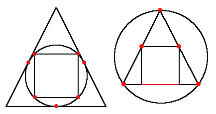

<h1 style='text-align: center;'> A. Inscribed Figures</h1>

<h5 style='text-align: center;'>time limit per test: 1 second</h5>
<h5 style='text-align: center;'>memory limit per test: 256 megabytes</h5>

The math faculty of Berland State University has suffered the sudden drop in the math skills of enrolling students. This year the highest grade on the entrance math test was 8. Out of 100! Thus, the decision was made to make the test easier.

Future students will be asked just a single question. They are given a sequence of integer numbers $a_1, a_2, \dots, a_n$, each number is from $1$ to $3$ and $a_i \ne a_{i + 1}$ for each valid $i$. The $i$-th number represents a type of the $i$-th figure:

1. circle;
2. isosceles triangle with the length of height equal to the length of base;
3. square.

The figures of the given sequence are placed somewhere on a Cartesian plane in such a way that:

* $(i + 1)$-th figure is inscribed into the $i$-th one;
* each triangle base is parallel to OX;
* the triangle is oriented in such a way that the vertex opposite to its base is at the top;
* each square sides are parallel to the axes;
* for each $i$ from $2$ to $n$ figure $i$ has the maximum possible length of side for triangle and square and maximum radius for circle.

## Note

 that the construction is unique for some fixed position and size of just the first figure.

The task is to calculate the number of distinct points (not necessarily with integer coordinates) where figures touch. The trick is, however, that the number is sometimes infinite. But that won't make the task difficult for you, will it?

So can you pass the math test and enroll into Berland State University?

#### Input

The first line contains a single integer $n$ ($2 \le n \le 100$) — the number of figures.

The second line contains $n$ integer numbers $a_1, a_2, \dots, a_n$ ($1 \le a_i \le 3$, $a_i \ne a_{i + 1}$) — types of the figures.

#### Output

The first line should contain either the word "Infinite" if the number of distinct points where figures touch is infinite or "Finite" otherwise.

If the number is finite than print it in the second line. It's guaranteed that the number fits into 32-bit integer type.

## Examples

#### Input


```text
3
2 1 3
```
#### Output


```text
Finite
7
```
#### Input


```text
3
1 2 3
```
#### Output


```text
Infinite
```
## Note

Here are the glorious pictures for the examples. 
## Note

 that the triangle is not equilateral but just isosceles with the length of height equal to the length of base. Thus it fits into a square in a unique way.

The distinct points where figures touch are marked red.

In the second example the triangle and the square touch each other for the whole segment, it contains infinite number of points.

  

#### Tags 

#1400 #NOT OK #geometry 

## Blogs
- [All Contest Problems](../Educational_Codeforces_Round_64_(Rated_for_Div._2).md)
- [Announcement](../blogs/Announcement.md)
- [Tutorial (en)](../blogs/Tutorial_(en).md)
