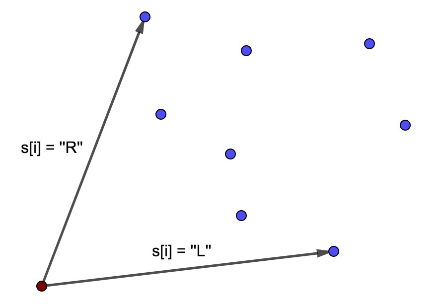

# Tutorial_(en)_(en)

### [1159A - A pile of stones](https://codeforces.com/contest/1159/problem/A "Codeforces Round 559 (Div. 2)")

Let's consider an array aa, there ai=1ai=1, if si=si="+" and ai=−1ai=−1, if si=si="-". 

Let's notice, that the answer ≥ak+1+…+an≥ak+1+…+an for all kk. It is true, because after making the first kk operations the number of stones will be ≥0≥0, so at the end the number of stones will be ≥ak+1+…+an≥ak+1+…+an.

Let's prove, that the answer is equal to ans=max0≤k≤n(ak+1+…+an)ans=max0≤k≤n(ak+1+…+an). We proved that it should be at least that number of stones. It's easy to see, that if we will take a1+…+an−ansa1+…+an−ans stones at the beginning, the pile will be non-empty each time when Vasya should take a stone and at the end, the number of stones will be equal to ansans.

Complexity: O(n)O(n).

Jury solution: [54047380](https://codeforces.com/contest/1159/submission/54047380 "Submission 54047380 by isaf27") 

### [1159B - Expansion coefficient of the array](https://codeforces.com/contest/1159/problem/B "Codeforces Round 559 (Div. 2)")

Let our array be a kk-extension. All inequalities k⋅|i−j|≤min(ai,aj)k⋅|i−j|≤min(ai,aj) for i≠ji≠j can be changed to k≤min(ai,aj)|i−j|k≤min(ai,aj)|i−j|. For all i=ji=j inequalities are always true, because all numbers are non-negative. 

So, the maximum possible value of kk is equal to the minimum of min(ai,aj)|i−j|min(ai,aj)|i−j| for all i<ji<j. Let's note, that min(ai,aj)|i−j|=min(ai|i−j|,aj|i−j|)min(ai,aj)|i−j|=min(ai|i−j|,aj|i−j|). So, we need to take a minimum of ai|i−j|ai|i−j| for all i≠ji≠j. If we will fix ii the minimum value for all jj is equal to aimax(i−1,n−i)aimax(i−1,n−i) and it is reached at the maximum denominator value, because ai≥0ai≥0.

So the answer is equal to min1≤i≤naimax(i−1,n−i)min1≤i≤naimax(i−1,n−i) and it can be simply found by linear time.

Complexity: O(n)O(n).

 Jury solution: [54047416](https://codeforces.com/contest/1159/submission/54047416 "Submission 54047416 by isaf27") 
### [1159C - The Party and Sweets](https://codeforces.com/contest/1159/problem/C "Codeforces Round 559 (Div. 2)")

Let's note, that for all 1≤i≤n,1≤j≤m1≤i≤n,1≤j≤m is is true, that bi≤gjbi≤gj, because bi≤aij≤gjbi≤aij≤gj. So max(b1,b2,…,bn)≤min(g1,g2,…,gm)max(b1,b2,…,bn)≤min(g1,g2,…,gm). If it is not true, the answer is −1−1.

Let's prove, that if max(b1,b2,…,bn)≤min(g1,g2,…,gm)max(b1,b2,…,bn)≤min(g1,g2,…,gm) the answer always exists and let's find it. Let's make all aij=biaij=bi. Let's note, that bi=min(ai1,ai2,…,aim)bi=min(ai1,ai2,…,aim). But in this case maximums in each column can be wrong. To make them correct we should place 1≤j≤m1≤j≤m into the jj-th column of the table aa the number gjgj. To make the sum as small as possible we want to place all gjgj into the row with maximal bibi. If we will make it the minimal in this row will be equal min(g1,g2,…,gm)min(g1,g2,…,gm). But the number bb for this row is equal to max(b1,b2,…,bn)max(b1,b2,…,bn). So, if max(b1,b2,…,bn)=min(g1,g2,…,gm)max(b1,b2,…,bn)=min(g1,g2,…,gm) the answer is equal to (b1+b2+…+bn)m+g1+g2+…+gm−max(b1,b2,…,bn)m(b1+b2+…+bn)m+g1+g2+…+gm−max(b1,b2,…,bn)m. But if max(b1,b2,…,bn)<min(g1,g2,…,gm)max(b1,b2,…,bn)<min(g1,g2,…,gm) we should place some of the gjgj in the other row. Let's place g1g1 into the row there bibi is second maximum in the array bb. It's easy to check in this case, that all minimums, maximums will be correct in this case. In this case the answer is equal to (b1+b2+…+bn)m+g1+g2+…+gm−max(b1,b2,…,bn)(m−1)−max2(b1,b2,…,bn)(b1+b2+…+bn)m+g1+g2+…+gm−max(b1,b2,…,bn)(m−1)−max2(b1,b2,…,bn).

So: 

* If max(b1,b2,…,bn)>min(g1,g2,…,gm)max(b1,b2,…,bn)>min(g1,g2,…,gm) the answer is −1−1;
* If max(b1,b2,…,bn)=min(g1,g2,…,gm)max(b1,b2,…,bn)=min(g1,g2,…,gm) the answer is (b1+b2+…+bn)m+g1+g2+…+gm−max(b1,b2,…,bn)m(b1+b2+…+bn)m+g1+g2+…+gm−max(b1,b2,…,bn)m;
* If max(b1,b2,…,bn)<min(g1,g2,…,gm)max(b1,b2,…,bn)<min(g1,g2,…,gm) the answer is (b1+b2+…+bn)m+g1+g2+…+gm−max(b1,b2,…,bn)(m−1)−max2(b1,b2,…,bn)(b1+b2+…+bn)m+g1+g2+…+gm−max(b1,b2,…,bn)(m−1)−max2(b1,b2,…,bn).

Maximum, second maximum in the array bb, minimum in the array gg and the sums in the arrays bb and gg can be easily computed in the linear time. So, we have a linear time solution.

Complexity: O(n+m)O(n+m).

 Jury solution: [54047456](https://codeforces.com/contest/1158/submission/54047456 "Submission 54047456 by isaf27") 
### [1159D - The minimal unique substring](https://codeforces.com/contest/1159/problem/D "Codeforces Round 559 (Div. 2)")

Let's define the value a=n−k2a=n−k2. We know, that (kmod2)=(nmod2)(kmod2)=(nmod2) so aa is integer number. Let's construct this string ss: aa symbols "0", 11 symbol "1", aa symbols "0", 11 symbol "1", …… Let's prove, that this string satisfy the conditions. Let's note, that it's period is equal to (a+1)(a+1). 

Let the substring tt be unique. Let's look at the only ll for this substring. But if l>a+1l>a+1, then l−(a+1)l−(a+1) satisfy (as the left border of the string tt occurrence), if l≤n−(a+|t|)l≤n−(a+|t|) then l+(a+1)l+(a+1) satisfy (because the period of ss is equal to (a+1)(a+1), so shift on (a+1)(a+1) don't change anything). So l≤a+1l≤a+1 and n−(a+|t|)<ln−(a+|t|)<l, because in other case ll can't be the only. So n−(a+|t|)<l≤a+1n−(a+|t|)<l≤a+1 so n−(a+|t|)<a+1n−(a+|t|)<a+1 so n−(a+|t|)≤an−(a+|t|)≤a so n−2⋅a≤|t|n−2⋅a≤|t| so k≤|t|k≤|t|. 

As the example of the unique substring of length kk we can take t=sa+1…sn−at=sa+1…sn−a.

Complexity: O(n)O(n).

Bonus: How to solve the problem without condition, that (kmod2)=(nmod2)(kmod2)=(nmod2)? For what kk the answer exists?

 Jury solution: [54047487](https://codeforces.com/contest/1158/submission/54047487 "Submission 54047487 by isaf27") 
### [1159E - Permutation recovery](https://codeforces.com/contest/1159/problem/E "Codeforces Round 559 (Div. 2)")

Note that if there are indices i<ji<j for which the values nextinexti and nextjnextj are defined and i<j<nexti<nextji<j<nexti<nextj are satisfied, then there is no answer. Suppose that this is not true and there exists permutation p1,p2,…,pnp1,p2,…,pn. Note that since j<nextij<nexti we get that pi>pjpi>pj (otherwise nextinexti would not be the minimum position in which the number is greater than pipi). But then pj<pi<pnextipj<pi<pnexti, so nextjnextj is not the minimum position for jj. Contradiction.

Now we prove that if for any pair of indices i<ji<j such condition is not satisfied, then the permutation always exists.

First, let's get rid of nexti=−1nexti=−1. If nexti=−1nexti=−1 let's say nexti=i+1nexti=i+1. Note that for any pair i<ji<j the condition i<j<nexti<nextji<j<nexti<nextj is still not satisfied (since nexti=i+1nexti=i+1 cannot take part in such inequality).

Consider the following rooted tree with n+1n+1 vertices: the vertex with index n+1n+1 will be the root, and the ancestor of the vertex with index ii will be nextinexti. Since it is always i<nextii<nexti we get the rooted tree. 

Let's run the depth first search algorithm (dfsdfs) from the vertex n+1n+1 in this tree. In this case, we will bypass the sons of each vertex in order from the smaller number to the larger one. Let's make some global variable timer=n+1timer=n+1. Each time we come to the vertex ii, we will make pi=timerpi=timer and reduce timertimer by 11. Note that p1,p2,…,pnp1,p2,…,pn will form a permutation of numbers from 11 to nn.

We prove that this permutation is the answer.

First of all, for all ii due to nextinexti was the ancestor of ii, we'll go there early and so pnexti>pipnexti>pi. Let i<j<nextii<j<nexti. We need to prove that we will come to the vertex jj later than to the vertex ii. Note that then the vertex nextinexti will be a descendant of jj in the tree, because if you start go from jj by nextnext, you cannot jump over nextinexti, because otherwise there is an index xx, for which the inequality i<x<nexti<nextxi<x<nexti<nextx is satisfied. But such pair of indexes ii, xx cannot exist. We'll get to jj later because the son of nextinexti, which is the ancestor of jj will be ≥j≥j, and thus >i>i. 

That is, we understood what is the criterion of the answer and learned how to quickly build an answer, if this criterion is satisfied. But we still need to check that this criterion is satisfied. This can be done by some simple linear algorithm. But we will do this: let's make an algorithm for constructing the answer (without checking the criterion) and find the permutation pp. Now, using the stack and the standard algorithm, we find the nextinexti values for it. If they match the given nextinexti, then we have found the answer, otherwise, let's say that there is no answer. If the criterion is satisfied we will find the answer and if not satisfied after checking pp we will say there are no answers.

Complexity: O(n)O(n) time and memory.

 Jury solution: [54047513](https://codeforces.com/contest/1158/submission/54047513 "Submission 54047513 by isaf27") 
### [1159F - Winding polygonal line](https://codeforces.com/contest/1159/problem/F "Codeforces Round 559 (Div. 2)")

Let's describe the algorithm, which is always finding the answer:

Let's find any point AiAi, lying at the convex hull of points A1,A2,…,AnA1,A2,…,An. We don't need to construct the convex hull for this, we can simply take the point with the minimal yy. This point will be the first in the permutation. 

Let's construct the polygonal line one by one. Let the last added point to the polygonal line be ApiApi. The point ApiApi should always lie at the convex hull of remaining points and ApiApi (at the beginning it is true). If si=si= "L" the next point be the most right point (sorted by angle) and if si=si= "R"the next point be the most left point (sorted by angle) from the remaining. This is the picture for this:

  It is easy to see, that the new point lies at the convex hull. The next rotation at the point Api+1Api+1 will be to the right side, because if si=si= "L" all other points lies from the left of the vector →ApiApi+1ApiApi+1−→−−−− and if si=si= "R" all other points lies from the right of the vector →ApiApi+1ApiApi+1−→−−−−.

To take the most left or right point, sorted by the angle from the remaining we will simply take minimum or maximum using the linear search. The point XX lies to the right of the point YY from the point ApiApi, if →ApiX×→ApiY>0ApiX−→−−×ApiY−→−−>0. The operation ×× is vectors multiply.

Complexity: O(n2)O(n2).

 Jury solution: [54047561](https://codeforces.com/contest/1158/submission/54047561 "Submission 54047561 by isaf27") 
### [1158E - Strange device](../problems/E._Strange_device.md "Codeforces Round 559 (Div. 1)")

The solution will consist of two parts.

1 part

Let's divide all points into sets with equal distance to the vertex 11. To do this, we will do the following algorithm. How to understand what set of points lies at a distance ⌊n2⌋⌊n2⌋ from the top of 11? Let's fill dd with zeros and make d1=⌊n2⌋d1=⌊n2⌋ for the first operation and d1=⌊n2⌋−1d1=⌊n2⌋−1 for the second operation. After that we will make 22 operations with such dd arrays. Those vertices whose bulbs did not light up during the first operation lie at a distance of >⌊n2⌋>⌊n2⌋. Those that caught fire at the first, but did not catch fire at the second operation lie at a distance of ⌊n2⌋⌊n2⌋. Finally, those who caught fire during the second operation lie at a distance of <⌊n2⌋<⌊n2⌋. Generalize this idea. We will store the set of distances for which we already know the set of vertices at lying such distance from 11 (we will call them good distances). Initially it is 00 (only vertex 11 at distance 00) and nn (empty vertex set at distance nn). We will also store between each pair of adjacent good distances l1<l2l1<l2 those vertices for which the distance is greater than l1l1, but less than l2l2. Now let's iterate over pairs of adjacent good distances l1<l2l1<l2. Take m=⌊l1+l22⌋m=⌊l1+l22⌋. Now the sets of vertices lying at distances greater than l1l1, but less than mm, exactly mm and more than mm, but less than l2l2 can be obtained using the two operations described at the beginning. With this action, we make mm a good distance. To do this in parallel for several pairs of adjacent good distances just iterate over pairs with even numbers and odd ones. Then as each of the cases would not be adjacent pairs, you can make two common operations. Thus, with the help of 44 operations, we will make the middle between all pairs of adjacent good distances also a good distance. If we divide in half, then for ⌈logn⌉⌈logn⌉ of divisions we will make all distances good. At this part we will spend 4⌈logn⌉4⌈logn⌉ operations.

2 part

For each vertex at the distance of l>0l>0 let's find the index of the ancestor vertex lying at a distance of l−1l−1 (which is the only one). Suppose we want to do this for only one distance l>0l>0. Note that if we make dv=1dv=1 for all v∈Sv∈S, for some subset of vertices SS lying at a distance l−1l−1, and for all other vertices 00, then among the vertices at a distance ll will include those whose ancestor belongs to SS. Then let's for all ii such that 2i<n2i<n choose SS as the set of vertices vv such that v−1v−1 contains ii-th bit in binary notation and lies at a distance of l−1l−1. Then, for each vertex at a distance of ll, we will know all the bits in the binary representation of its ancestor, that is, we will find this number. This process can also be done in parallel, if we take the distance ll, giving the same remainder of dividing by 33. Then, since these distances are not close, they will not interfere with each other. At this part we will spend 3⌈logn⌉3⌈logn⌉ operations.

In total we get a solution using 7⌈logn⌉7⌈logn⌉ operations.

Complexity: O(nlogn)O(nlogn).

Number of operations: 7⌈logn⌉7⌈logn⌉.

 Jury solution: [54047626](https://codeforces.com/contest/1158/submission/54047626 "Submission 54047626 by isaf27") 
### [1158F - Density of subarrays](../problems/F._Density_of_subarrays.md "Codeforces Round 559 (Div. 1)")

We have some cc-array aa. Let's find the criterion, that any cc-array of length pp is its subsequence. To check that cc-array bb is a subsequence of aa, we should iterate all elements of bb and take the most left occurrence of this symbol in aa, starting from the current moment. Because any cc-array should be a subsequence of aa on each step we can take the symbol the most left occurrence of such is the most right. Let's denote the positions, which we have taken on each step l1,l2,…,lpl1,l2,…,lp. So if we will look to the array a[li+1…li+1]a[li+1…li+1], in this arrays each of the cc symbols exists and the symbol ali+1ali+1 occurs exactly 11 time. Let's name such array "critical block". So the density of a≥pa≥p, if aa is the concatenation of pp consecutive critical blocks and some other symbols at the end.

Let's note, that the density of any array of length nn won't be more than k=nck=nc. It is obvious, because in any critical block at least cc symbols.

Let's find dpt,idpt,i as the number of subsequences of the array prefix a[1…i]a[1…i] that contain the position ii, which are divided into exactly tt critical arrays (and no other characters). We will consider it for all 1≤t≤k1≤t≤k and 1≤i≤n1≤i≤n. 

Let's first understand how to get an answer from these values, and then show how to calculate them. If we denote by ftft the number of subsequences whose density is ≥t≥t, then ft=n∑i=1dpt,i⋅2n−ift=∑i=1ndpt,i⋅2n−i. Next, note that the number of density subsequences exactly tt is anst=ft+1−ftanst=ft+1−ft.

Here are 22 different ways to calculate dpt,idpt,i:

1) denote by numi,jnumi,j the number of subsequences of array a[i…j]a[i…j] that contain jj and are critical. Then numi,j=c∏x=1,x≠aj(2cntx,i,j−1)numi,j=∏x=1,x≠ajc(2cntx,i,j−1), where cntx,i,jcntx,i,j — is the number of characters xx among a[i…j]a[i…j]. Then we can calculate numnum for O(n2c)O(n2c). To speed up this calculation to O(n2)O(n2) we will fix ii and increase jj by 11, supporting c∏x=1(2cntx,i,j−1)∏x=1c(2cntx,i,j−1). Then in such a product 11 multiplier will be changed and it can be recalculated by O(1)O(1). To get numi,jnumi,j, you simply divide the supported product by 2cntaj,i,j−12cntaj,i,j−1.

Then note that dpt,i=i−1∑j=0dpt−1,j⋅numj+1,idpt,i=∑j=0i−1dpt−1,j⋅numj+1,i (iterate over jj — the end of the previous critical block). This allows us to calculate the values of dpdp in time O(n2k)O(n2k).

2) We will need an auxiliary dinamical programming values ui,t,maskui,t,mask (where maskmask is a mask of characters, that is 0≤mask<2c0≤mask<2c), which means the number of ways to choose a subsequence from the prefix a[1…i]a[1…i], in which there will be first tt critical blocks and then several characters that are in maskmask, but each character from maskmask will be at the several symbols at least once. Then dpt,i=ui−1,t−1,2c−1−2aidpt,i=ui−1,t−1,2c−1−2ai, which follows from the definition. 

Conversion formulas are as follows: ui,t,mask=ui−1,t,maskui,t,mask=ui−1,t,mask, if aiai is not contained in maskmask and ui,t,mask=2ui−1,t,mask+ui−1,t,mask−2aiui,t,mask=2ui−1,t,mask+ui−1,t,mask−2ai, if aiai is contained in maskmask (if you take aiai in the subsequence and if not). For mask=0mask=0 it is true, that ui,t,0=ui−1,t,0+dpI,tui,t,0=ui−1,t,0+dpI,t.

These formulas can be used to calculate the values of uu and dpdp by iterating ii in increasing order over time O(nk2c)O(nk2c). The ii parameter can be omitted from memory because the recalculation is only from the previous layer.

In total, we get 22 ways to calculate dpdp working for O(n2k)O(n2k) and O(nk2c)O(nk2c). Recall that k=nck=nc. That is, our solutions work at the time O(n3c)O(n3c) and O(n22cc)O(n22cc). If c>lognc>logn, then let's run the first solution and it will work for O(n3logn)O(n3logn), otherwise if c≤lognc≤logn and 2cc≤nlogn2cc≤nlogn, so let's run the second solution, which will then work, too, in O(n3logn)O(n3logn) time.

If we carefully implement these 22 solutions and run them depending on cc, we get a solution with O(n3logn)O(n3logn) complexity and it is working fast enough.

Complexity: O(n3logn)O(n3logn) or O(n2c⋅min(n,2c))O(n2c⋅min(n,2c)).

 Jury solution: [54047665](https://codeforces.com/contest/1158/submission/54047665 "Submission 54047665 by isaf27")