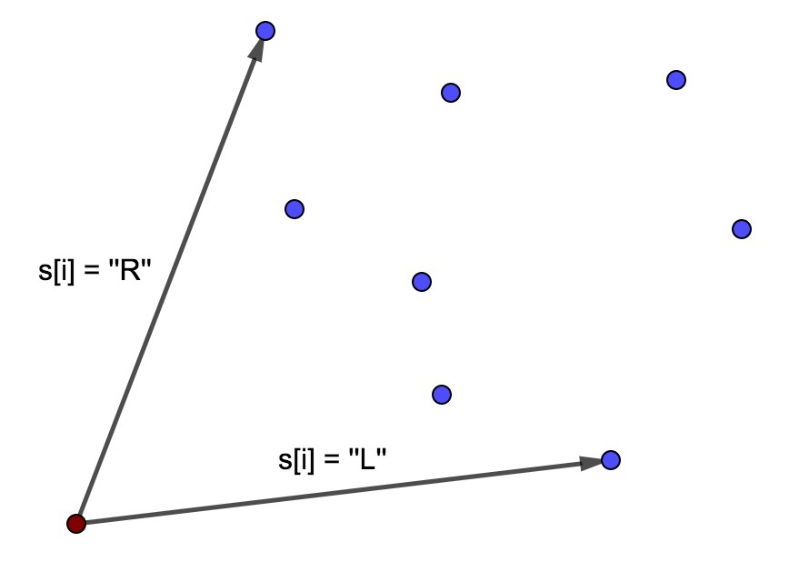

# Tutorial_2_(ru)

### [1159A - A pile of stones](../problems/A._A_pile_of_stones.md "Codeforces Round 559 (Div. 2)")

Let's consider an array a, there ai=1, if si="+" and ai=−1, if si="-". 

Let's notice, that the answer ≥ak+1+…+an for all k. It is true, because after making the first k operations the number of stones will be ≥0, so at the end the number of stones will be ≥ak+1+…+an.

Let's prove, that the answer is equal to ans=max. We proved that it should be at least that number of stones. It's easy to see, that if we will take a_1 + \ldots + a_n - ans stones at the beginning, the pile will be non-empty each time when Vasya should take a stone and at the end, the number of stones will be equal to ans.

Complexity: O(n).

Jury solution: [54047380](https://codeforces.com/contest/1159/submission/54047380 "Submission 54047380 by isaf27") 

### [1159B - Expansion coefficient of the array](../problems/B._Expansion_coefficient_of_the_array.md "Codeforces Round 559 (Div. 2)")

Let our array be a $k$-extension. All inequalities $k \cdot |i - j| \leq min(a_i, a_j)$ for $i \neq j$ can be changed to $k \leq \frac{min(a_i, a_j)}{|i - j|}$. For all $i = j$ inequalities are always true, because all numbers are non-negative. 

So, the maximum possible value of $k$ is equal to the minimum of $\frac{min(a_i, a_j)}{|i - j|}$ for all $i < j$. Let's note, that $\frac{min(a_i, a_j)}{|i - j|} = min(\frac{a_i}{|i-j|}, \frac{a_j}{|i-j|})$. So, we need to take a minimum of $\frac{a_i}{|i-j|}$ for all $i \neq j$. If we will fix $i$ the minimum value for all $j$ is equal to $\frac{a_i}{max(i - 1, n - i)}$ and it is reached at the maximum denominator value, because $a_i \geq 0$.

So the answer is equal to $\min\limits_{1 \leq i \leq n} \frac{a_i}{max(i - 1, n - i)}$ and it can be simply found by linear time.

Complexity: $O(n)$.

 Jury solution: [54047416](https://codeforces.com/contest/1159/submission/54047416 "Submission 54047416 by isaf27") 
### [1159C - The Party and Sweets](https://codeforces.com/contest/1159/problem/C "Codeforces Round 559 (Div. 2)")

Let's note, that for all $1 \leq i \leq n, 1 \leq j \leq m$ is is true, that $b_i \leq g_j$, because $b_i \leq a_{{i}{j}} \leq g_j$. So $max(b_1, b_2, \ldots, b_n) \leq min(g_1, g_2, \ldots, g_m)$. If it is not true, the answer is $-1$.

Let's prove, that if $max(b_1, b_2, \ldots, b_n) \leq min(g_1, g_2, \ldots, g_m)$ the answer always exists and let's find it. Let's make all $a_{{i}{j}} = b_i$. Let's note, that $b_i = min(a_{{i}{1}}, a_{{i}{2}}, \ldots, a_{{i}{m}})$. But in this case maximums in each column can be wrong. To make them correct we should place $1 \leq j \leq m$ into the $j$-th column of the table $a$ the number $g_j$. To make the sum as small as possible we want to place all $g_j$ into the row with maximal $b_i$. If we will make it the minimal in this row will be equal $min(g_1, g_2, \ldots, g_m)$. But the number $b$ for this row is equal to $max(b_1, b_2, \ldots, b_n)$. So, if $max(b_1, b_2, \ldots, b_n) = min(g_1, g_2, \ldots, g_m)$ the answer is equal to $(b_1 + b_2 + \ldots + b_n) m + g_1 + g_2 + \ldots + g_m - max(b_1, b_2, \ldots, b_n) m$. But if $max(b_1, b_2, \ldots, b_n) < min(g_1, g_2, \ldots, g_m)$ we should place some of the $g_j$ in the other row. Let's place $g_1$ into the row there $b_i$ is second maximum in the array $b$. It's easy to check in this case, that all minimums, maximums will be correct in this case. In this case the answer is equal to $(b_1 + b_2 + \ldots + b_n) m + g_1 + g_2 + \ldots + g_m - max(b_1, b_2, \ldots, b_n) (m - 1) - max_2(b_1, b_2, \ldots, b_n)$.

So: 

* If $max(b_1, b_2, \ldots, b_n) > min(g_1, g_2, \ldots, g_m)$ the answer is $-1$;
* If $max(b_1, b_2, \ldots, b_n) = min(g_1, g_2, \ldots, g_m)$ the answer is $(b_1 + b_2 + \ldots + b_n) m + g_1 + g_2 + \ldots + g_m - max(b_1, b_2, \ldots, b_n) m$;
* If $max(b_1, b_2, \ldots, b_n) < min(g_1, g_2, \ldots, g_m)$ the answer is $(b_1 + b_2 + \ldots + b_n) m + g_1 + g_2 + \ldots + g_m - max(b_1, b_2, \ldots, b_n) (m - 1) - max_2(b_1, b_2, \ldots, b_n)$.

Maximum, second maximum in the array $b$, minimum in the array $g$ and the sums in the arrays $b$ and $g$ can be easily computed in the linear time. So, we have a linear time solution.

Complexity: $O(n + m)$.

 Jury solution: [54047456](https://codeforces.com/contest/1158/submission/54047456 "Submission 54047456 by isaf27") 
### [1159D - The minimal unique substring](https://codeforces.com/contest/1159/problem/D "Codeforces Round 559 (Div. 2)")

Let's define the value $a = \frac {n-k} 2$. We know, that $(k \bmod 2) = (n \bmod 2)$ so $a$ is integer number. Let's construct this string $s$: $a$ symbols "0", $1$ symbol "1", $a$ symbols "0", $1$ symbol "1", $\ldots$ Let's prove, that this string satisfy the conditions. Let's note, that it's period is equal to $(a+1)$. 

Let the substring $t$ be unique. Let's look at the only $l$ for this substring. But if $l > a + 1$, then $l - (a + 1)$ satisfy (as the left border of the string $t$ occurrence), if $l \leq n - (a + |t|)$ then $l + (a + 1)$ satisfy (because the period of $s$ is equal to $(a + 1)$, so shift on $(a + 1)$ don't change anything). So $l \leq a + 1$ and $n - (a + |t|) < l$, because in other case $l$ can't be the only. So $n - (a + |t|) < l \leq a + 1$ so $n - (a + |t|) < a + 1$ so $n - (a + |t|) \leq a$ so $n - 2 \cdot a \leq |t|$ so $k \leq |t|$. 

As the example of the unique substring of length $k$ we can take $t = s_{a+1} \ldots s_{n-a}$.

Complexity: $O(n)$.

Bonus: How to solve the problem without condition, that $(k \bmod 2) = (n \bmod 2)$? For what $k$ the answer exists?

 Jury solution: [54047487](https://codeforces.com/contest/1158/submission/54047487 "Submission 54047487 by isaf27") 
### [1159E - Permutation recovery](https://codeforces.com/contest/1159/problem/E "Codeforces Round 559 (Div. 2)")

Note that if there are indices $i < j$ for which the values $next_i$ and $next_j$ are defined and $i < j < next_i < next_j$ are satisfied, then there is no answer. Suppose that this is not true and there exists permutation $p_1, p_2, \ldots, p_n$. Note that since $j < next_i$ we get that $p_i > p_j$ (otherwise $next_i$ would not be the minimum position in which the number is greater than $p_i$). But then $p_j < p_i < p_{next_i}$, so $next_j$ is not the minimum position for $j$. Contradiction.

Now we prove that if for any pair of indices $i < j$ such condition is not satisfied, then the permutation always exists.

First, let's get rid of $next_i = -1$. If $next_i = -1$ let's say $next_i = i + 1$. Note that for any pair $i < j$ the condition $i < j < next_i < next_j$ is still not satisfied (since $next_i = i + 1$ cannot take part in such inequality).

Consider the following rooted tree with $n + 1$ vertices: the vertex with index $n + 1$ will be the root, and the ancestor of the vertex with index $i$ will be $next_i$. Since it is always $i < next_i$ we get the rooted tree. 

Let's run the depth first search algorithm ($dfs$) from the vertex $n + 1$ in this tree. In this case, we will bypass the sons of each vertex in order from the smaller number to the larger one. Let's make some global variable $timer = n + 1$. Each time we come to the vertex $i$, we will make $p_i = timer$ and reduce $timer$ by $1$. Note that $p_1, p_2, \ldots, p_n$ will form a permutation of numbers from $1$ to $n$.

We prove that this permutation is the answer.

First of all, for all $i$ due to $next_i$ was the ancestor of $i$, we'll go there early and so $p_{next_i} > p_i$. Let $i < j < next_i$. We need to prove that we will come to the vertex $j$ later than to the vertex $i$. Note that then the vertex $next_i$ will be a descendant of $j$ in the tree, because if you start go from $j$ by $next$, you cannot jump over $next_i$, because otherwise there is an index $x$, for which the inequality $i < x < next_i < next_x$ is satisfied. But such pair of indexes $i$, $x$ cannot exist. We'll get to $j$ later because the son of $next_i$, which is the ancestor of $j$ will be $\geq j$, and thus $> i$. 

That is, we understood what is the criterion of the answer and learned how to quickly build an answer, if this criterion is satisfied. But we still need to check that this criterion is satisfied. This can be done by some simple linear algorithm. But we will do this: let's make an algorithm for constructing the answer (without checking the criterion) and find the permutation $p$. Now, using the stack and the standard algorithm, we find the $next_i$ values for it. If they match the given $next_i$, then we have found the answer, otherwise, let's say that there is no answer. If the criterion is satisfied we will find the answer and if not satisfied after checking $p$ we will say there are no answers.

Complexity: $O(n)$ time and memory.

 Jury solution: [54047513](https://codeforces.com/contest/1158/submission/54047513 "Submission 54047513 by isaf27") 
### [1159F - Winding polygonal line](https://codeforces.com/contest/1159/problem/F "Codeforces Round 559 (Div. 2)")

Let's describe the algorithm, which is always finding the answer:

Let's find any point $A_i$, lying at the convex hull of points $A_1, A_2, \ldots, A_n$. We don't need to construct the convex hull for this, we can simply take the point with the minimal $y$. This point will be the first in the permutation. 

Let's construct the polygonal line one by one. Let the last added point to the polygonal line be $A_{p_i}$. The point $A_{p_i}$ should always lie at the convex hull of remaining points and $A_{p_i}$ (at the beginning it is true). If $s_i = $ "L" the next point be the most right point (sorted by angle) and if $s_i = $ "R"the next point be the most left point (sorted by angle) from the remaining. This is the picture for this:

  It is easy to see, that the new point lies at the convex hull. The next rotation at the point $A_{p_{i+1}}$ will be to the right side, because if $s_i = $ "L" all other points lies from the left of the vector $\overrightarrow{A_{p_i} A_{p_{i+1}}}$ and if $s_i = $ "R" all other points lies from the right of the vector $\overrightarrow{A_{p_i} A_{p_{i+1}}}$.

To take the most left or right point, sorted by the angle from the remaining we will simply take minimum or maximum using the linear search. The point $X$ lies to the right of the point $Y$ from the point $A_{p_i}$, if $\overrightarrow{A_{p_i} X} \times \overrightarrow{A_{p_i} Y} > 0$. The operation $\times$ is vectors multiply.

Complexity: $O(n^2)$.

 Jury solution: [54047561](https://codeforces.com/contest/1158/submission/54047561 "Submission 54047561 by isaf27") 
### [1158E - Strange device](https://codeforces.com/contest/1158/problem/E "Codeforces Round 559 (Div. 1)")

The solution will consist of two parts.

1 part

Let's divide all points into sets with equal distance to the vertex $1$. To do this, we will do the following algorithm. How to understand what set of points lies at a distance $\lfloor \frac{n}{2} \rfloor$ from the top of $1$? Let's fill $d$ with zeros and make $d_1 = \lfloor \frac{n}{2} \rfloor$ for the first operation and $d_1 = \lfloor \frac{n}{2} \rfloor - 1$ for the second operation. After that we will make $2$ operations with such $d$ arrays. Those vertices whose bulbs did not light up during the first operation lie at a distance of $> \lfloor \frac{n}{2} \rfloor$. Those that caught fire at the first, but did not catch fire at the second operation lie at a distance of $\lfloor \frac{n}{2} \rfloor$. Finally, those who caught fire during the second operation lie at a distance of $< \lfloor \frac{n}{2} \rfloor$. Generalize this idea. We will store the set of distances for which we already know the set of vertices at lying such distance from $1$ (we will call them good distances). Initially it is $0$ (only vertex $1$ at distance $0$) and $n$ (empty vertex set at distance $n$). We will also store between each pair of adjacent good distances $l_1 < l_2$ those vertices for which the distance is greater than $l_1$, but less than $l_2$. Now let's iterate over pairs of adjacent good distances $l_1 < l_2$. Take $m = \lfloor \frac{l_1 + l_2}{2} \rfloor$. Now the sets of vertices lying at distances greater than $l_1$, but less than $m$, exactly $m$ and more than $m$, but less than $l_2$ can be obtained using the two operations described at the beginning. With this action, we make $m$ a good distance. To do this in parallel for several pairs of adjacent good distances just iterate over pairs with even numbers and odd ones. Then as each of the cases would not be adjacent pairs, you can make two common operations. Thus, with the help of $4$ operations, we will make the middle between all pairs of adjacent good distances also a good distance. If we divide in half, then for $\lceil \log{n} \rceil$ of divisions we will make all distances good. At this part we will spend $4 \lceil \log{n} \rceil$ operations.

2 part

For each vertex at the distance of $l > 0$ let's find the index of the ancestor vertex lying at a distance of $l-1$ (which is the only one). Suppose we want to do this for only one distance $l > 0$. Note that if we make $d_v = 1$ for all $v \in S$, for some subset of vertices $S$ lying at a distance $l-1$, and for all other vertices $0$, then among the vertices at a distance $l$ will include those whose ancestor belongs to $S$. Then let's for all $i$ such that $2^i < n$ choose $S$ as the set of vertices $v$ such that $v - 1$ contains $i$-th bit in binary notation and lies at a distance of $l-1$. Then, for each vertex at a distance of $l$, we will know all the bits in the binary representation of its ancestor, that is, we will find this number. This process can also be done in parallel, if we take the distance $l$, giving the same remainder of dividing by $3$. Then, since these distances are not close, they will not interfere with each other. At this part we will spend $3 \lceil \log{n} \rceil$ operations.

In total we get a solution using $7 \lceil \log{n} \rceil$ operations.

Complexity: $O(n \log{n})$.

Number of operations: $7 \lceil \log{n} \rceil$.

 Jury solution: [54047626](https://codeforces.com/contest/1158/submission/54047626 "Submission 54047626 by isaf27") 
### [1158F - Density of subarrays](https://codeforces.com/contest/1158/problem/F "Codeforces Round 559 (Div. 1)")

We have some $c$-array $a$. Let's find the criterion, that any $c$-array of length $p$ is its subsequence. To check that $c$-array $b$ is a subsequence of $a$, we should iterate all elements of $b$ and take the most left occurrence of this symbol in $a$, starting from the current moment. Because any $c$-array should be a subsequence of $a$ on each step we can take the symbol the most left occurrence of such is the most right. Let's denote the positions, which we have taken on each step $l_1, l_2, \ldots, l_p$. So if we will look to the array $a[l_i+1 \ldots l_{i+1}]$, in this arrays each of the $c$ symbols exists and the symbol $a_{l_{i+1}}$ occurs exactly $1$ time. Let's name such array "critical block". So the density of $a \geq p$, if $a$ is the concatenation of $p$ consecutive critical blocks and some other symbols at the end.

Let's note, that the density of any array of length $n$ won't be more than $k = \frac{n}{c}$. It is obvious, because in any critical block at least $c$ symbols.

Let's find $dp_{{t},{i}}$ as the number of subsequences of the array prefix $a[1 \ldots i]$ that contain the position $i$, which are divided into exactly $t$ critical arrays (and no other characters). We will consider it for all $1 \leq t \leq k$ and $1 \leq i \leq n$. 

Let's first understand how to get an answer from these values, and then show how to calculate them. If we denote by $f_t$ the number of subsequences whose density is $\geq t$, then $f_t = \sum\limits_{i=1}^n{dp_ {t},{i}} \cdot 2^{n - i}$. Next, note that the number of density subsequences exactly $t$ is $ans_t = f_{t+1} - f_t$.

Here are $2$ different ways to calculate $dp_{{t},{i}}$:

1) denote by $num_{{i},{j}}$ the number of subsequences of array $a[i \ldots j]$ that contain $j$ and are critical. Then $num_{{i},{j}} = \prod\limits_{x=1, x \neq a_j}^{c}{(2^{cnt_{{x},{i},{j}}} - 1)}$, where $cnt_{{x},{i},{j}}$ — is the number of characters $x$ among $a[i \ldots j]$. Then we can calculate $num$ for $O(n^2 c)$. To speed up this calculation to $O(n^2)$ we will fix $i$ and increase $j$ by $1$, supporting $\prod\limits_{x=1}^{c}{(2^{cnt_{{x},{i},{j}}} - 1)}$. Then in such a product $1$ multiplier will be changed and it can be recalculated by $O(1)$. To get $num_{{i},{j}}$, you simply divide the supported product by $2^{cnt_{{a_j},{i},{j}}} - 1$.

Then note that $dp_{{t},{i}} = \sum\limits_{j=0}^{i - 1}{dp_{{t-1},{j}}} \cdot num_{{j+1},{i}}$ (iterate over $j$ — the end of the previous critical block). This allows us to calculate the values of $dp$ in time $O(n^2 k)$.

2) We will need an auxiliary dinamical programming values $u_{{i},{t},{mask}}$ (where $mask$ is a mask of characters, that is $0 \leq mask < 2^c$), which means the number of ways to choose a subsequence from the prefix $a[1 \ldots i]$, in which there will be first $t$ critical blocks and then several characters that are in $mask$, but each character from $mask$ will be at the several symbols at least once. Then $dp_{{t},{i}} = u_{{i-1},{t-1},{2^c - 1 - 2^{a_i}}}$, which follows from the definition. 

Conversion formulas are as follows: $u_{{i},{t},{mask}} = u_{{i-1},{t},{mask}}$, if $a_i$ is not contained in $mask$ and $u_{{i},{t},{mask}} = 2 u_{{i-1},{t},{mask}} + u_{{i-1},{t},{mask - 2^{a_i}}}$, if $a_i$ is contained in $mask$ (if you take $a_i$ in the subsequence and if not). For $mask = 0$ it is true, that $u_{{i},{t},{0}} = u_{{i-1},{t},{0}} + dp_{{I},{t}}$.

These formulas can be used to calculate the values of $u$ and $dp$ by iterating $i$ in increasing order over time $O(n k 2^c)$. The $i$ parameter can be omitted from memory because the recalculation is only from the previous layer.

In total, we get $2$ ways to calculate $dp$ working for $O(n^2 k)$ and $O(n k 2^c)$. Recall that $k = \frac{n}{c}$. That is, our solutions work at the time $O(\frac{n^3}{c})$ and $O(\frac{n^2 2^c}{c})$. If $c > \log{n}$, then let's run the first solution and it will work for $O(\frac{n^3}{\log{n}})$, otherwise if $c \leq \log{n}$ and $\frac{2^c}{c} \leq \frac{n}{\log{n}}$, so let's run the second solution, which will then work, too, in $O(\frac{n^3}{\log{n}})$ time.

If we carefully implement these $2$ solutions and run them depending on $c$, we get a solution with $O(\frac{n^3}{\log{n}})$ complexity and it is working fast enough.

Complexity: $O(\frac{n^3}{\log{n}})$ or $O(\frac{n^2}{c} \cdot min(n, 2^c))$.

 Jury solution: [54047665](https://codeforces.com/contest/1158/submission/54047665 "Submission 54047665 by isaf27")