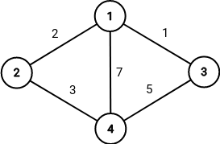
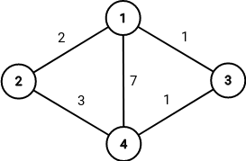
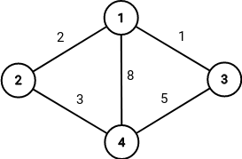

<h1 style='text-align: center;'> F. Indecisive Taxi Fee</h1>

<h5 style='text-align: center;'>time limit per test: 2 seconds</h5>
<h5 style='text-align: center;'>memory limit per test: 512 megabytes</h5>

In the city of Capypaland where Kuro and Shiro resides, there are $n$ towns numbered from $1$ to $n$ and there are $m$ bidirectional roads numbered from $1$ to $m$ connecting them. The $i$-th road connects towns $u_i$ and $v_i$. Since traveling between the towns is quite difficult, the taxi industry is really popular here. To survive the harsh competition, each taxi company has to find a distinctive trait for their customers.

Kuro is the owner of a taxi company. He has decided to introduce a new fee model for his taxi brand, where the fee for each ride is not calculated based on the trip length, but on the sum of the prices of the roads traveled. The price for each of the $m$ roads has been decided by Kuro himself.

As of now, the price for the road $i$ is $w_i$ and hence the fee for a taxi ride traveling through roads $e_1, e_2, \ldots, e_k$ is $\sum_{i=1}^k w_{e_i}$.

However, Kuro himself is an indecisive person, so he has drafted $q$ plans to change the road price. Each of the plans will be based on the original prices $w_i$, except for a single road $t_j$, the price of which is changed to $x_j$. 
## Note

, that the plans are independent of each other.

Shiro is a regular customer of the Kuro's taxi brand since she uses the taxi to travel from town $1$ to town $n$ every day. Since she's so a regular customer, Kuro decided to show her all his $q$ plans before publishing them to the public. Now, Shiro wants to know the lowest fee she must pay to travel from the town $1$ to the town $n$ for each Kuro's plan.

##### Input

The first line contains three integers $n$, $m$ and $q$ ($2 \le n \le 2 \cdot 10^5$, $1 \le m, q \le 2 \cdot 10^5$) — the number of towns, the number of roads, and the number of plans that Kuro has drafted respectively.

The $i$-th of the next $m$ contains three integers $u_i$, $v_i$ and $w_i$ ($1 \le u_i, v_i \le n$, $1 \le w_i \le 10^9$, $u_i \ne v_i$) — two endpoints and the original price of the $i$-th road.

It is guaranteed, that there is at least one way to travel from town $1$ to town $n$ using these $m$ bidirectional roads.

Each of the next $q$ lines contains two integers $t_j$ and $x_j$ ($1 \leq t_j \leq m, 1 \leq x_j \leq 10^9$) — the index of the road Kuro has planned to change and its new price respectively.

##### Output

Print $q$ integers — the lowest fee Shiro must pay to get from town $1$ to town $n$ in each of those $q$ plans.

## Examples

##### Input


```text
4 5 6
1 2 2
2 4 3
1 4 7
1 3 1
3 4 5
3 4
5 1
3 8
1 4
2 1
3 1
```
##### Output


```text
4
2
5
6
3
1
```
##### Input


```text
2 4 4
1 2 2
1 2 3
1 2 4
1 2 5
2 1
3 2
4 3
1 5
```
##### Output


```text
1
2
2
3
```
##### Input


```text
2 1 1
1 2 1
1 3
```
##### Output


```text
3
```
## Note

In the first example, the original overview of Capypaland looks like this, where the number next to each road denotes the original prices of the roads,

  The overview of the first plan,

  The lowest fee Shiro must pay in this plan is $4$, which corresponds to the path $1 \rightarrow 4$.

The overview of the second plan,

  The lowest fee Shiro must pay in this plan is $2$, which corresponds to the path $1 \rightarrow 3 \rightarrow 4$.

The overview of the third plan,

  The lowest fee Shiro must pay in this plan is $5$, which corresponds to the path $1 \rightarrow 2 \rightarrow 4$.


#### Tags 

#3000 #NOT OK #data_structures #graphs #shortest_paths 

## Blogs
- [All Contest Problems](../Codeforces_Round_558_(Div._2).md)
- [Announcement (en)](../blogs/Announcement_(en).md)
- [Tutorial (en)](../blogs/Tutorial_(en).md)
