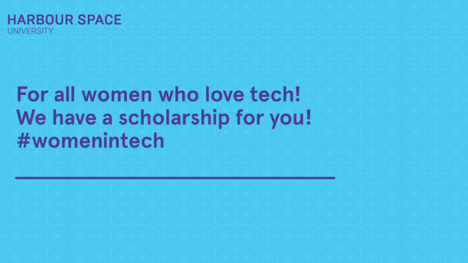

# Announcement

Hello Codeforces!

On [Wednesday, May 15, 2019 at 20:35UTC+6](https://codeforces.com/https://www.timeanddate.com/worldclock/fixedtime.html?day=15&month=5&year=2019&hour=17&min=35&sec=0&p1=166) [Educational Codeforces Round 65 (Rated for Div. 2)](https://codeforces.com/contest/1167 "Educational Codeforces Round 65 (Rated for Div. 2)") will start.

Series of Educational Rounds continue being held as [Harbour.Space University](https://codeforces.com/https://harbour.space/) initiative! You can read the details about the cooperation between [Harbour.Space University](https://codeforces.com/https://harbour.space/) and Codeforces in the [blog post](//codeforces.com/blog/entry/51208).

This round will be **rated for the participants with rating lower than 2100**. It will be held on extended ICPC rules. The penalty for each incorrect submission until the submission with a full solution is 10 minutes. After the end of the contest you will have 12 hours to hack any solution you want. You will have access to copy any solution and test it locally.

You will be given **7 problems** and **2 hours** to solve them.

The problems were invented and prepared by Roman [Roms](https://codeforces.com/profile/Roms "Master Roms") Glazov, Adilbek [adedalic](https://codeforces.com/profile/adedalic "International Master adedalic") Dalabaev, Vladimir [vovuh](https://codeforces.com/profile/vovuh "Candidate Master vovuh") Petrov, Ivan [BledDest](https://codeforces.com/profile/BledDest "Grandmaster BledDest") Androsov, Maksim [Neon](https://codeforces.com/profile/Neon "Candidate Master Neon") Mescheryakov and me. Also huge thanks to Mike [MikeMirzayanov](https://codeforces.com/profile/MikeMirzayanov "Headquarters, MikeMirzayanov") Mirzayanov for great systems Polygon and Codeforces.

Good luck to all participants!

Our friends at Harbour.Space also have a message for you:

Hello Codeforces! 

We are collaborating with an external sponsor who is offering **a unique scholarship opportunity for women who want to study Cybersecurity or Fintech**, both for Bachelors and Masters level. 

**The scholarship includes:** 

 * An up to $10,000, one-time financial award, paid to the University
* An all-expenses-paid trip to the EMEA Summit 28-30 October, 2019 in Berlin
* A Cybersecurity professional to serve as an industry mentor

**Apply before May 30th** and Harbour.Space will also consider you for a scholarship from our own funds. 

Don't miss this chance to study with us in Barcelona!

If you have questions about the scholarship, please contact us at [hello@harbour.space!](https://codeforces.com/mailto:hello@harbour.space!) 

  [APPLY HERE→](https://codeforces.com/https://harbour.space/register) Congratulations to the winners: 

| Rank | Competitor | Problems Solved | Penalty |
| --- | --- | --- | --- |
| 1 | [Radewoosh](https://codeforces.com/profile/Radewoosh "Legendary Grandmaster Radewoosh") | 7 | 174 |
| 2 | [mnbvmar](https://codeforces.com/profile/mnbvmar "Legendary Grandmaster mnbvmar") | 7 | 183 |
| 3 | [I_love_Tanya_Romanova](https://codeforces.com/profile/I_love_Tanya_Romanova "International Grandmaster I_love_Tanya_Romanova") | 6 | 119 |
| 4 | [Farhod](https://codeforces.com/profile/Farhod "International Master Farhod") | 6 | 124 |
| 5 | [xiaowuc1](https://codeforces.com/profile/xiaowuc1 "Grandmaster xiaowuc1") | 6 | 142 |

Congratulations to the best hackers: 

| Rank | Competitor | Hack Count |
| --- | --- | --- |
| 1 | [algmyr](https://codeforces.com/profile/algmyr "Candidate Master algmyr") | **57****:-1** |
| 2 | [mnbvmar](https://codeforces.com/profile/mnbvmar "Legendary Grandmaster mnbvmar") | **16****:-2** |
| 3 | [xavier_cai](https://codeforces.com/profile/xavier_cai "Expert xavier_cai") | **11****:-1** |
| 4 | [halyavin](https://codeforces.com/profile/halyavin "Legendary Grandmaster halyavin") | **10****:-3** |
| 5 | [avm](https://codeforces.com/profile/avm "Expert avm") | **7** |

 291 successful hacks and 306 unsuccessful hacks were made in total!And finally people who were the first to solve each problem: 

| Problem | Competitor | Penalty |
| --- | --- | --- |
| A | [Dalgerok](https://codeforces.com/profile/Dalgerok "Candidate Master Dalgerok") | 0:01 |
| B | [Farhod](https://codeforces.com/profile/Farhod "International Master Farhod") | 0:05 |
| C | [sillysilly](https://codeforces.com/profile/sillysilly "Master sillysilly") | 0:04 |
| D | [nuip](https://codeforces.com/profile/nuip "Grandmaster nuip") | 0:10 |
| E | [Farhod](https://codeforces.com/profile/Farhod "International Master Farhod") | 0:23 |
| F | [ugly2333](https://codeforces.com/profile/ugly2333 "International Grandmaster ugly2333") | 0:13 |
| G | [Dukkha](https://codeforces.com/profile/Dukkha "Candidate Master Dukkha") | 0:57 |

**UPD:** [Editorial is out](Tutorial.md)

