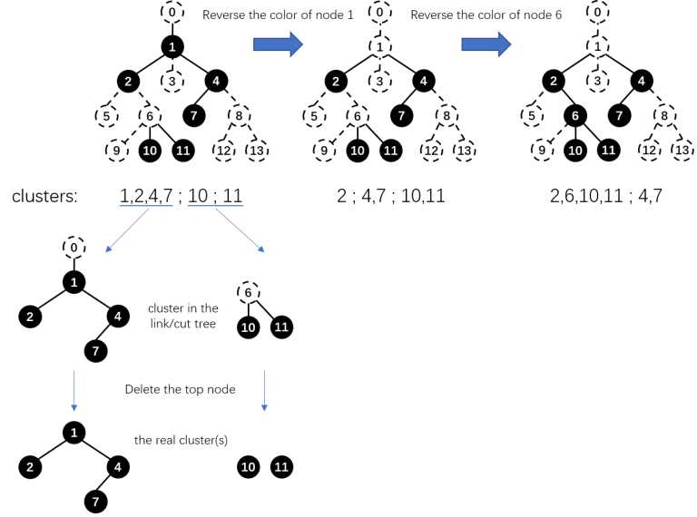
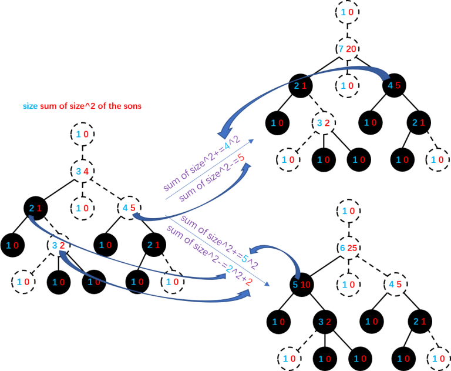
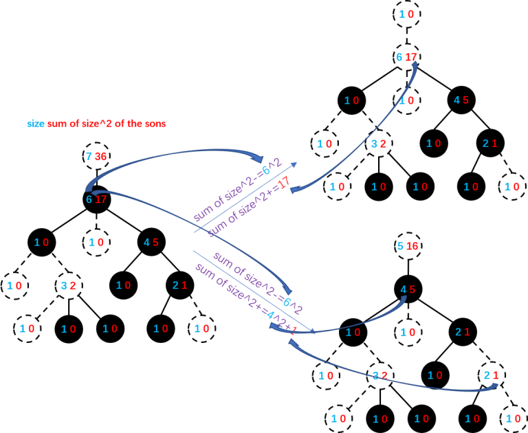

# Tutorial_(en)

[1173A - Nauuo and Votes](../problems/A._Nauuo_and_Votes.md "Codeforces Round 564 (Div. 2)")

Idea: [ouuan](https://codeforces.com/profile/ouuan "Master ouuan")

 **Tutorial**Consider the two edge cases: all the z persons upvote / all the z persons downvote. If the results are the same in these two cases, it is the answer. Otherwise, the result is uncertain.

 **Solution**
```cpp
#include <iostream>

using namespace std;

const char result[4] = {'+', '-', '0', '?'};

int solve(int x, int y)
{
	return x == y ? 2 : x < y;
}

int main()
{
	int x, y, z;
	
	cin >> x >> y >> z;
	
	cout << result[solve(x + z, y) == solve(x, y + z) ? solve(x, y) : 3];
	
	return 0;
}
```
[1173B - Nauuo and Chess](../problems/B._Nauuo_and_Chess.md "Codeforces Round 564 (Div. 2)")

Idea: [Sulfox](https://codeforces.com/profile/Sulfox "Grandmaster Sulfox")

 **Tutorial*** m≥⌊n2⌋+1

Consider the chess pieces 1 and n.

∵{|r1−rn|+|c1−cn|≥n−1|r1−rn|≤m−1|c1−cn|≤m−1

∴m−1+m−1≥n−1

∴m≥n+12

∵m is an integer

∴m≥⌊n2⌋+1

 * m can be ⌊n2⌋+1

If we put the i-th piece on (ri,ci) satisfying ri+ci=i+1, it is a feasible plan, because |ri−rj|+|ci−cj|≥|ri+ci−rj−cj|.

 **Solution**
```cpp
#include <cstdio>

using namespace std;

int main()
{
    int n, i, ans;

    scanf("%d", &n);
    ans = n / 2 + 1;

    printf("%d", ans);

    for (i = 1; i <= ans; ++i) printf("n%d 1", i);
    for (i = 2; i <= n - ans + 1; ++i) printf("n%d %d", ans, i);

    return 0;
}

```
[1172A - Nauuo and Cards](https://codeforces.com/contest/1172/problem/A "Codeforces Round 564 (Div. 1)")

Idea: [QAQAutoMaton](https://codeforces.com/profile/QAQAutoMaton "Grandmaster QAQAutoMaton")

 **Tutorial**First, try to finish it without playing any empty cards.

If that's not possible, the best choice is to play several empty cards in a row, then play from 1 to n. For a card i, suppose that it is in the pi-th position in the pile (pi=0 if it is in the hand), you have to play at least pi−i+1 empty cards. So the answer will be max{pi−i+1+n}.

 **Solution**
```cpp
#include <iostream>
#include <cstdio>
#include <algorithm>

using namespace std;

const int N = 200010;

int n, a[N], b[N], p[N], ans;

int main()
{
    int i, j;

    scanf("%d", &n);

    for (i = 1; i <= n; ++i)
    {
        scanf("%d", a + i);
        p[a[i]] = 0;
    }

    for (i = 1; i <= n; ++i)
    {
        scanf("%d", b + i);
        p[b[i]] = i;
    }

    if (p[1])
    {
        for (i = 2; p[i] == p[1] + i - 1; ++i);
        if (p[i - 1] == n)
        {
            for (j = i; j <= n && p[j] <= j - i; ++j);
            if (j > n)
            {
                printf("%d", n - i + 1);
                return 0;
            }
        }
    }

    for (i = 1; i <= n; ++i) ans = max(ans, p[i] - i + 1 + n);

    printf("%d", ans);

    return 0;
}
```
[1172B - Nauuo and Circle](https://codeforces.com/contest/1172/problem/B "Codeforces Round 564 (Div. 1)")

Idea: [Sulfox](https://codeforces.com/profile/Sulfox "Grandmaster Sulfox")

 **Tutorial**First, if we choose a node as the root, then each subtree must be in a continuous arc on the circle. Then, we can use DP to solve this problem.

Let fu be the number of plans to draw the subtree of u, then fu=(|son(u)|+[u≠root])!∏v∈son(u)fv — choose a position for each subtree and then u itself, then draw the subtrees. However, instead of choosing the position of the root, we suppose the root is on a certain point on the circle, then rotate the circle, thus get the answer: nfroot.

In fact, we don't have to write a DP, the answer is n times the product of the factorial of each node's degree (nn∏i=1degree[i]!).

 **Solution**
```cpp
  
#include <iostream>
#include <cstdio>

using namespace std;

typedef long long ll;

const int N = 200010;
const int mod = 998244353;

int n, ans, d[N];

int main()
{
    int i, u, v;

    scanf("%d", &n);
    ans = n;

    for (i = 1; i < n; ++i)
    {
        scanf("%d%d", &u, &v);
        ans = (ll) ans * (++d[u]) % mod * (++d[v]) % mod;
    }

    cout << ans;

    return 0;
}
```
[1172C1 - Nauuo and Pictures (easy version)](https://codeforces.com/contest/1172/problem/C1 "Codeforces Round 564 (Div. 1)") and [1172C2 - Nauuo and Pictures (hard version)](https://codeforces.com/contest/1172/problem/C2 "Codeforces Round 564 (Div. 1)")

Idea: [ouuan](https://codeforces.com/profile/ouuan "Master ouuan")

 **Tutorial**First, let's focus on a single picture with weight w which Nauuo likes, so we only have to know the sum of the weights of the pictures Nauuo likes (SA=n∑i=1wi[ai=1]) and the sum of the disliked ones (SB=n∑i=1wi[ai=0]) instead of all the n weights.

Then, we can use DP to solve this problem.

Let fw[i][j][k] be the expected weight of a picture Nauuo likes with weight w after another i visits since SA=j and SB=k.

Obviously, fw[0][j][k]=w.

The state transition:

 * The next visit displays the picture we focus on. Probaility: wj+k. Lead to: fw+1[i−1][j+1][k].
* The next visit displays a picture Nauuo likes but is not the one we focus on. Probaility: j−wj+k. Lead to: fw[i−1][j+1][k].
* The next visit displays a picture Nauuo doesn't like. Probaility: kj+k. Lead to: fw[i−1][j][k−1].

So, fw[i][j][k]=wj+kfw+1[i−1][j+1][k]+j−wj+kfw[i−1][j+1][k]+kj+kfw[i−1][j][k−1].

Let gw[i][j][k] be the expected weight of a picture Nauuo **doesn't like** with weight w after another i visits since SA=j and SB=k. The state transition is similar.

Note that i,j,k,m have some relation. In fact we can let f′w[i][j] be fw[m−i−j][SA+i][SB−j] (SA and SB are the initial ones here).

But up to now, we can only solve the easy version.

To solve the hard version, let's introduce a lemma:

 fw[i][j][k]=wf1[i][j][k]Proof:

Obviously, this is true when i=0.

Then, suppose we have already proved fw[i−1][j][k]=wf1[i−1][j][k].

f1[i][j][k]=1j+kf2[i−1][j+1][k]+j−1j+kf1[i−1][j+1][k]+kj+kf1[i−1][j][k−1]=2j+kf1[i−1][j+1][k]+j−1j+kf1[i−1][j+1][k]+kj+kf1[i−1][j][k−1]=j+1j+kf1[i−1][j+1][k]+kj+kf1[i−1][j][k−1]

fw[i][j][k]=wj+kfw+1[i−1][j+1][k]+j−wj+kfw[i−1][j+1][k]+kj+kfw[i−1][j][k−1]=w(w+1)j+kf1[i−1][j+1][k]+w(j−w)j+kf1[i−1][j+1][k]+wkj+kf1[i−1][j][k−1]=w(j+1)j+kf1[i−1][j+1][k]+wkj+kf1[i−1][j][k−1]=wf1[i][j][k]

Also, a brief but not so strict proof: the increment in each step is proportional to the expectation.

So, we only have to calculate f1[i][j][k] (f′1[i][j]).

In conclusion:

f′1[i][j]=1 (i+j=m)

f′1[i][j]=SA+i+1SA+SB+i−jf′1[i+1][j]+SB−jSA+SB+i−jf′1[i][j+1] (i+j<m)

g′1[i][j]=1 (i+j=m)

g′1[i][j]=SA+iSA+SB+i−jg′1[i+1][j]+SB−j−1SA+SB+i−jg′1[i][j+1] (i+j<m)

If ai=1, the expected weight of the i-th picture is wif′1[0][0], otherwise, the expected weight is wig′1[0][0].

Last question: how to calculate the result modulo 998244353?

If you don't know how, please read [the wiki](https://codeforces.com/https://en.wikipedia.org/wiki/Modular_multiplicative_inverse) to learn it.

You can calculate and store all the O(m) inverses at first, then you can get an O(n+m2+mlogp) solution instead of O(n+m2logp) (p=998244353 here).

 **Solution**
```cpp
#include <cstdio>
#include <algorithm>

using namespace std;

typedef long long ll;

const int N = 200010;
const int M = 3010;
const int mod = 998244353;

int qpow(int x, int y) //calculate the modular multiplicative inverse
{
	int out = 1;
	while (y)
	{
		if (y & 1) out = (ll) out * x % mod;
		x = (ll) x * x % mod;
		y >>= 1;
	}
	return out;
}

int n, m, a[N], w[N], f[M][M], g[M][M], inv[M << 1], sum[3];

int main()
{
	int i,j;
	
	scanf("%d%d", &n, &m);
	
	for (i = 1; i <= n; ++i) scanf("%d", a + i);
	
	for (i = 1; i <= n; ++i)
	{
		scanf("%d", w + i);
		sum[a[i]] += w[i];
		sum[2] += w[i];
	}
	
	for (i = max(0, m - sum[0]); i <= 2 * m; ++i) inv[i] = qpow(sum[2] + i - m, mod - 2);
	
	for (i = m; i >= 0; --i)
	{
		f[i][m - i] = g[i][m - i] = 1;
		for (j = min(m - i - 1, sum[0]); j >= 0; --j)
		{
			f[i][j] = ((ll) (sum[1] + i + 1) * f[i + 1][j] + (ll) (sum[0] - j) * f[i][j + 1]) % mod * inv[i - j + m] % mod;
			g[i][j] = ((ll) (sum[1] + i) * g[i + 1][j] + (ll) (sum[0] - j - 1) * g[i][j + 1]) % mod * inv[i - j + m] % mod;
		}
	}
	
	for (i = 1; i <= n; ++i) printf("%dn", int((ll) w[i] * (a[i] ? f[0][0] : g[0][0]) % mod));
	
	return 0;
}
```
[1172D - Nauuo and Portals](https://codeforces.com/contest/1172/problem/D "Codeforces Round 564 (Div. 1)")

Idea: [Sulfox](https://codeforces.com/profile/Sulfox "Grandmaster Sulfox")

 **Tutorial**Consider this problem:

the person in (i,1) facing right is numbered ai, the person in (1,i) facing bottom is numbered bi. The person numbered pi has to exit the grid from (i,n), the person numbered qi has to exit the grid from (n,i).

The original problem can be easily transferred to this problem. And now let's transfer it into an (n−1)×(n−1) subproblem by satisfying the requirement of the first row and the first column.

If a1=p1 and b1=q1, you can simply do nothing and get an (n−1)×(n−1) subproblem.

Otherwise, you can set a portal consisting of two doors in (x,1) and (1,y) where ax=p1 and by=q1. Swap a1 and ax, b1 and by, then you will get an (n−1)×(n−1) subproblem.

Then, you can solve the problem until it changes into a 1×1 one.

This problem can be solved in O(n), but the checker needs O(n2).

 **Solution**
```cpp
#include <iostream>
#include <cstdio>
#include <vector>
#include <algorithm>

using namespace std;

const int N = 1010;

struct Portal
{
	int x, y, p, q;
	Portal(int _x, int _y, int _p, int _q): x(_x), y(_y), p(_p), q(_q) {}
};
vector<Portal> ans;
int n, a[N], b[N], c[N], d[N], ra[N], rb[N], rc[N], rd[N];

int main()
{
	int i;
	
	scanf("%d", &n);
	
	for (i = 1; i <= n; ++i)
	{
		scanf("%d", b + i);
		rb[b[i]] = i;
	}
	for (i = 1; i <= n; ++i)
	{
		scanf("%d", a + i);
		ra[a[i]] = i;
	}
	for (i = 1; i <= n; ++i) c[i] = d[i] = rc[i] = rd[i] = i;
	
	for (i = 1; i < n; ++i)
	{
		if (c[i] == ra[i] && d[i] == rb[i]) continue;
		ans.push_back(Portal(i, rc[ra[i]], rd[rb[i]], i));
		int t1 = c[i];
		int t2 = d[i];
		swap(c[i], c[rc[ra[i]]]);
		swap(d[i], d[rd[rb[i]]]);
		swap(rc[ra[i]], rc[t1]);
		swap(rd[rb[i]], rd[t2]);
	}
	
	printf("%dn", ans.size());
	for (auto k : ans) printf("%d %d %d %dn", k.x, k.y, k.p, k.q);
	
	return 0;
}
```
[1172E - Nauuo and ODT](https://codeforces.com/contest/1172/problem/E "Codeforces Round 564 (Div. 1)")

Idea: [ODT](https://codeforces.com/profile/ODT "Master ODT")

 **Tutorial**For each color, we can try to maintain the number of simple paths that do not contain such color.

If we can maintain such information, we can easily calculate the number of simple paths that contain a certain color, thus get the answer.

For each color, we delete all nodes that belong to such color, thus splitting the tree into some clusters (here we define a "cluster" as a connected subgraph of the original tree).

By maintaining ∑cluster size2, we can get the number of simple paths that do not contain such color.

For each color we try to maintain the same information, add them together, and get the answer.

So now the problem is: a white tree

 1. reverse the color of a node ( white <-> black )
2. output ∑cluster size2

This problem can be solved by many data structures like top tree, link/cut tree or heavy path decomposition.

Let's use the link/cut tree for example.

You can maintain the size of each subtree and the sum of size2 of each node's sons. Link/cut one node with its father (choose a node as the root and make the tree a rooted-tree first) when its color changes. In this way, the real clusters are the ones that are still connected after deleting the top node of a cluster in the link/cut tree. Update ∑cluster size2 while linking/cutting.



link:



cut:



 **Solution**
```cpp
#include <algorithm>
#include <cctype>
#include <cstdio>
#include <cstring>
#include <iostream>
#include <vector>

using namespace std;

typedef long long ll;

const int N = 400010;

struct Node
{
    int fa, ch[2], siz, sizi;
    ll siz2i;
    ll siz2() { return (ll) siz * siz; }
} t[N];

bool nroot(int x);
void rotate(int x);
void Splay(int x);
void access(int x);
int findroot(int x);
void link(int x);
void cut(int x);
void pushup(int x);

void add(int u, int v);
void dfs(int u);

int head[N], nxt[N << 1], to[N << 1], cnt;
int n, m, c[N], f[N];
ll ans, delta[N];
bool bw[N];
vector<int> mod[N][2];

int main()
{
    int i, j, u, v;
    ll last;

    scanf("%d%d", &n, &m);

    for (i = 1; i <= n; ++i)
    {
        scanf("%d", c + i);
        mod[c[i]][0].push_back(i);
        mod[c[i]][1].push_back(0);
    }

    for (i = 1; i <= n + 1; ++i) t[i].siz = 1;

    for (i = 1; i < n; ++i)
    {
        scanf("%d%d", &u, &v);
        add(u, v);
        add(v, u);
    }

    for (i = 1; i <= m; ++i)
    {
        scanf("%d%d", &u, &v);
        mod[c[u]][0].push_back(u);
        mod[c[u]][1].push_back(i);
        c[u] = v;
        mod[v][0].push_back(u);
        mod[v][1].push_back(i);
    }

    f[1] = n + 1;
    dfs(1);

    for (i = 1; i <= n; ++i) link(i);

    for (i = 1; i <= n; ++i)
    {
        if (!mod[i][0].size())
        {
            delta[0] += (ll)n * n;
            continue;
        }
        if (mod[i][1][0])
        {
            delta[0] += (ll)n * n;
            last = (ll)n * n;
        } else
            last = 0;
        for (j = 0; j < mod[i][0].size(); ++j)
        {
            u = mod[i][0][j];
            if (bw[u] ^= 1)
                cut(u);
            else
                link(u);
            if (j == mod[i][0].size() - 1 || mod[i][1][j + 1] != mod[i][1][j])
            {
                delta[mod[i][1][j]] += ans - last;
                last = ans;
            }
        }
        for (j = mod[i][0].size() - 1; ~j; --j)
        {
            u = mod[i][0][j];
            if (bw[u] ^= 1)
                cut(u);
            else
                link(u);
        }
    }

    ans = (ll) n * n * n;
    for (i = 0; i <= m; ++i)
    {
        ans -= delta[i];
        printf("%I64d ", ans);
    }

    return 0;
}

bool nroot(int x) { return x == t[t[x].fa].ch[0] || x == t[t[x].fa].ch[1]; }

void rotate(int x)
{
    int y = t[x].fa;
    int z = t[y].fa;
    int k = x == t[y].ch[1];
    if (nroot(y)) t[z].ch[y == t[z].ch[1]] = x;
    t[x].fa = z;
    t[y].ch[k] = t[x].ch[k ^ 1];
    t[t[x].ch[k ^ 1]].fa = y;
    t[x].ch[k ^ 1] = y;
    t[y].fa = x;
    pushup(y);
    pushup(x);
}

void Splay(int x)
{
    while (nroot(x))
    {
        int y = t[x].fa;
        int z = t[y].fa;
        if (nroot(y)) (x == t[y].ch[1]) ^ (y == t[z].ch[1]) ? rotate(x) : rotate(y);
        rotate(x);
    }
}

void access(int x)
{
    for (int y = 0; x; x = t[y = x].fa)
    {
        Splay(x);
        t[x].sizi += t[t[x].ch[1]].siz;
        t[x].sizi -= t[y].siz;
        t[x].siz2i += t[t[x].ch[1]].siz2();
        t[x].siz2i -= t[y].siz2();
        t[x].ch[1] = y;
        pushup(x);
    }
}

int findroot(int x)
{
    access(x);
    Splay(x);
    while (t[x].ch[0]) x = t[x].ch[0];
    Splay(x);
    return x;
}

void link(int x)
{
    int y = f[x];
    Splay(x);
    ans -= t[x].siz2i + t[t[x].ch[1]].siz2();
    int z = findroot(y);
    access(x);
    Splay(z);
    ans -= t[t[z].ch[1]].siz2();
    t[x].fa = y;
    Splay(y);
    t[y].sizi += t[x].siz;
    t[y].siz2i += t[x].siz2();
    pushup(y);
    access(x);
    Splay(z);
    ans += t[t[z].ch[1]].siz2();
}

void cut(int x)
{
    int y = f[x];
    access(x);
    ans += t[x].siz2i;
    int z = findroot(y);
    access(x);
    Splay(z);
    ans -= t[t[z].ch[1]].siz2();
    Splay(x);
    t[x].ch[0] = t[t[x].ch[0]].fa = 0;
    pushup(x);
    Splay(z);
    ans += t[t[z].ch[1]].siz2();
}

void pushup(int x)
{
    t[x].siz = t[t[x].ch[0]].siz + t[t[x].ch[1]].siz + t[x].sizi + 1;
}

void add(int u, int v)
{
    nxt[++cnt] = head[u];
    head[u] = cnt;
    to[cnt] = v;
}

void dfs(int u)
{
    int i, v;
    for (i = head[u]; i; i = nxt[i])
    {
        v = to[i];
        if (v != f[u])
        {
            f[v] = u;
            dfs(v);
        }
    }
}
```
[1172F - Nauuo and Bug](https://codeforces.com/contest/1172/problem/F "Codeforces Round 564 (Div. 1)")

Idea: [rushcheyo](https://codeforces.com/profile/rushcheyo "Master rushcheyo")

 **Tutorial**At first, let's solve this problem in O(n√nlogn).

Let's split our array into blocks by B integers, and let's find a function, f(x)= which value you will get at the end of the current block if you will start with x. With simple induction, you can prove that this function is a piece-wise linear, and it has O(B) segments, so you can build it iteratively in O(B2) time for each block, so the preprocessing took O(nB).

And to answer the query, you can keep the current value of x and then find with binary search by that piece-wise linear function the f(x) for the current block.

With a good choice of B, this solution will work in O(n√nlogn).

Ok, but then how to solve it in O(nlog+qlog2)?

Lemma: each segment of this piece-wise linear function has length at least p.

You can prove it with simple induction.

And then, with this lemma, it is possible by two functions f(x) of size n and g(x) of size m find the new function h(x)=g(f(x)), in the O(n+m), you can do it with two pointers, similar to the previous iterative method, but adding a several points to the function each time, best way to understand it is to check the indendent solution :)

 **Solution**
```cpp
#include <bits/stdc++.h>
using namespace std;

typedef long long ll;

const int N = 1000005;
const ll inf = (ll)1e16;
int n, m, P, a[N];
ll sum[N];
vector<ll> func[N << 2];

vector<ll> merge(int l, int r, int mid, const vector<ll> &f, const vector<ll> &g) {
	ll suml = sum[mid] - sum[l - 1], sumr = sum[r] - sum[mid];
	vector<ll> ret(f.size() + g.size() - 1, inf);
	for (int i = 0, j = 0; i < (int)f.size(); ++i) {
		ll xl = f[i], xr = (i + 1 == (int)f.size() ? inf : f[i + 1] - 1), yl = xl + suml - (ll)i * P, yr = xr + suml - (ll)i * P;
		while (j > 0 && g[j] > yl) --j;
		while (j < (int)g.size() && (j == 0 || g[j] <= yl)) ++j;
		--j;
		for (; j < (int)g.size() && g[j] <= yr; ++j)
			ret[i + j] = min(ret[i + j], max(xl, g[j] - suml + (ll)i * P));
	}
	ret[0] = -inf;
	return ret;
}
void build(int u, int l, int r) {
	if (l == r) {
		func[u].push_back(-inf);
		func[u].push_back(P - a[l]);
		return;
	}
	int mid = l + r >> 1;
	build(u << 1, l, mid);
	build(u << 1 | 1, mid + 1, r);
	func[u] = merge(l, r, mid, func[u << 1], func[u << 1 | 1]);
}
ll query(int u, int l, int r, int ql, int qr, ll now) {
	if (l >= ql && r <= qr)
		return now + sum[r] - sum[l - 1] - (ll)P * (upper_bound(func[u].begin(), func[u].end(), now) - func[u].begin() - 1);
	int mid = l + r >> 1;
	if (qr <= mid)
		return query(u << 1, l, mid, ql, qr, now);
	if (ql > mid)
		return query(u << 1 | 1, mid + 1, r, ql, qr, now);
	return query(u << 1 | 1, mid + 1, r, ql, qr, query(u << 1, l, mid, ql, qr, now));
}

int main() {
	scanf("%d%d%d", &n, &m, &P);
	for (int i = 1; i <= n; ++i)
		scanf("%d", a + i), sum[i] = sum[i - 1] + a[i];
	build(1, 1, n);
	for (int l, r; m--;) {
		scanf("%d%d", &l, &r);
		printf("%I64dn", query(1, 1, n, l, r, 0));
	}
	return 0;
}
```
We had prepared a problem similar to [1174F - Ehab and the Big Finale](https://codeforces.com/contest/1174/problem/F "Codeforces Round 563 (Div. 2)") before that round, so we needed to prepare new problems in four days. It was in such a hurry that there are some imperfections in our round. Please accept our sincere apology.

