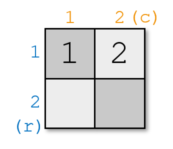
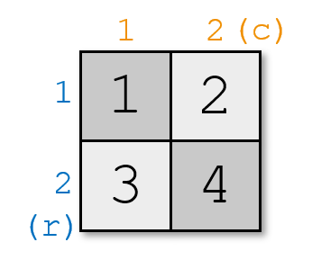
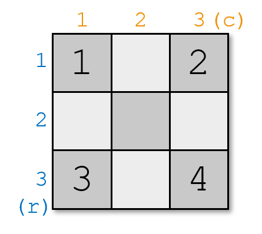

<h1 style='text-align: center;'> B. Nauuo and Chess</h1>

<h5 style='text-align: center;'>time limit per test: 1 second</h5>
<h5 style='text-align: center;'>memory limit per test: 256 megabytes</h5>

Nauuo is a girl who loves playing chess.

One day she invented a game by herself which needs $n$ chess pieces to play on a $m\times m$ chessboard. The rows and columns are numbered from $1$ to $m$. We denote a cell on the intersection of the $r$-th row and $c$-th column as $(r,c)$.

The game's goal is to place $n$ chess pieces numbered from $1$ to $n$ on the chessboard, the $i$-th piece lies on $(r_i,\,c_i)$, while the following rule is satisfied: for all pairs of pieces $i$ and $j$, $|r_i-r_j|+|c_i-c_j|\ge|i-j|$. Here $|x|$ means the absolute value of $x$.

However, Nauuo discovered that sometimes she couldn't find a solution because the chessboard was too small.

She wants to find the smallest chessboard on which she can put $n$ pieces according to the rules.

She also wonders how to place the pieces on such a chessboard. Can you help her?

#### Input

The only line contains a single integer $n$ ($1\le n\le 1000$) — the number of chess pieces for the game.

#### Output

The first line contains a single integer — the minimum value of $m$, where $m$ is the length of sides of the suitable chessboard.

The $i$-th of the next $n$ lines contains two integers $r_i$ and $c_i$ ($1\le r_i,c_i\le m$) — the coordinates of the $i$-th chess piece.

If there are multiple answers, print any.

## Examples

#### Input


```text
2
```
#### Output


```text
2
1 1
1 2
```
#### Input

```text

4

```
#### Output


```text

3
1 1
1 3
3 1
3 3
```
## Note

In the first example, you can't place the two pieces on a $1\times1$ chessboard without breaking the rule. But you can place two pieces on a $2\times2$ chessboard like this:



In the second example, you can't place four pieces on a $2\times2$ chessboard without breaking the rule. For example, if you place the pieces like this:



then $|r_1-r_3|+|c_1-c_3|=|1-2|+|1-1|=1$, $|1-3|=2$, $1<2$; and $|r_1-r_4|+|c_1-c_4|=|1-2|+|1-2|=2$, $|1-4|=3$, $2<3$. It doesn't satisfy the rule.

However, on a $3\times3$ chessboard, you can place four pieces like this:




#### Tags 

#1100 #NOT OK #constructive_algorithms #greedy 

## Blogs
- [All Contest Problems](../Codeforces_Round_564_(Div._2).md)
- [Codeforces Round #564 (en)](../blogs/Codeforces_Round_564_(en).md)
- [Tutorial (en)](../blogs/Tutorial_(en).md)
