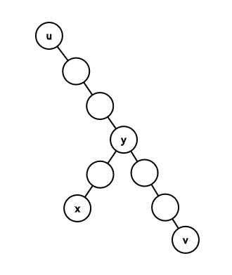

# Tutorial_(en)

[1174A - Ehab Fails to Be Thanos](../problems/A._Ehab_Fails_to_Be_Thanos.md "Codeforces Round 563 (Div. 2)")
-----------------------------------------------------------------------------------------------------------------

If all elements in the array are equal, there's no solution. Otherwise, sort the array. The sum of the second half will indeed be greater than that of the first half.

Another solution is to see if they already have different sums. If they do, print the array as it is. Otherwise, find any pair of different elements from different halves and swap them.

Code link: [https://pastebin.com/FDXTuDdZ](https://codeforces.com/https://pastebin.com/FDXTuDdZ)

[1174B - Ehab Is an Odd Person](../problems/B._Ehab_Is_an_Odd_Person.md "Codeforces Round 563 (Div. 2)")
---------------------------------------------------------------------------------------------------------------

Notice that you can only swap 2 elements if they have different parities. If all elements in the array have the same parity, you can't do any swaps, and the answer will just be like the input. Otherwise, let's prove you can actually swap any pair of elements. Assume you want to swap 2 elements, a and b, and they have the same parity. There must be a third element c that has a different parity. Without loss of generality, assume the array is [a,b,c]. You'll do the following swaps:

 * Swap a and c: [c,b,a].
* Swap b and c: [b,c,a].
* Swap a and c: [b,a,c].

In other words, you'll use c as an intermediate element to swap a and b, and it'll return to its original position afterwards! Since you can swap any pair of elements, you can always sort the array, which is the lexicographically smallest permutation.

Code link: [https://pastebin.com/xhqGXLiu](https://codeforces.com/https://pastebin.com/xhqGXLiu)

Time complexity: O(nlog(n)).

[1174C - Ehab and a Special Coloring Problem](../problems/C._Ehab_and_a_Special_Coloring_Problem.md "Codeforces Round 563 (Div. 2)")
-----------------------------------------------------------------------------------------------------------------------------

Let's call the maximum value in the array max. Let the number of primes less than or equal to n be called p. Then, max≥p. That's true because a distinct number must be assigned to each prime, since all primes are coprime to each other. Now if we can construct an answer wherein max=p, it'll be optimal. Let's first assign a distinct number to each prime. Then, assign to every composite number the same number as any of its prime divisors. This works because for any pair of numbers (i,j), i is given the same number of a divisor and so is j, so if they're coprime (don't share a divisor), they can't be given the same number!

Code link: [https://pastebin.com/tDbgtnC8](https://codeforces.com/https://pastebin.com/tDbgtnC8)

Time complexity: O(nlog(n)).

[1174D - Ehab and the Expected XOR Problem](../problems/D._Ehab_and_the_Expected_XOR_Problem.md "Codeforces Round 563 (Div. 2)")
---------------------------------------------------------------------------------------------------------------------------

The main idea is to build the prefix-xor of the array, not the array itself, then build the array from it. Let the prefix-xor array be called b. Now, al⊕al+1⋯⊕ar=bl−1⊕br. Thus, the problem becomes: construct an array such that no pair of numbers has bitwise-xor sum equal to 0 or x, and its length should be maximal. Notice that "no pair of numbers has bitwise-xor sum equal to 0" simply means "you can't use the same number twice". If x≥2n, no pair of numbers less than 2n will have bitwise-xor sum equal to x, so you can just use all the numbers from 1 to 2n−1 in any order. Otherwise, you can think of the numbers forming pairs, where each pair consists of 2 numbers with bitwise-xor sum equal to x. From any pair, if you add one number to the array, you can't add the other. However, the pairs are independent from each other: your choice in one pair doesn't affect any other pair. Thus, you can just choose either number in any pair and add them in any order you want. After you construct b, you can construct a using the formula: ai=bi⊕bi−1.

Code link: [https://pastebin.com/0gCLC0BP](https://codeforces.com/https://pastebin.com/0gCLC0BP)

Time complexity: O(2n).

[1174E - Ehab and the Expected GCD Problem](../problems/E._Ehab_and_the_Expected_GCD_Problem.md "Codeforces Round 563 (Div. 2)")
---------------------------------------------------------------------------------------------------------------------------

Let's call the permutations from the statement good. For starters, we'll try to find some characteristics of good permutations. Let's call the first element in a good permutation s. Then, s must have the maximal possible number of prime divisors. Also, every time the gcd changes as you move along prefixes, you must drop only one prime divisor from it. That way, we guarantee we have as many distinct gcds as possible. Now, there are 2 important observations concerning s:

**Observation #1:** s=2x∗3y for some x and y. In other words, only 2 and 3 can divide s. That's because if s has some prime divisor p, you can divide it by p and multiply it by 4. That way, you'll have more prime divisors.

**Observation #2:** y≤1. That's because if s=2x∗3y, and y≥2, you can instead replace it with 2x+3∗3y−2 (divide it by 9 and multiply it by 8), and you'll have more prime divisors.

Now, we can create dp[i][x][y], the number of ways to fill a good permutation up to index i such that its gcd is 2x∗3y. Let f(x,y)=⌊n2x∗3y⌋. It means the number of multiples of 2x∗3y less than or equal to n. Here are the transitions:

If your permutation is filled until index i and its gcd is 2x∗3y, you can do one of the following 3 things upon choosing pi+1:

 * Add a multiple of 2x∗3y. That way, the gcd won't change. There are f(x,y) numbers you can add, but you already added i of them, so: dp[i+1][x][y]=dp[i+1][x][y]+dp[i][x][y]∗(f(x,y)−i).
* Reduce x by 1. To do that, you can add a multiple of 2x−1∗3y that isn't a multiple of 2x∗3y, so: dp[i+1][x−1][y]=dp[i+1][x−1][y]+dp[i][x][y]∗(f(x−1,y)−f(x,y)).
* Reduce y by 1. To do that, you can add a multiple of 2x∗3y−1 that isn't a multiple of 2x∗3y, so: dp[i+1][x][y−1]=dp[i+1][x][y−1]+dp[i][x][y]∗(f(x,y−1)−f(x,y)).

As for the base case, let x=⌊log2(n)⌋. You can always start with 2x, so dp[1][x][0]=1. Also, if 2x−1∗3≤n, you can start with it, so dp[1][x−1][1]=1. The answer is dp[n][0][0].

Code link: [https://pastebin.com/N8FRN9sA](https://codeforces.com/https://pastebin.com/N8FRN9sA)

Time complexity: O(nlog(n)).

[1174F - Ehab and the Big Finale](../problems/F._Ehab_and_the_Big_Finale.md "Codeforces Round 563 (Div. 2)")
-----------------------------------------------------------------------------------------------------------------

Let depa be the depth of node a and sza be the size of the subtree of node a. First, we'll query the distance between node 1 and node x to know depx. The idea in the problem is to maintain a "search scope", some nodes such that x is one of them, and to try to narrow it down with queries. From this point, I'll describe two solutions:

### HLD solution:

Assume that your search scope is the subtree of some node u (initially, u=1). How can we narrow it down efficiently? I'll pause here to add some definitions. The heavy child of a node a is the child that has the maximal subtree size. The heavy path of node a is the path that starts with node a and every time moves to the heavy child of the current node. Now back to our algorithm. Let's get the heavy path of node u. Assume its other endpoint is node v. We know that a prefix of this path contains ancestors of node x. Let the deepest node in the path that is an ancestor of node x be node y (the last node in this prefix). I'll now add a drawing to help you visualize the situation.

So, recapping, u is the root of your search scope, v is the endpoint of the heavy path starting from u, x is the hidden node, and y the last ancestor of x in the heavy path. Notice that y is lca(x,v). Now, we know that dist(x,v)=depx+depv−2∗depy. Since we know depx, and we know depv, we can query dist(x,v) to find depy. Since all nodes in the path have different depths, that means we know y itself!

 **Another way to find y****Observation #1:** dist(u,x)+dist(v,x)=dist(u,v)+2∗dist(x,y). In both sides of the equation, every edge in the heavy path appears once, and every edge in the path from x to y appears twice.

We know dist(u,x)=depx−depu. We also know dist(u,v)=depv−depu. Additionally, we can query dist(v,x). From these 3 pieces of information and the equation above, we can find dist(x,y).

**Observation #2:** dist(u,y)=dist(u,x)−dist(x,y). Now we know dist(u,y). Since all nodes in the heavy path have different distances from node u, we know y itself!

Now, if depx=depy, x=y, so we found the answer. Otherwise, we know, by definition, that y is an ancestor of x, so it's safe to use the second query type. Let the answer be node l. We can repeat the algorithm with u=l! How long will this algorithm take? Note that l can't be the heavy child of y (because y is **the last** ancestor of x in the heavy path), so szl≤⌊szy2⌋, since it's well-known that only the heavy child can break that condition. So with only 2 queries, we managed to cut down at least half of our search scope! So this algorithm does no more than 34 queries (actually 32 under these constraints, but that's just a small technicality).

Code link: [https://pastebin.com/CM8QwdUf](https://codeforces.com/https://pastebin.com/CM8QwdUf)

### Centroid decomposition solution:

As I said, assume we have a search scope. Let's get the centroid, c, of that search scope. If you don't know, the centroid is a node that, if removed, the tree will be broken down to components, and each component's size will be at most half the size of the original tree. Now, c may and may not be an ancestor of x. How can we determine that? Let's query dist(c,x). c is an ancestor of x if and only if depc+dist(c,x)=depx. Now, if c is an ancestor of x, we can safely query the second node on the path between them. Let the answer be s, then its component will be the new search scope. What if c isn't an ancestor of x? That means node x can't be in the subtree of c, so it must be in the component of c's parent. We'll make the component of c's parent the new search scope! Every time, the size of our search scope is, at least, halved, so the solution does at most 36 queries.

Code link: [https://pastebin.com/hCNW5BfQ](https://codeforces.com/https://pastebin.com/hCNW5BfQ)

