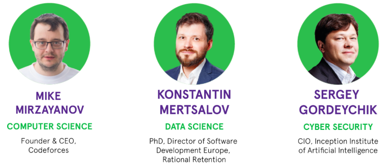

# Announcement

Hello Codeforces!

On [Wednesday, June 5, 2019 at 20:35UTC+6](https://codeforces.com/https://www.timeanddate.com/worldclock/fixedtime.html?day=5&month=6&year=2019&hour=17&min=35&sec=0&p1=166) [Educational Codeforces Round 66 (Rated for Div. 2)](https://codeforces.com/contest/1175 "Educational Codeforces Round 66 (Rated for Div. 2)") will start.

Series of Educational Rounds continue being held as [Harbour.Space University](https://codeforces.com/https://harbour.space/) initiative! You can read the details about the cooperation between [Harbour.Space University](https://codeforces.com/https://harbour.space/) and Codeforces in the [blog post](//codeforces.com/blog/entry/51208).

This round will be **rated for the participants with rating lower than 2100**. It will be held on extended ICPC rules. The penalty for each incorrect submission until the submission with a full solution is 10 minutes. After the end of the contest you will have 12 hours to hack any solution you want. You will have access to copy any solution and test it locally.

You will be given **7 problems** and **2 hours** to solve them.

The problems were invented and prepared by Roman [Roms](https://codeforces.com/profile/Roms "Master Roms") Glazov, Adilbek [adedalic](https://codeforces.com/profile/adedalic "International Master adedalic") Dalabaev, Vladimir [vovuh](https://codeforces.com/profile/vovuh "Candidate Master vovuh") Petrov, Ivan [BledDest](https://codeforces.com/profile/BledDest "Grandmaster BledDest") Androsov, Maksim [Neon](https://codeforces.com/profile/Neon "Candidate Master Neon") Mescheryakov and me. Also huge thanks to Mike [MikeMirzayanov](https://codeforces.com/profile/MikeMirzayanov "Headquarters, MikeMirzayanov") Mirzayanov for great systems Polygon and Codeforces.

Good luck to all participants!

UPD:

Our friends at Harbour.Space also have a message for you:

*Codeforces! What is the next step in your development?*

*We understand all about doing things by yourself — after all, we are a startup university, and our student body is exceptional in part because of it’s made up of people who didn’t wait for anyone to show them the way.*

*If this is you, you belong at Harbour.Space. The purpose of our University is to create a global community of these kinds of people, regardless of age or nationality, because when you’re working by yourself, you can change for the better, but when you work with others, you can change the world.* 

*If you believe you have what it takes, we want you!* 

*The curriculum is part of what makes the modules so special, and the other half? Our outstanding teachers who are leaders in their own respective industries.*

*Our scholarships are set in such a way that doesn’t require additional applications — we believe in merit and potential, and so what you put in your application to the university will be our criteria.*

***You could be just the diamond we’re looking for, but you’ll never know unless you apply!*** 

  [APPLY NOW→](https://harbour.space/admissions/scholarship?utm_source=codeforces&utm_medium=partners) Congratulations to the winners: 

| Rank | Competitor | Problems Solved | Penalty |
| --- | --- | --- | --- |
| 1 | [mango_lassi](https://codeforces.com/profile/mango_lassi "Grandmaster mango_lassi") | 6 | 145 |
| 2 | [E869120](https://codeforces.com/profile/E869120 "Grandmaster E869120") | 6 | 148 |
| 3 | [244mhq](https://codeforces.com/profile/244mhq "Grandmaster 244mhq") | 6 | 154 |
| 4 | [Egor.Lifar](https://codeforces.com/profile/Egor.Lifar "International Master Egor.Lifar") | 6 | 154 |
| 5 | [Umi](https://codeforces.com/profile/Umi "Master Umi") | 6 | 157 |

Congratulations to the best hackers: 

| Rank | Competitor | Hack Count |
| --- | --- | --- |
| 1 | [Radewoosh](https://codeforces.com/profile/Radewoosh "International Grandmaster Radewoosh") | **97****:-19** |
| 2 | [test_hack](https://codeforces.com/profile/test_hack "Unrated, test_hack") | **56****:-37** |
| 3 | [alvinvaja](https://codeforces.com/profile/alvinvaja "Expert alvinvaja") | **30****:-10** |
| 4 | [AryaKnight](https://codeforces.com/profile/AryaKnight "Expert AryaKnight") | **48****:-48** |
| 5 | [nikolapesic2802](https://codeforces.com/profile/nikolapesic2802 "Master nikolapesic2802") | **30****:-14** |

 779 successful hacks and 1077 unsuccessful hacks were made in total!And finally people who were the first to solve each problem: 

| Problem | Competitor | Penalty |
| --- | --- | --- |
| A | [Geothermal](https://codeforces.com/profile/Geothermal "International Master Geothermal") | 0:01 |
| B | [mango_lassi](https://codeforces.com/profile/mango_lassi "Grandmaster mango_lassi") | 0:05 |
| C | [nuip](https://codeforces.com/profile/nuip "Grandmaster nuip") | 0:07 |
| D | [Yushen](https://codeforces.com/profile/Yushen "Specialist Yushen") | 0:04 |
| E | [Sehnsucht](https://codeforces.com/profile/Sehnsucht "Master Sehnsucht") | 0:20 |
| F | [----------](https://codeforces.com/profile/---------- "Master ----------") | 0:05 |
| G | [LgndryGrandmasturbator](https://codeforces.com/profile/LgndryGrandmasturbator "Expert LgndryGrandmasturbator") | 0:47 |

**UPD:** [The editorial is out](Editorial_(en).md)

