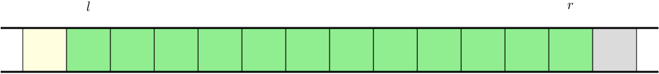
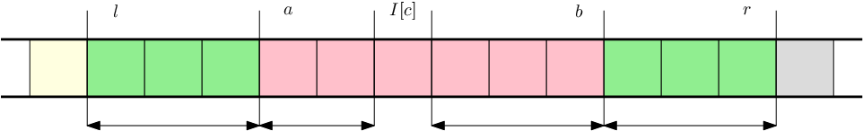

# E_(en)


### [1178A - Prime Minister](../problems/A._Prime_Minister.md "Codeforces Global Round 4")

Ignore the parties that have more than half of Alice's party seats. For all other parties it is never disadvantageous to include them in the coalition, so we might as well take all of them. If the resulting number of seats is a majority, we output all involved parties, otherwise the answer is $0$. 

The complexity is $\mathcal O(n)$.

 **Code**
```cpp
#include <iostream>
#include <vector>

using namespace std;

int main() {
    int N; cin >> N;
    vector<int> A(N); for (int&a:A) cin >> a;
    vector<int> P{1};
    int rest = 0, cur = A[0];
    for (int i = 1; i < N; ++i) {
        if (A[i] <= A[0]/2) {  
            cur += A[i];
            P.push_back(i+1);
        } else {
            rest += A[i];
        }
    }

    if (cur > rest) {
        cout << P.size() << endl;
        for (int i = 0; i < P.size(); ++i) cout << P[i] << " n"[i==P.size()-1];
    } else {
        cout << 0 << endl;
    }
}
```
 
### [1178B - WOW Factor](../problems/B._WOW_Factor.md "Codeforces Global Round 4")

We find all maximal blocks of vs. If there are $k$ of them, we replace the block with $k-1$ copies of w. After that, we can use a simple DP for finding the number of subsequences equal to wow. 

Complexity $\mathcal O(n)$. 

 **Code**
```cpp
#include <iostream>
#include <string>

using namespace std;
typedef long long ll;

int main() {
    string S; cin >> S;
    ll a = 0, b = 0, c = 0;    
    for (int i = 0; i < S.size(); ++i) {
        if (S[i] == 'o') {
            b += a;
        } else if (i > 0 && S[i-1] == 'v') {
            a++;
            c += b;
        }
    }
    cout << c << endl;
}
```
 
### [1178C - Tiles](../problems/C._Tiles.md "Codeforces Global Round 4")

Observe that for a fixed pair of tiles $(i-1, j)$ and $(i, j-1)$ there is exactly one way of placing a tile at $(i, j)$ that satisfies the conditions. As a result, when all tiles $(1,i)$ and $(j,1)$ are placed, the rest is determined uniquely. We only need to count the number of ways to tile the first row and first column.

There are four ways of placing the tile on $(1,1)$. After that, each tile in the first row or first column has exactly two ways of being placed. 

The answer is $2^{w + h}$. The complexity is $\mathcal O(w+h)$ or $\mathcal O(\log w + \log h)$ if we use binary exponentiation.

Bonus: Hexagonal tiles and hexagonal kitchen.

 **Code**
```cpp
#include <iostream>

using namespace std;

constexpr int MOD = 998244353;
    
int main() {
    int R, C; cin >> R >> C;
    int X = 1;
    while (R--) X = (2*X)%MOD;
    while (C--) X = (2*X)%MOD;
    cout << X << endl;
}
```
 
### [1178D - Prime Graph](../problems/D._Prime_Graph.md "Codeforces Global Round 4")

A solution always exists. We show a simple construction.

For $n = 3$, a triangle is (the only) solution.

For $n \geq 4$ we make a cycle on $n$ vertices: $1 \leftrightarrow 2 \leftrightarrow 3 \dots n \leftrightarrow 1$. The degree of each vertex is $2$ (a prime number), but the total number of edges – $n$ – might not be. For some $k$, we add edges of form $i \leftrightarrow i + \frac{n}{2}$ for all $i$ from $1$ to $k$. If $k \leq \frac{n}{2}$, each vertex gets at most one more neighbor, having degree $3$. 

Fortunately for us, for each $n \geq 3$ there is a prime number in interval $[n, \frac{3n}{2}]$, simply the smallest of them will do.

The time complexity is $\mathcal O(n)$.

 **Code**
```cpp
#include <iostream>

using namespace std;

bool prime(int x) {
    if (x < 2) return false;
    for (int i = 2; i*i <= x; ++i) {
        if (x%i == 0) return false;
    }
    return true;
}


int main(int argc, char ** argv){
	int n; cin >> n;
    int m = n;
    while (!prime(m)) ++m;
    cout << m << "n1 " << n << 'n';
    for (int i = 0; i < n-1; ++i) {
        cout << i+1 << ' ' << i+2 << 'n';
    }

    for (int i = 0; i < m-n; ++i) {
        cout << i+1 << ' ' << i+1+n/2 << 'n';
    }
}
```
 Tutorial is loading... **Code**
```cpp
#include <iostream>
#include <string>
#include <algorithm>

using namespace std;
int main() {
    string S; cin >> S;
    int N = S.size();
    int i = 0, j = N-1;
    string A;
    while (j-i >= 3) {
        if (S[i] == S[j]) {
            A.push_back(S[i]);
            ++i; --j;
        } else if (S[i] == S[j-1]) {
            A.push_back(S[i]);
            ++i; j -= 2;
        } else {
            A.push_back(S[i+1]);
            if (S[i+1] == S[j]) {
                --j;
            } else {
                j -= 2;
            }
            i += 2;
        }
    }
    string B = A;
    if (j >= i) A.push_back(S[i]);
    reverse(B.begin(),B.end());
    cout << A << B << endl;
}
```
 
### [1178F1 - Short Colorful Strip](../problems/F1._Short_Colorful_Strip.md "Codeforces Global Round 4")

Let $LO[l][r]$ be the lowest ID of a colour used in the final strip on interval $[l,r]$. Let $I[c]$ be the position on which the colour $c$ occurs on the target strip.

We solve this problem by computing $DP[l][r]$ – the number of ways of painting the interval $[l,r]$, given that it is painted with a single colour and all subsequent colouring intervals must be either completely inside or completely outside of this interval.



The first colour used on this interval will be $c = LO[l][r]$. How can we choose to paint it? Clearly, we can choose any interval $[a,b]$ such that $l \leq a \leq I[c] \leq b \leq r$. Once we perform this operation, then $I[c]$ can never be recoloured, and the interval $[l,r]$ is split into four single coloured intervals (possibly empty) that can be solved independently.



This gives us $DP[l][r] = \sum_a \sum_b DP[l][a-1] * DP[a][I[c]-1] * DP[I[c]+1][b] * DP[b+1][r]$ which can be computed naively in $\mathcal O(n^4)$. To optimise it to $\mathcal O(n^3)$ just note that the selection of $a$ and $b$ is independent.

 **Code**
```cpp
#include <iostream>
#include <vector>

using namespace std;

template <unsigned int N> class Field {
    typedef unsigned int ui;
    typedef unsigned long long ull;
public:
    inline Field(int x = 0) : v(x) {}
    inline Field<N>&operator+=(const Field<N>&o) {if (v+o.v >= N) v += o.v - N; else v += o.v; return *this; }
    inline Field<N>&operator*=(const Field<N>&o) {v=(ull)v*o.v % N; return *this; }
    inline Field<N> operator*(const Field<N>&o) const {Field<N>r{*this};return r*=o;}
	inline explicit operator ui() const { return v; }
private: ui v;
};
template<unsigned int N>ostream &operator<<(std::ostream&os,const Field<N>&f){return os<<(unsigned int)f;}
template<unsigned int N>Field<N> operator*(int i,const Field<N>&f){return Field<N>(i)*f;}

typedef Field<998244353> F;

int main() {
    ios_base::sync_with_stdio(false);
    
    int N, M; cin >> N >> M;
    vector<int> C(N); for (int &c: C) { cin >> c; --c; }
    
    vector<vector<F>> D(N+1, vector<F>(N+1, 1));
    for (int l = 1; l <= M; ++l) {
        for (int a = 0; a + l <= M; ++a) {
            pair<int,int> lo = {C[a],0};
            for (int i = 0; i < l; ++i) lo = min(lo, {C[a+i],i});
            int j = lo.second;
            if (j < 0 || j >= l) { D[a][l] = 0; continue; }
            F left = 0, right = 0;
            for (int u = 0; u <= j; ++u) left += D[a][u] * D[a+u][j-u];
            for (int v = j+1; v <= l; ++v) right += D[a+j+1][v-(j+1)] * D[a+v][l-v];
            D[a][l] = left * right;
        }
    }
    
    cout << D[0][N] << endl;
}
```
 
### [1178F2 - Long Colorful Strip](../problems/F2._Long_Colorful_Strip.md "Codeforces Global Round 4")

There are several additional observations we need compared to previous subtask. 

First, note that if we ever colour a pair of positions with different colours, they will forever stay coloured with different colours. In other words, if two positions have the same colour in the final strip, the set of colours they were coloured with is the same. As a result, we can compress the input by removing consecutive equal values.

Next, we look at the number of changes in the strip. A change is a position $i$ such that $c_i \neq c_{i+1}$. Initially, there are $0$ changes, and each operation adds at most $2$ changes. As a result, if the length of the input after the compression is more than $2n$, we can immediately print $0$.

Now we can use the DP as in previous tasks, but there is one more complication to resolve. Consider the third sample: 


```cpp
  
2 3  
2 1 2  

```
The DP suggests that $DP[0][2] = DP[0][0] * DP[2][2] = 1$. The reason why we get a wrong answer is that we treat the intervals $[0,0]$ and $[2,2]$ as independent, but in reality they are not. 

To fix this, instead of finding a single value of $I[c]$, we set $I'[c]$ to be all positions (in the whole array) containing colour $c$. We can then pick $l \leq a \leq \min(I'[c])$ and $\max(I'[c]) \leq b \leq r$. For this to be possible, all occurrences of the colour $c$ must be within interval $[l,r]$, otherwise $D[l][r] = 0$. The occurrences of colour $c$ and the indices $a$ and $b$ now can split the interval $[l,r]$ into more than $4$ segments, but this does not affect the complexity.

Final complexity is $\mathcal O(n^3 + m)$.

Bonus (courtesy of [user:Um_nik]): Can you solve it faster?

 **Code**
```cpp
#include <iostream>
#include <vector>

using namespace std;

template <unsigned int N> class Field {
    typedef unsigned int ui;
    typedef unsigned long long ull;
public:
    inline Field(int x = 0) : v(x) {}
	inline Field<N> pow(int p){return (*this)^p; }
    inline Field<N>&operator+=(const Field<N>&o) {if (v+o.v >= N) v += o.v - N; else v += o.v; return *this; }
    inline Field<N>&operator*=(const Field<N>&o) {v=(ull)v*o.v % N; return *this; }
    inline Field<N> operator*(const Field<N>&o) const {Field<N>r{*this};return r*=o;}
	inline explicit operator ui() const { return v; }
private: ui v;
};
template<unsigned int N>ostream &operator<<(std::ostream&os,const Field<N>&f){return os<<(unsigned int)f;}
template<unsigned int N>Field<N> operator+(int i,const Field<N>&f){return Field<N>(i)+f;}
template<unsigned int N>Field<N> operator*(int i,const Field<N>&f){return Field<N>(i)*f;}

typedef Field<998244353> F;

int main() {
    ios_base::sync_with_stdio(false);
    
    int N, M; cin >> N >> M;
    vector<int> C(M); for (int &c: C) { cin >> c; --c; }
    vector<int> W;
    for (int i = 0; i < M; ++i) if (W.empty() || W.back() != C[i]) W.push_back(C[i]);
    M = W.size();
    if (M > 2*N) { cout << "0n"; return 0; }
    vector<vector<int>> E(N);
    for (int i = 0; i < M; ++i) E[W[i]].push_back(i);
       
    vector<vector<F>> D(M+1, vector<F>(M+1, 1));
    for (int l = 1; l <= M; ++l) {
        for (int a = 0; a + l <= M; ++a) {
            int lo = W[a];
            for (int i = 0; i < l; ++i) lo = min(lo, W[a+i]);
            int j = E[lo][0] - a;
            int k = E[lo].back() - a;
            if (j < 0 || k >= l) { D[a][l] = 0; continue; }
            F left = 0, right = 0;
            for (int u = 0; u <= j; ++u) left += D[a][u] * D[a+u][j-u];
            for (int v = k+1; v <= l; ++v) right += D[a+k+1][v-(k+1)] * D[a+v][l-v];
            D[a][l] = left * right;
            for (int m = 0; m < E[lo].size()-1; ++m) {
                if (E[lo][m] + 1 != E[lo][m+1]) {
                    D[a][l] *= D[E[lo][m]+1][E[lo][m+1] - E[lo][m] - 1];
                }
            }
        }
    }
    
    cout << D[0][M] << endl;
}
```
 
### [1178G - The Awesomest Vertex](../problems/G._The_Awesomest_Vertex.md "Codeforces Global Round 4")

Denote $c_v = \sum_{w \in R(v)} a_w$ and $d_v = \sum_{w \in R(v)} b_w$.

Let's solve a simpler task first, where we assume that all $a_i$ and $b_i$ are positive, and all updates and queries are on the root vertex. We can see that we are looking into maximum $\left(x + c_v \right) \cdot d_v$ = $c_vd_v + xd_v$, where $x$ is the cumulative sum of updates until this point. For a given $x$, this can be solved in $\mathcal O(\log n)$ using convex hull trick. 

How do we handle negative values of $a_i$ and $b_i$? We simply try all the lines $-c_vd_v - xd_v$ as well.

The second issue is that our updates and queries can occur on arbitrary vertices. We can linearise the tree using DFS – then subtree of a vertex corresponds to an interval in the array. Afterwards, we use sqrt-decomposition in a fairly standard way: 

* We partition the array into blocks of size roughly $\sqrt n$, build a convex hull trick structure on each of them, and remember the value of $x$ for each of them separately.
* Given an update, some blocks are untouched, in some we just need to update $x$ in constant time, and there are at most two blocks which are updated partially, which we rebuild from scratch.
* Given a query, we can use the convex hull trick structure to get the maximum in a block that is fully covered by the query. Again, we have at most two blocks that are partially intersected – there we can brute force the maximum.

This yields a $\mathcal O(n + q \sqrt n \log n)$ algorithm. 

  You just want contribution, go away! Oh wait, you're right. This solution has a rather large constant factor, so let's not stop there. What do we need the $\log n$ factor for? Two things: sorting all the lines by slope and determining the best line in a convex hull trick structure. Let's get rid of both – firstly, as $b_i$ doesn't change, we can sort once before processing any queries. Secondly, notice that the updates only add positive values, thus we only ever query lines with increasing $x$. Hence, no binary search is needed – we can simply advance a pointer over the structure in $\mathcal O(1)$ amortised. Overall complexity becomes $\mathcal O(n \log n + q \sqrt n)$. There, no marmots harmed.

One final remark – the cost of building a convex hull structure in a block is slightly higher than that of iterating over the blocks. It seems that the most efficient size of the block is $\sqrt{n/6}$. This final observation was not needed to get AC.

 **Code**
```cpp
#include <vector>
#include <iostream>
#include <iomanip>
#include <algorithm>
#include <cassert>
#include <cmath>
using namespace std;

#define x first
#define y second
typedef std::pair<int,int> pii; typedef long long ll; typedef unsigned long long ull; typedef unsigned int ui; typedef pair<ui,ui> puu;

template<typename T>std::istream&operator>>(std::istream&i,vector<T>&t) {for(auto&v:t){i>>v;}return i;}
template <typename T> bool in(T a, T b, T c) { return a <= b && b < c; }

bool fractionGreaterOrEqual(double a, double b, double c, double d) {
	return a/b >= c/d;
}

int TOTAL;

/* UpperEnvelope that with O(N) build and amortized O(1) query.
 * The updates need be sorted by (m,b), the queries need to be sorted by x, and
 * updates need to come before queries. */
namespace LinearEnvelope {
	template<typename T> struct Line { T m, b; int id; };

	template <typename T>
	struct Upper {
		Line<T> *V;
		T t; int i, s;

		Upper(int w) : V(new Line<T>[w]), t(0), i(0), s(0) { TOTAL++; }
		~Upper() { TOTAL--; }
		//~Upper() { delete []V; }
		void clear() { i = s = 0; t = 0; }

		void insert_line(T m, T b, int i = 0) {
			assert(t == 0);
			if (s > 0 && V[s-1].m == m && V[s-1].b >= b) return;
			while (s > 0 && ((V[s-1].b < b) || (V[s-1].b == b && V[s-1].m < m))) --s;
			while (s >= 2 && fractionGreaterOrEqual(V[s-2].b - V[s-1].b, V[s-1].m - V[s-2].m, V[s-1].b - b, m - V[s-1].m)) --s;
			V[s++] = {m,b,i};
		}

		pair<T,int> advance(T x) {
			assert(x >= 0);
			t += x;
			while (i+1 < s && V[i].m * t + V[i].b < V[i+1].m * t + V[i+1].b) ++i;
			return {V[i].m * t + V[i].b, V[i].id};
		}
	};
};


class RPPS {
public:
    vector<vector<int>> E;
    vector<ll> A,B,RA,RB;
    vector<int> Enter,Exit;
    int T;

    void dfs(int u, ll a, ll b) {
        A[u] += a;
        B[u] += b;
        Enter[u] = T++;
        for (int v:E[u]) dfs(v, A[u], B[u]);
        Exit[u] = T;
    }

    struct Block {
        Block(int L, int R, const vector<ll>&A, const vector<ll>&B) : U(2*(R-L)), L(L), R(R), off(0), cur(0) {
            for (int i = L; i < R; ++i) W.push_back({{B[i], A[i]*B[i]}, i});
            for (int i = L; i < R; ++i) if (A[i] < 0 || B[i] < 0) W.push_back({{-B[i], -A[i]*B[i]}, i});
            sort(W.begin(),W.end());
            build();
        }

        void build() {
            U.clear();
            for (auto &w:W) U.insert_line(w.x.x, w.x.y);
            cur = U.advance(0LL).x;
        }

        void add(int l, int r, ll x) {
            if (l >= R || r <= L) return;
            else if (l <= L && r >= R) {
                cur = U.advance(x).x;
                off += x;
            } else {
                for (auto &w:W) {
                    w.x.y += w.x.x * off;
                    if (in(l, w.y, r)) {
                        w.x.y += w.x.x * x;
                    }
                }
                off = 0;
                build();
            }
        }

        ll get(int l, int r) {
            if (l >= R || r <= L) return numeric_limits<ll>::min();
            else if (l <= L && r >= R) return cur;
            else {
                ll ans = numeric_limits<ll>::min();
                for (auto &w:W) {
                    if (in(l, w.y, r)) {
                        ans = max(ans, w.x.x * off + w.x.y);
                    }
                }
                return ans;
            }
        }

        LinearEnvelope::Upper<ll> U;
        vector<pair<pair<ll,ll>,int>> W;
        int L, R;
        ll off, cur;
    };

void solve(istream& cin, ostream& cout) {
    TOTAL = 0;
    int N, Q; cin >> N >> Q;
    E.resize(N);
    A.resize(N);
    B.resize(N);
    RA.resize(N);
    RB.resize(N);
    Enter.resize(N);
    Exit.resize(N);

    for (int i = 1; i < N; ++i) {
        int p; cin >> p; --p;
        E[p].push_back(i);
    }
    cin >> A >> B;

    T = 0;
    dfs(0, 0, 0);

    for (int i = 0; i < N; ++i) {
        RA[Enter[i]] = A[i];
        RB[Enter[i]] = B[i];
    }

    int BS = max(1,(int)sqrt(N/6));
    vector<Block> D;
    D.reserve(1+(N-1)/BS);
    for (int i = 0; i < N; i+=BS) D.emplace_back(i, min(i+BS,N), RA, RB);
    
    ll diff = 0;
    for (int q = 0; q < Q; ++q) {
        int t,v; cin >> t >> v;
        --v;
        if (t == 1) {
            ll x; cin >> x;
            for (Block&b:D) b.add(Enter[v],Exit[v],x);
        } else {
            ll ans = numeric_limits<ll>::min();
            for (Block&b:D) ans = max(ans, b.get(Enter[v],Exit[v]));
            cout << ans << 'n';
        }
    }
}
};


int main() {
	ios_base::sync_with_stdio(false); cin.tie(nullptr); cout.tie(nullptr);
	RPPS solver;
	std::istream& in(std::cin);
	std::ostream& out(std::cout);
	solver.solve(in, out);
    return 0;
}
```
 
### [1178H - Stock Exchange](../problems/H._Stock_Exchange.md "Codeforces Global Round 4")

Lemma: If there is a solution $S$ for time $T$, there is also a solution $S'$ for time $T$ using not more exchanges than $S$, in which all exchanges occur either in time $0$ or in time $T$.

Proof: Induction on $n$ - the number of exchanges not happening in time $0$ or $T$. If $n = 0$, we are done.

Otherwise, pick an arbitrary exchange $i \rightarrow j$ at time $t$. There are a few cases: 

* There is an exchange $j \rightarrow k$ at time $t$. We can substitute both by exchange $i \rightarrow k$.
* There is an exchange $k \rightarrow i$ at time $t$. We can substitute both by exchange $k \rightarrow j$.
* If $a[i] \geq a[j]$ and
	+ there is an exchange $j \rightarrow k$ in time $t < t_1 < T$. We substitute both with exchange $i \rightarrow k$ in time $t_1$.
	+ otherwise, postpone the exchange to time $T$
* If $a[i] < a[j]$ and
	+ there is an exchange $k \rightarrow i$ in time $0 < t_1 < t$. We substitute both with exchange $k \rightarrow j$ in time $t_1$.
	+ otherwise, prepone the exchange to time $0$

Thanks to this lemma, and the fact that we can get rid of transitive exchanges happening at the same time, we can model this problem as min-cost max-flow on $4N+2$ vertices. Let there be vertices $u_i$ and $v_i$ for each stock, and $s$ and $t$ are source and sink, respectively. There are edges of six types: 

1. Edge $s \rightarrow u_i$ for all $0 \leq i < N$ with capacity $1$ and cost $0$ (representing the starting stock).
2. Edge $u_i \rightarrow v_i$ for all $0 \leq i < N$ with capacity $1$ and cost $0$ (representing stock not exchanged at $t = 0$).
3. Edge $u_i \rightarrow v_j$ for all $0 \leq i < N$ and $j$ such that $B[i] \geq B[j]$, with capacity $1$ and cost $1$ (representing an exchange at $t = 0$).
4. Edge $v_i \rightarrow u_i$ for all $N \leq i < 2N$ with capacity $1$ and cost $0$ (representing stock not exchanged at $t = T$).
5. Edge $v_i \rightarrow u_j$ for all $0 \leq i < 2N$ and $N \leq j < N$ sucht that $A[i]*T + B[i] \geq A[j]*T + B[j]$, with capacity $1$ and cost $1$ (representing an exchange at $t = T$).
6. Edge $u_i \rightarrow t$ for all $N \leq i < 2N$ with capacity $1$ and cost $0$ (representing desired stock).

If the flow size equals $N$, then there exists a strategy. The number of exchanges equals to the cost of the flow.

This combined runs in $O(N^3 \log N \log MAX)$ using e.g. preflow-push. Even when considering the fact that the bounds on flow algorithms are often not tight, this is not very promising. Furthermore, it uses $O(N^2)$ memory, which is clearly too much. Let's improve it.

Removing $\log MAX$ factor: The first observation is that we don't need to run the MCMF for every iteration of the binary search – we don't need the cost, all that is required is deciding whether max-flow size is $N$. There are many approaches to this, perhaps the simplest one is to solve it in $O(N \log N)$: 

* At time $T$, exchange each stock to the most expensive stock at $t = T$ that we can afford to exchange at $t = 0$.
* Check whether at time $t = T$ the prices of stocks obtained this way dominate the prices of the desired stocks.

Reducing the space complexity:  Note that the edges of type $3$ and $5$ connect a stock $i$ to some subset of stocks $j$. This subset of stocks is a prefix of the array of stocks sorted by their price. We can thus connect each stock only to the most expensive stock to which it can be exchanged, and connect these in order of decreasing price with edges of capacity $N$ and cost $0$ (make sure the ties are broken correctly).

This way, we reduce the number of edges from quadratic to $12N$, improving the space complexity.

Reducing to $O(N^2 \log N)$ time: The maximum flow is capped by $N$. In such a setting primal methods such as Ford-Fulkerson, respectively it's MCMF version called Successive Shortest Paths Algorithm, behave quite well, needing only $O(f \cdot |E| \log |E|) = O(N^2 \log N)$ time.

Reducing to $O(N^2)$ time: However, in our problem, the costs are also bounded by a small constant, namely $0$ or $1$. In Dijsktra's algorithm, the subroutine of SSPA, one can use a fixed size array instead of a priority queue, reducing the complexity even further. This last optimisation is difficult to separate, so with a reasonable implementation it is not necessary to get AC.

The total complexity is thus $O(N \log N \log MAX + N^2)$.

 **Code**
```cpp
#include <vector>
#include <iostream>
#include <algorithm>
using namespace std;

#define x first
#define y second
typedef long long ll; 

template<typename T,typename F>T bsl(T l,T h,const F&f){T r=-1,m;while(l<=h){m=(l+h)/2;if(f(m)){h=m-1;r=m;}else{l=m+1;}}return r;}


/** Successive shortest paths algorithm. Runs in O(maxFlow * (|E| + sumCosts)). */
template<typename Cap = int, typename Cost = int>
struct SSPA {
    struct Edge{
        Cost c; Cap f; int to, rev;
        Edge(int _to, Cost _c, Cap _f, int _rev):c(_c), f(_f), to(_to), rev(_rev){}
    };
    int N, source, sink;
    vector<vector<Edge>> G;
    SSPA(int N, int source, int sink): N(N), source(source), sink(sink), G(N) {}
    void addEdge(int a, int b, Cap cap, Cost cost) {
        assert(cap>=0);
        assert(a>=0&&a<N&&b>=0&&b<N);
        if(a==b){assert(cost>=0); return;}
        G[a].emplace_back(b, cost, cap, G[b].size());
        G[b].emplace_back(a, -cost, 0, G[a].size()-1);
    }

    pair<Cap, Cost> minCostMaxFlow() {
        /* Vertex potentials. These are maintained so that all edges with non-zero
         * residual have non-negative length. Thus, Dijkstra can be used instead of
         * Bellman-Ford in each step of the algorithm. */
        vector<Cost> Pi(N, 0);
        Cost infty = std::numeric_limits<Cost>::max();
        Cap totFlow = 0;
        Cost totCost = 0;
        while (true) {
            vector<Cost> D(N, infty);
            vector<int> Prev(N, -1);
            D[source] = 0;

            vector<vector<int>> Q{{source}};
            for (int i = 0; i < Q.size(); ++i) {
                for (int j = 0; j < Q[i].size(); ++j) {
                    int u = Q[i][j];
                    if (D[u] < i) continue;

                    for (auto &e: G[u]) {
                        if (e.f > 0) {
                            Cost c = D[u] + e.c;
                            if (D[e.to] > c) {
                                D[e.to] = c;
                                while (c >= Q.size()) Q.emplace_back();
                                Q[c].push_back(e.to);
                                Prev[e.to] = u;
                            }
                        }
                    }
                }
            }

            // if sink is unreachable, flow is optimal
            if (D[sink] == infty) break;

            // reconstruct some shortest path
            int v = sink;
            vector<int> Path;
            while (v != -1) { Path.push_back(v); v = Prev[v]; }
            reverse(Path.begin(),Path.end());

            // found the minimum of the edge residuals along the path
            Cap augment = std::numeric_limits<Cap>::max();
            int L = Path.size();
            for (int i = 0; i < L-1; ++i) {
                int u = Path[i], v = Path[i+1];
                for (auto&e: G[u]) {
                    // be careful, there might be multiedges
                    if (e.to == v && e.f > 0 && D[v] == D[u] + e.c) {
                        augment = min(augment, e.f);
                        break;
                    }
                }
            }

            for (int i = 0; i < L-1; ++i) {
                int u = Path[i], v = Path[i+1];
                for (auto&e: G[u]) {
                    if (e.to == v && e.f > 0 && D[v] == D[u] + e.c) {
                        e.f -= augment;
                        G[v][e.rev].f += augment;
                        break;
                    }
                }
            }

            // store the cost & flow size
            Cost cost = Pi[source] - Pi[sink] + D[sink];
            totFlow += augment;
            totCost += cost * augment;

            // remove potentials from costs
            for (int i = 0; i < N; ++i) {
                for (auto &e: G[i]) {
                    e.c -= Pi[e.to] - Pi[i];
                }
            }


            // add potentials to costs again
            for (int i = 0; i < N; ++i) {
                for (auto &e: G[i]) {
                    e.c += (Pi[e.to] - D[e.to]) - (Pi[i] - D[i]);
                }
            }

            // update potentials based on the results
            for (int i = 0; i < N; ++i) Pi[i] -= D[i];

        }
        return {totFlow,totCost};
    }
};

class Stock {
public:
    void solve(istream& cin, ostream& cout) {
        int N; cin >> N;
        vector<int> A(2*N), B(2*N);
        for (int i = 0; i < 2*N; ++i) {
            cin >> A[i] >> B[i];
        }

        // find T: O(N log MAX log N)
        int T = bsl(0, 1000000000, [&](int t) {
            // ( (price at 0) x (-price at t) x (is initial stock) )
            vector<pair<pair<int, ll>, bool>> Stocks(2*N);
            for (int i = 0; i < 2*N; ++i) {
                Stocks[i] = {{B[i], -(A[i]*ll(t) + B[i])}, i<N};
            }
            sort(Stocks.begin(),Stocks.end());
            ll best = 0;
            vector<ll> CanHave, Required;
            for (int i = 0; i < 2*N; ++i) {
                best = max(best, -Stocks[i].x.y);
                if (Stocks[i].y) {
                    CanHave.push_back(best);
                } else {
                    Required.push_back(-Stocks[i].x.y);
                }
            }
            sort(CanHave.begin(),CanHave.end());
            sort(Required.begin(),Required.end());
            for (int i = 0; i < N; ++i) {
                if (CanHave[i] < Required[i]) return false;
            }
            return true;
        });

        if (T == -1) {
            cout << -1 << endl;
            return;
        }

        vector<pair<pair<int,ll>,int>> Begin(2*N);
        vector<pair<ll, int>> End(2*N);
        for (int i = 0; i < 2*N; ++i) {
            ll end = A[i]*ll(T) + B[i];
            // bigger start => process later
            // bigger end => process earlier
            Begin[i] = {{B[i], -end}, i};

            // bigger end => process later
            // bigger id => process earlier
            End[i] = {end, -i};
        }
        sort(Begin.begin(),Begin.end());
        sort(End.begin(),End.end());
        reverse(Begin.begin(),Begin.end());
        reverse(End.begin(),End.end());

        // SSPA, using O(dijkstra * flow)
        SSPA<int,int> G(6*N+2, 6*N, 6*N+1);
        for (int i = 0; i < 2*N; ++i) {
            if (i != 2*N-1) {
                int j = Begin[i].y;
                int k = Begin[i+1].y;
                G.addEdge(N+j, N+k, N, 0); // perform exchange at t=0

                j = -End[i].y;
                k = -End[i+1].y;
                G.addEdge(3*N+j, 3*N+k, N, 0); // perform exchange at t=T
            }

            if (Begin[i].y < N) {
                int j = Begin[i].y;
                G.addEdge(6*N, j, 1, 0); // super source
                G.addEdge(j, N+j, 1, 1); // exchange for something at t=0
                G.addEdge(j, 3*N+j, 1, 0); // hold until t=T
            }

            if ((-End[i].y) >= N) {
                int j = -End[i].y;
                G.addEdge(N+j, 5*N+(j-N), 1, 0); // was kept from t=0
                G.addEdge(3*N+j, 5*N+(j-N), 1, 1); // was exchanged at t=T
                G.addEdge(5*N+(j-N), 6*N+1, 1, 0); // super sink
            }

            G.addEdge(N+i, 3*N+i, N, 0); // hold between 0 and T
        }

        auto res = G.minCostMaxFlow();
        assert(res.x == N);
        cout << T << ' ' << res.y << 'n';

    }
};


int main() {
	ios_base::sync_with_stdio(false); cin.tie(nullptr); cout.tie(nullptr);
	Stock solver;
	std::istream& in(std::cin);
	std::ostream& out(std::cout);
	solver.solve(in, out);
    return 0;
}
```
