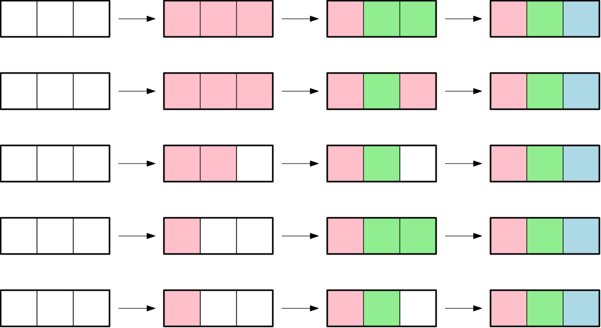

<h1 style='text-align: center;'> F2. Long Colorful Strip</h1>

<h5 style='text-align: center;'>time limit per test: 6 seconds</h5>
<h5 style='text-align: center;'>memory limit per test: 256 megabytes</h5>

This is the second subtask of problem F. The only differences between this and the first subtask are the constraints on the value of $m$ and the time limit. It is sufficient to solve this subtask in order to hack it, but you need to solve both subtasks in order to hack the first one.

There are $n+1$ distinct colours in the universe, numbered $0$ through $n$. There is a strip of paper $m$ centimetres long initially painted with colour $0$. 

Alice took a brush and painted the strip using the following process. For each $i$ from $1$ to $n$, in this order, she picks two integers $0 \leq a_i < b_i \leq m$, such that the segment $[a_i, b_i]$ is currently painted with a single colour, and repaints it with colour $i$. 

Alice chose the segments in such a way that each centimetre is now painted in some colour other than $0$. Formally, the segment $[i-1, i]$ is painted with colour $c_i$ ($c_i \neq 0$). Every colour other than $0$ is visible on the strip.

Count the number of different pairs of sequences $\{a_i\}_{i=1}^n$, $\{b_i\}_{i=1}^n$ that result in this configuration. 

Since this number may be large, output it modulo $998244353$.

####### Input

The first line contains a two integers $n$, $m$ ($1 \leq n \leq 500$, $n \leq m \leq 10^6$) — the number of colours excluding the colour $0$ and the length of the paper, respectively.

The second line contains $m$ space separated integers $c_1, c_2, \ldots, c_m$ ($1 \leq c_i \leq n$) — the colour visible on the segment $[i-1, i]$ after the process ends. It is guaranteed that for all $j$ between $1$ and $n$ there is an index $k$ such that $c_k = j$.

####### Output

####### Output

 a single integer — the number of ways Alice can perform the painting, modulo $998244353$.

## Examples

####### Input


```text
3 3
1 2 3
```
####### Output


```text
5
```
####### Input


```text
2 3
1 2 1
```
####### Output


```text
1
```
####### Input


```text
2 3
2 1 2
```
####### Output


```text
0
```
####### Input


```text
7 7
4 5 1 6 2 3 7
```
####### Output


```text
165
```
####### Input


```text
8 17
1 3 2 2 7 8 2 5 5 4 4 4 1 1 6 1 1
```
####### Output


```text
20
```
## Note

In the first example, there are $5$ ways, all depicted in the figure below. Here, $0$ is white, $1$ is red, $2$ is green and $3$ is blue.



Below is an example of a painting process that is not valid, as in the second step the segment 1 3 is not single colour, and thus may not be repainted with colour $2$.


In the second example, Alice must first paint segment 0 3 with colour $1$ and then segment 1 2 with colour $2$. 


#### Tags 

#2600 #NOT OK #dp 

## Blogs
- [All Contest Problems](../Codeforces_Global_Round_4.md)
- [Announcement](../blogs/Announcement.md)
- [E (en)](../blogs/E_(en).md)
