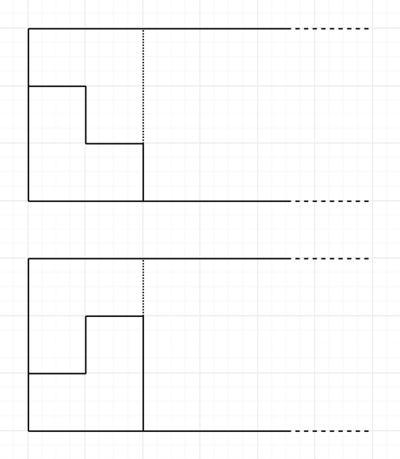
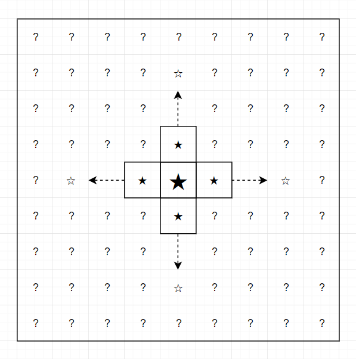
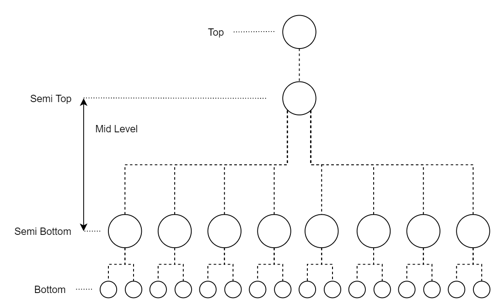
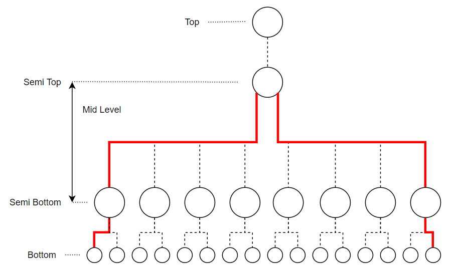
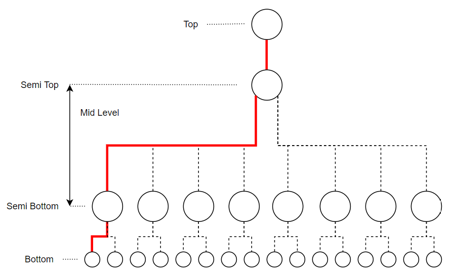
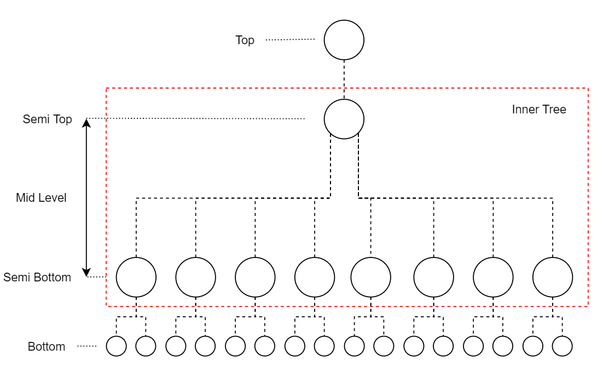

# Tutorial_(en)

Sorry for such difficulty balance. Here is the editorial.

 
### [1182A - Filling Shapes](../problems/A._Filling_Shapes.md "Codeforces Round 566 (Div. 2)")

If you want to have no empty spaces on 3×n3×n tiles, you should fill leftmost bottom tile. Then you have only 2 choices;

  Both cases force you to group leftmost 3×23×2 tiles and fill. By this fact, we should group each 3×23×2 tiles and fill independently. So the answer is — if nn is odd, then the answer is 00 (impossible), otherwise, the answer is 2n22n2.

Time complexity is O(1)O(1) with bit operation or O(n)O(n) with iteration.

[Solution Code for A](https://codeforces.com/problemset/submission/1182/55478830)

**Behind story of B: Original B was harder. None of 2100+ rated testers solved original B, so it got downgraded. Also there was more than 15 pretests before.** 

### [1182B - Plus from Picture](../problems/B._Plus_from_Picture.md "Codeforces Round 566 (Div. 2)")

First, try to find if there is any nonempty space which has 4 neighbors are all nonempty spaces. (Giant black star in the picture below.) If there is no such nonempty space, the answer is "NO".

Second, try to search the end of the "+" shape from the center. (White stars in the picture below.)

  Third, try to find if there is any nonempty space outside of "+" shape(the area filled with "?"). If found then the answer is "NO".

If you validated all steps, then the answer is "YES".

Time complexity is O(wh)O(wh).

 [Solution Code for B](https://codeforces.com/problemset/submission/1182/55478850)**Behind story of C: C is created before few days to contest. If there was no current C, the contest would have hell balances.** 

### [1182C - Beautiful Lyrics](../problems/C._Beautiful_Lyrics.md "Codeforces Round 566 (Div. 2)")

Let's make some definitions;

* s1s1 and s2s2 are complete duo if two word s1s1 and s2s2 have same number of vowels and the last vowels of s1s1 and s2s2 are same. For example, "hello" and "hollow" are complete duo.
* s1s1 and s2s2 are semicomplete duo if two word s1s1 and s2s2 have same number of vowels but the last vowels of s1s1 and s2s2 are different. For example, "hello" and "hola" are semicomplete duo.

If you want to form a beautiful lyric with 44 words, then the lyric must be one of the things listed below;

* Consist of two complete duos.
* Consist of one semicomplete duo and one complete duo.

Since the order of lyrics is not important, make complete duos as many as possible, then make semicomplete duos as many as possible. This can be done with the greedy approach with the usage of the red-black tree or hashmap.

After you formed all duos, make beautiful lyrics using one semicomplete duo and one complete duo first, then make beautiful lyrics using two complete duos. With this method, you can make the maximum possible number of beautiful lyrics.

Time complexity is O(n log n)O(n log n) or O(n)O(n).

 [Solution Code for C](https://codeforces.com/problemset/submission/1182/55478862)**Behind story of D: Honestly I predicted D as hell hard problem. But other high rated people said it's not that hard.** 

### [1182D - Complete Mirror](../problems/D._Complete_Mirror.md "Codeforces Round 566 (Div. 2)")

First, the valid tree should form like the picture below unless the whole tree is completely linear.

  * top: This node is the top of the tree. This node has always degree 11. This node is always one of the possible answers of valid tree. There might be no top node in the tree.
* semitop: This node is the closest children from the top node that satisfies degree>=3degree>=3. In other words, this node is the end of the leaf branch which includes top node as leaf. This node can be one of the possible answers of valid tree. If there is no semitop in the tree, the whole tree is invalid.
* mid level: This is the area of nodes between semitop node and semibottom nodes.
* semibottom: These nodes are the closest ancestors from each leaf nodes which satisfies degree>=3degree>=3. In other words, these nodes are the end of each leaf branches.
* bottom: These nodes are the leaves except top node.

And also let's define u1u1 and u2u2 are directly reachable if there are only nodes with degree=2degree=2 between u1u1 and u2u2 exclusive.

There are two ways to find the top node and the semitop node.

1. Lawali's solution. Find the diameter path and validate for two leaves of the diameter path. If no valid vertex found(i.e. top is not in the diameter path), then the semitop should be the middle of the diameter path. Now validate for the semitop and the closest directly reachable leaf from semitop. If any valid vertex found, print it. Otherwise print −1−1.  The first case of diameter path in valid tree. Semitop node is the middle of diameter path. The second case of diameter path in valid tree. Top node is the end of diameter path.
2. McDic's solution. Clone the whole tree and cut the leaf branches(include top) from the cloned tree. Let's call this tree as "inner tree". Inner tree consists of only semitop, mid level nodes and semibottom nodes. Then you can find the semitop by collapsing each level from leaf nodes of inner tree. Now validate for semitop, the furthest directly reachable leaf node from semitop, and the closest directly reachable leaf node from semitop. It is guaranteed that the top node is one of those two leaves. If any valid vertex found, print it. Otherwise print −1−1.  This is the inner tree of original tree. You can find the semitop easier than before since top is removed in inner tree.

Time complexity is O(n)O(n).

 [Solution Code for D](https://codeforces.com/problemset/submission/1182/55478873)**Behind story of E: I didn't expected such well-known problem. My solution for E is more complicated.** 

### [1182E - Product Oriented Recurrence](../problems/E._Product_Oriented_Recurrence.md "Codeforces Round 566 (Div. 2)")

You can form the expression into this;

cxfx=cx−1fx−1⋅cx−2fx−2⋅cx−3fx−3cxfx=cx−1fx−1⋅cx−2fx−2⋅cx−3fx−3

Let g(x,p)=cxfxg(x,p)=cxfx's pp-occurrence for prime number pp. For example, 40=23×540=23×5 so 4040's 22-occurrence is 33.

Then we can set the formula g(x,p)=g(x−1,p)+g(x−2,p)+g(x−3,p)g(x,p)=g(x−1,p)+g(x−2,p)+g(x−3,p) and calculate g(n,p)g(n,p) using matrix exponentiation. Since all different prime numbers pp share same matrix, we can calculate matrix only once. And we have less or equal than 36 distinct prime numbers targeted because you cannot get more than 99 distinct prime numbers by prime decomposition from numbers in range [1,109][1,109].

With g(x,p)g(x,p) we can calculate cnfncnfn, and we can calculate fnfn using modulo inverse.

Time complexity is O(log n+ sqrt(max(f1,f2,f3,c)))O(log n+ sqrt(max(f1,f2,f3,c))).

 [Solution Code for E](https://codeforces.com/problemset/submission/1182/55478881)**Behind story of F: This problem was located at D originally.** 

### [1182F - Maximum Sine](../problems/F._Maximum_Sine.md "Codeforces Round 566 (Div. 2)")

Lemma: For all xx, yy ∈[0,π]∈[0,π], if |sin(x)|>|sin(y)||sin(x)|>|sin(y)| then xx is more closer to the π2π2 than yy.

With this lemma, we can avoid the calculation of floating precision numbers. Let's reform the problem; Find minimum possible integer xx that pqxπmodπpqxπmodπ is the closest to π2π2. This is equivalent to find minimum possible integer xx that 2pxmod2q2pxmod2q is the closest to qq. 

Let g(x)=2pxmod2qg(x)=2pxmod2q. Now set the interval with length t=sqrt(b−a+1)t=sqrt(b−a+1) and construct the list like this — [(g(a),a),(g(a+1),a+1),…(g(a+t−1),a+t−1)][(g(a),a),(g(a+1),a+1),…(g(a+t−1),a+t−1)]. Then remove the big number xxs with duplicated g(x)g(x) values from the list and sort the list.

Now we can find any xx that g(x)g(x) is the closest to any integer yy in O(log(n))O(log(n)). We will search all numbers in range [a,b][a,b] without modifying the list we created. How is this possible? Because g(x)+g(y)≡g(x+y)(mod2q)g(x)+g(y)≡g(x+y)(mod2q) for all integers xx, yy.

So in every sqrt(b−a+1)sqrt(b−a+1) iterations, we can set the target and just find. More precisely, our target value is q−2×i⋅t⋅pmod2qq−2×i⋅t⋅pmod2q for ii-th iteration. With this search, we can find such minimum possible integer xx. Oh, don't forget to do bruteforce in remaining range!

The time complexity is O(sqrt n log n)O(sqrt n log n).

 [Solution Code for F](https://codeforces.com/problemset/submission/1182/55478889)