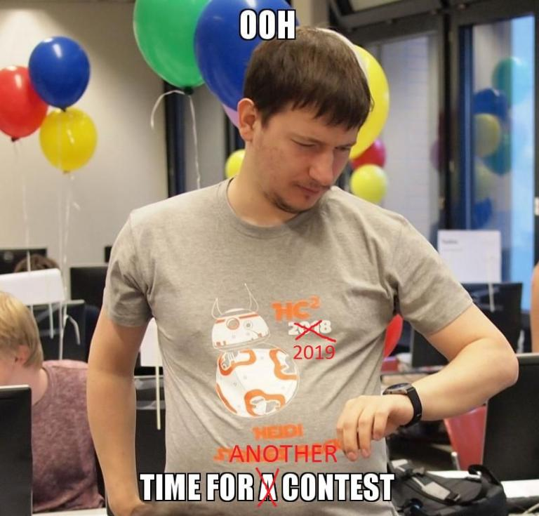

# A_(en)

**UPDATE: the editorial is [here](https://assets.codeforces.com/files/helvetic/helvetic-coding-contest-2019-editorial.pdf)**

**[Link to the online mirror](https://codeforces.com/contest/1184)**

Hello CodeForces! This year again, I'd like to invite you to [the online mirror](https://codeforces.com/contest/1184) of an open championship of Switzerland called HC2 (the Helvetic Coding Contest). A mirror was also held [one](//codeforces.com/contest/958), [two](//codeforces.com/contest/802) and [three years ago](//codeforces.com/contest/690).

[The Helvetic Coding Contest](https://codeforces.com/http://hc2.ch/) is a yearly contest held at [the EPFL](https://codeforces.com/http://epfl.ch/) in Lausanne by the [PolyProg](https://codeforces.com/http://polyprog.epfl.ch/) association. The contest itself took place on April the 13th, but the online mirror is scheduled on [**Sunday, 7th of July, 10:05 Moscow time**](https://codeforces.com/https://www.timeanddate.com/worldclock/fixedtime.html?msg=Helvetic+Coding+Contest+2019+online+mirror&iso=20190707T0705&ah=4&am=30). The duration is 4:30.

Rules:

 * you can participate in teams or individually (1-3 people),
* standard ACM-ICPC rules (no hacking),
* the contest is not rated,
* if you have participated in the onsite contest, please do not participate in the mirror.

The contest this year is Doctor Who-themed. It features 5 series of 2-3 related tasks with increasing difficulty (easy/medium/hard). (For the online mirror, we will skip one series that had appeared in the onsite contest.) Sometimes it may be the case that a solution for the hard version solves all of them, but usually not. We think that the problemset is diverse and interesting, and while the contest is ACM-style, you will find that some problems are not so standard. Most easy&medium problems are even solvable in Python, so you can also recommend this contest to your newbie friends :) We promise to post a nice editorial as soon as the contest ends.

Acknowledgments: the problems were set by [bgamlath](https://codeforces.com/profile/bgamlath "Expert bgamlath"), [DamianS](https://codeforces.com/profile/DamianS "Master DamianS"), [esrever](https://codeforces.com/profile/esrever "Candidate Master esrever"), [milenkoviclazar](https://codeforces.com/profile/milenkoviclazar "Expert milenkoviclazar"), [Wajeb](https://codeforces.com/profile/Wajeb "Expert Wajeb") (who coordinated), and myself. Thanks also go out to people who helped with the statements and testing: [anayMehrotra](https://codeforces.com/profile/anayMehrotra "Expert anayMehrotra"), Michalina Pacholska (who also draws the cows), [cdkrot](https://codeforces.com/profile/cdkrot "Grandmaster cdkrot") for the Russian statements, [KAN](https://codeforces.com/profile/KAN "Grandmaster KAN") for CodeForces coordination, as well as everyone involved in the actual onsite contest, who are too many to name here. We also thank the sponsors [Open Systems](https://codeforces.com/http://open.ch/) and [nexthink](https://codeforces.com/http://nexthink.com/). Lastly, thanks to [MikeMirzayanov](https://codeforces.com/profile/MikeMirzayanov "Headquarters, MikeMirzayanov") for CodeForces and Polygon (which was used to prepare the problems).

Finally, in a bit of autopromotion, note that you can use [Hightail](//codeforces.com/blog/entry/13141) to automatically test your solutions :) Good luck!

**After-contest UPDATE:**

[>>> Editorial <<<](https://assets.codeforces.com/files/helvetic/helvetic-coding-contest-2019-editorial.pdf)
------------------------------------------------------------------------------------------------------------------

Also:

 * two extra problems from the onsite contest that were left out for the online mirror are [available in the Gym](https://codeforces.com/gym/102271)
* the new [uphacking feature](https://codeforces.com/blog/entry/68204) is available for all problems except A3 and C3

Thanks to everyone who participated! We hope you have enjoyed the problems. The top three teams are:

 1. 大象大象你的鼻子为什么那么长 (solved all 14 problems!): [FizzyDavid](https://codeforces.com/profile/FizzyDavid "International Grandmaster FizzyDavid"), [300iq](https://codeforces.com/profile/300iq "Legendary Grandmaster 300iq"), [TLE](https://codeforces.com/profile/TLE "International Grandmaster TLE")
2. zxtxdy (13 problems): [cuizhuyefei](https://codeforces.com/profile/cuizhuyefei "Grandmaster cuizhuyefei"), [MarkF](https://codeforces.com/profile/MarkF "Grandmaster MarkF"), [zx2003](https://codeforces.com/profile/zx2003 "Grandmaster zx2003")
3. helveticow (12 problems): [scott_wu](https://codeforces.com/profile/scott_wu "International Grandmaster scott_wu"), [ksun48](https://codeforces.com/profile/ksun48 "International Grandmaster ksun48"), [ecnerwala](https://codeforces.com/profile/ecnerwala "Legendary Grandmaster ecnerwala")

See you again next year!

