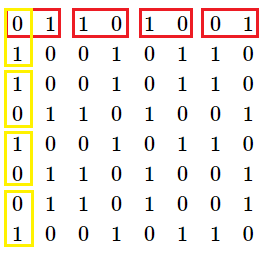
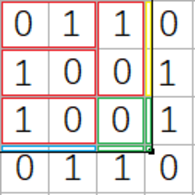
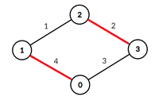

# E_(en)

### [1186A - Vus the Cossack and a Contest](../problems/A._Vus_the_Cossack_and_a_Contest.md "Codeforces Round 571 (Div. 2)")

Since a pen and a notebook would be given to each participant, the answer is "Yes" if and only if n≤kn≤k and n≤mn≤m. The answer is "No" otherwise.

 
### [1186C - Vus the Cossack and Strings](../problems/C._Vus_the_Cossack_and_Strings.md "Codeforces Round 571 (Div. 2)")

Let's say that we want to know whether f(c,d)f(c,d) is even for some strings cc and dd.

Let's define cntccntc as number of ones in string cc and cntdcntd as number of ones in dd.

It's easy to see that f(c,d)f(c,d) is even if and only if cntbcntb and cntccntc have same parity. In other words if cntc≡cntd(mod2)cntc≡cntd(mod2) then f(c,d)f(c,d) is even.

So, we can check if two strings have even number of distinct bits in O(1)O(1) if know how many ones does each of them contain.

Using that fact we can easily solve problem in O(n)O(n) by using prefix sums. 

 
### [1186D - Vus the Cossack and Numbers](../problems/D._Vus_the_Cossack_and_Numbers.md "Codeforces Round 571 (Div. 2)")

At first step we should floor all the elements of the array. Then we iterate through the array and do the following:

1. If sum of all the elements of array is equal to 00, then the algorithm stops.
2. If the decimal part of aiai was not equal to 00, then we assign ai:=ai+1ai:=ai+1
3. Increase ii and repeat step 1.

If you are interested why this works, here is the proof:

Every element aiai of the initial array can be expressed as ⌊ai⌋+εi⌊ai⌋+εi. It is obvious that 0≤εi<10≤εi<1.

Sum of all elements of array aa equals to 00, it means that: n∑i=1ai=0∑i=1nai=0 n∑i=1(⌊ai⌋+εi)=0∑i=1n(⌊ai⌋+εi)=0 n∑i=1⌊ai⌋+n∑i=1εi=0∑i=1n⌊ai⌋+∑i=1nεi=0

From equations above we can see that ∑ni=1εi∑ni=1εi is an integer. Every εi<1εi<1, and that means ∑ni=1εi∑ni=1εi is smaller than number of elements that were floored, so we will always be able to achieve zero sum of array aa by adding 11 to some of the numbers that were initially floored.

 
### [1186E - Vus the Cossack and a Field](../problems/E._Vus_the_Cossack_and_a_Field.md "Codeforces Round 571 (Div. 2)")

Let's define f(x,y)f(x,y) a function that returns sum of all elements of submatrix (1,1,x,y)(1,1,x,y) (these 44 numbers stand for x1,y1,x2,y2x1,y1,x2,y2 respectively. If we can get value of this function in a fast way, then we can answer the queries quickly by using well known formula for sum on submatrix with cooridantes x1,y1,x2,y2x1,y1,x2,y2:

sum=f(x2,y2)−f(x2,y1−1)−f(x1−1,y2)+f(x1−1,y1−1)sum=f(x2,y2)−f(x2,y1−1)−f(x1−1,y2)+f(x1−1,y1−1)

If you want to prove the formula you should draw some examples and use the inclusion-exclusion principle.

So we reduced our task to finding value of f(x,y)f(x,y) for some arbitrary xx and yy. 

At first, we should precalculate values of f(x,y)f(x,y) for every 1≤x≤n,1≤y≤m1≤x≤n,1≤y≤m. This can be easily done using dynamic programming. 

Let's forget about the sums for a while. Let's take a look on the fields. They can be both inverted or not inverted. Let's see how fields are distributed when generating an infinite field.

At step 00 we have one field, which is not inverted: 00

At step 11 we have four fields: 01100110

And so on...

After 3 steps we can see that you can split each horizontal or vertical line in pairs of inverted and not inverted fields like on the picture (vertical pairs are highlighted with yellow, horizontal pairs are highlighted with red):

  Sum of inverted and not inverted matrices of size n×mn×m is equal to n⋅mn⋅m.

Knowing these facts we can get O(1)O(1) solution.

Let's say that we want to know f(x,y)f(x,y). Let's define fieldxfieldx and fieldyfieldy as coordinates of the field which cell (x,y)(x,y) belongs to. They can be easily found: fieldx=⌊x−1n⌋+1fieldx=⌊x−1n⌋+1 fieldy=⌊y−1m⌋+1fieldy=⌊y−1m⌋+1 

The solution is splited into four parts: 

1. When both fieldxfieldx and fieldyfieldy are odd.
2. When fieldxfieldx is odd, but fieldyfieldy is even.
3. When fieldxfieldx is even, but fieldyfieldy is odd.
4. When both feildxfeildx and field+yfield+y are even.

Solving each of the part is very similar, so I'll show you how to get value of f(x,y)f(x,y) if both fieldxfieldx and fieldyfieldy are even (In this particular example fieldx=fieldy=4fieldx=fieldy=4). The big black dot shows us the position of (x,y)(x,y) (i.e. it shows that the cell with coordinates (x,y)(x,y) is located somewhere in the field with coordinates (4,4)(4,4)). 

  Using the fact I mentioned before we can get the value of pairs highlited as red: it is equal to ((fieldx−1)⋅(fieldy−1)−1)⋅n⋅m2((fieldx−1)⋅(fieldy−1)−1)⋅n⋅m2 

You can easily use the same fact in order to find the blue and yellow parts.

In order to find the green parts we need to know whether each of the matrices, highlighted with green is inversed. How to know if the matrix with coordinates (a,b)(a,b) is inversed? Here is the trick (here bitcntbitcnt is the function which returns number of bits in a number): 

 If bitcnt(a)+bitcnt(b)bitcnt(a)+bitcnt(b) is an odd number, then the matrix is inversed.  
### [1186F - Vus the Cossack and a Graph](../problems/F._Vus_the_Cossack_and_a_Graph.md "Codeforces Round 571 (Div. 2)")

At first, let's create a fictive vertex (I'll call it 00 vertex) and connect it with all of the vertices which have odd degree. Now all the vertices including 00 vertex have even degree. The statement that 00 vertex will have even degree too can be easily proven using the fact that the sum of degrees of all vertices equals to the number of edges multiplied by two. Let's denote the number of edges in the new graph as kk.

There were mm edges initially and we added at most nn new edges that connect fictive vertex with the real ones, so it always holds that k≤n+mk≤n+m.

Now, since all the vertices have even degree we can find Euler cycle of the new graph. Let's define e1,e2,…,eke1,e2,…,ek as an array of all edges of the graph, ordered as in found Euler cycle. Now we can iterate over the array ee and delete all the edges on even positions. Due to this action now the new graph contains at most ⌈k2⌉≤⌈n+m2⌉⌈k2⌉≤⌈n+m2⌉ edges. That is exactly what we needed!

It is interesting that in the new graph by deleting the edges the way mentioned above, the degree of each vertex would not be reduced more than twice. How to prove that? Well, you can think about it the following way:

Let's say that the eiei edge connects some vertices aa and bb, that means that the ei+1ei+1 edge connects vertex bb with some vertex cc. If ii is odd, then we will delete only the ei+1ei+1 edge, and if ii is even, then we will delete only the eiei edge. And that happens for every vertex: if some edge ii enters it, then we will either delete ii-th edge or i+1i+1-th edge. So at most half of edges connected to a vertex will be deleted. If the length of Euler cycle is odd, then the last edge in it won't be deleted at all, so the algorithm will still work correctly.

But that works for the new graph, which contains fictive vertex. But we need to solve the problem for the real graph. We can not simply delete all the edges from the real graph, that were on even positions in Euler cycle mentioned above. Here is the examle where it does not work (numbers near the edges show their positions in ee array, edges that would need to be removed are highlited with red):

  If we removed edge between vertices 22 and 33, degree of vertex 33 would become 00 which is definetely less then ⌈d32⌉=1⌈d32⌉=1. How do we avoid this bad situation? We can simply do the following:

* If eiei is a fictive edge (i.e. it connects a real vertex with fictive one), then we do not really care about it, since we have to output answer about the real graph.
* If eiei is a real edge (i.e it connects only real vertices) and we have to delete it, then we should look if ei−1ei−1 or ei+1ei+1 is a ficive edge. If either of them is one, then we can delete the fictive edge instead of the real edge eiei (i.e. we simply do not delete eiei from the graph), otherwise we delete the edge. (Note that if eiei is the last edge in the Euler cycle, then instead of checking the ek+1ek+1 edge which does not exist, you check if e1e1 is fictive or not, similar goes for the case if i=1i=1).

It is obvious that by doing so we do not change the number of edges deleted. It is also easy to see that the degree of a i−thi−th vertex in the new graph is at most di+1di+1. We still delete at most ⌊di+12⌋⌊di+12⌋ edges connected to it (or ⌊di2⌋⌊di2⌋ if it initially had an even degree), but in case when it's degree was "artificially" increased, we prefer to delete the fictive edge, which we do not care about. The last question is: whether there we will a fictive edge which we will try to delete more than once? It is easy to prove that there is no such edge, you can try it by yourself.

That's it, the problem is solved. 

Note that the graph is not necessarily connected, so you should find Euler cycle and do the following steps for each component independently.

In order to better understand the solution, check out author's source code:

