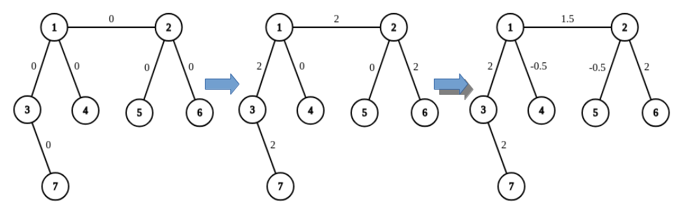
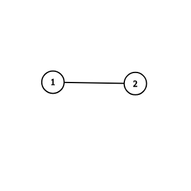
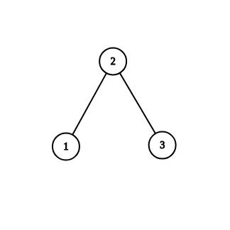
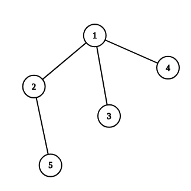
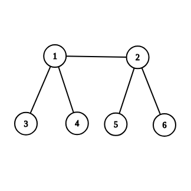

<h1 style='text-align: center;'> A1. Add on a Tree</h1>

<h5 style='text-align: center;'>time limit per test: 1 second</h5>
<h5 style='text-align: center;'>memory limit per test: 256 megabytes</h5>


## Note

 that this is the first problem of the two similar problems. You can hack this problem only if you solve both problems.

You are given a tree with $n$ nodes. In the beginning, $0$ is written on all edges. In one operation, you can choose any $2$ distinct leaves $u$, $v$ and any real number $x$ and add $x$ to values written on all edges on the simple path between $u$ and $v$.

For example, on the picture below you can see the result of applying two operations to the graph: adding $2$ on the path from $7$ to $6$, and then adding $-0.5$ on the path from $4$ to $5$. 

  Is it true that for any configuration of real numbers written on edges, we can achieve it with a finite number of operations?

Leaf is a node of a tree of degree $1$. Simple path is a path that doesn't contain any node twice.

###### Input

The first line contains a single integer $n$ ($2 \le n \le 10^5$) — the number of nodes.

Each of the next $n-1$ lines contains two integers $u$ and $v$ ($1 \le u, v \le n$, $u \neq v$), meaning that there is an edge between nodes $u$ and $v$. It is guaranteed that these edges form a tree.

###### Output

If there is a configuration of real numbers written on edges of the tree that we can't achieve by performing the operations, output "NO". 

Otherwise, output "YES". 

You can print each letter in any case (upper or lower).

## Examples

###### Input


```text
2
1 2
```
###### Output


```text
YES
```
###### Input

```text

3
1 2
2 3

```
###### Output


```text
NO
```
###### Input

```text

5
1 2
1 3
1 4
2 5

```
###### Output


```text
NO
```
###### Input

```text

6
1 2
1 3
1 4
2 5
2 6

```
###### Output


```text

YES
```
## Note

In the first example, we can add any real $x$ to the value written on the only edge $(1, 2)$.

  In the second example, one of configurations that we can't reach is $0$ written on $(1, 2)$ and $1$ written on $(2, 3)$.

  Below you can see graphs from examples $3$, $4$:

    

#### Tags 

#1600 #NOT OK #trees 

## Blogs
- [All Contest Problems](../Codeforces_Round_572_(Div._1).md)
- [Codeforces Round #572](../blogs/Codeforces_Round_572.md)
- [Tutorial](../blogs/Tutorial.md)
