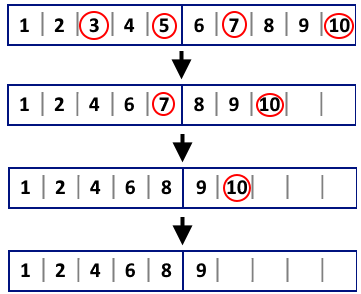

<h1 style='text-align: center;'> A. Tokitsukaze and Discard Items</h1>

<h5 style='text-align: center;'>time limit per test: 1 second</h5>
<h5 style='text-align: center;'>memory limit per test: 256 megabytes</h5>

Recently, Tokitsukaze found an interesting game. Tokitsukaze had $n$ items at the beginning of this game. However, she thought there were too many items, so now she wants to discard $m$ ($1 \le m \le n$) special items of them.

These $n$ items are marked with indices from $1$ to $n$. In the beginning, the item with index $i$ is placed on the $i$-th position. Items are divided into several pages orderly, such that each page contains exactly $k$ positions and the last positions on the last page may be left empty.

Tokitsukaze would do the following operation: focus on the first special page that contains at least one special item, and at one time, Tokitsukaze would discard all special items on this page. After an item is discarded or moved, its old position would be empty, and then the item below it, if exists, would move up to this empty position. The movement may bring many items forward and even into previous pages, so Tokitsukaze would keep waiting until all the items stop moving, and then do the operation (i.e. check the special page and discard the special items) repeatedly until there is no item need to be discarded.

  Consider the first example from the statement: $n=10$, $m=4$, $k=5$, $p=[3, 5, 7, 10]$. The are two pages. Initially, the first page is special (since it is the first page containing a special item). So Tokitsukaze discards the special items with indices $3$ and $5$. After, the first page remains to be special. It contains $[1, 2, 4, 6, 7]$, Tokitsukaze discards the special item with index $7$. After, the second page is special (since it is the first page containing a special item). It contains $[9, 10]$, Tokitsukaze discards the special item with index $10$. Tokitsukaze wants to know the number of operations she would do in total.

#### Input

The first line contains three integers $n$, $m$ and $k$ ($1 \le n \le 10^{18}$, $1 \le m \le 10^5$, $1 \le m, k \le n$) — the number of items, the number of special items to be discarded and the number of positions in each page.

The second line contains $m$ distinct integers $p_1, p_2, \ldots, p_m$ ($1 \le p_1 < p_2 < \ldots < p_m \le n$) — the indices of special items which should be discarded.

#### Output

Print a single integer — the number of operations that Tokitsukaze would do in total.

## Examples

#### Input


```text
10 4 5
3 5 7 10
```
#### Output


```text
3
```
#### Input


```text
13 4 5
7 8 9 10
```
#### Output


```text
1
```
## Note

For the first example:

* In the first operation, Tokitsukaze would focus on the first page $[1, 2, 3, 4, 5]$ and discard items with indices $3$ and $5$;
* In the second operation, Tokitsukaze would focus on the first page $[1, 2, 4, 6, 7]$ and discard item with index $7$;
* In the third operation, Tokitsukaze would focus on the second page $[9, 10]$ and discard item with index $10$.

For the second example, Tokitsukaze would focus on the second page $[6, 7, 8, 9, 10]$ and discard all special items at once.


#### Tags 

#1400 #NOT OK #implementation #two_pointers 

## Blogs
- [All Contest Problems](../Codeforces_Round_573_(Div._1).md)
- [Codeforces Round #573 (en)](../blogs/Codeforces_Round_573_(en).md)
- [E (en)](../blogs/E_(en).md)
