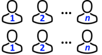
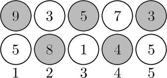
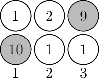

<h1 style='text-align: center;'> C. Basketball Exercise</h1>

<h5 style='text-align: center;'>time limit per test: 2 seconds</h5>
<h5 style='text-align: center;'>memory limit per test: 256 megabytes</h5>

Finally, a basketball court has been opened in SIS, so Demid has decided to hold a basketball exercise session. $2 \cdot n$ students have come to Demid's exercise session, and he lined up them into two rows of the same size (there are exactly $n$ people in each row). Students are numbered from $1$ to $n$ in each row in order from left to right.

  Now Demid wants to choose a team to play basketball. He will choose players from left to right, and the index of each chosen player (excluding the first one taken) will be strictly greater than the index of the previously chosen player. To avoid giving preference to one of the rows, Demid chooses students in such a way that no consecutive chosen students belong to the same row. The first student can be chosen among all $2n$ students (there are no additional constraints), and a team can consist of any number of students. 

Demid thinks, that in order to compose a perfect team, he should choose students in such a way, that the total height of all chosen students is maximum possible. Help Demid to find the maximum possible total height of players in a team he can choose.

##### Input

The first line of the input contains a single integer $n$ ($1 \le n \le 10^5$) — the number of students in each row.

The second line of the input contains $n$ integers $h_{1, 1}, h_{1, 2}, \ldots, h_{1, n}$ ($1 \le h_{1, i} \le 10^9$), where $h_{1, i}$ is the height of the $i$-th student in the first row.

The third line of the input contains $n$ integers $h_{2, 1}, h_{2, 2}, \ldots, h_{2, n}$ ($1 \le h_{2, i} \le 10^9$), where $h_{2, i}$ is the height of the $i$-th student in the second row.

##### Output

Print a single integer — the maximum possible total height of players in a team Demid can choose.

## Examples

##### Input


```text
5
9 3 5 7 3
5 8 1 4 5
```
##### Output


```text
29
```
##### Input


```text
3
1 2 9
10 1 1
```
##### Output


```text
19
```
##### Input


```text
1
7
4
```
##### Output


```text
7
```
## Note

In the first example Demid can choose the following team as follows: 

  In the second example Demid can choose the following team as follows: 

  

#### Tags 

#1400 #NOT OK #dp 

## Blogs
- [All Contest Problems](../Codeforces_Round_574_(Div._2).md)
- [Announcement](../blogs/Announcement.md)
- [Tutorial #1 (en)](../blogs/Tutorial_1_(en).md)
- [Tutorial #2 (ru)](../blogs/Tutorial_2_(ru).md)
- [Tutorial #3 (en)](../blogs/Tutorial_3_(en).md)
- [Tutorial #4 (ru)](../blogs/Tutorial_4_(ru).md)
