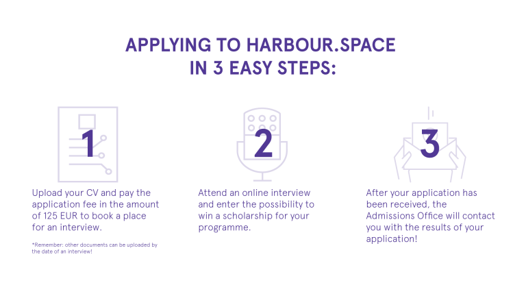

# A_(en)

Hello Codeforces!

On [Monday, July 22, 2019 at 20:35UTC+6](https://codeforces.com/https://www.timeanddate.com/worldclock/fixedtime.html?day=22&month=7&year=2019&hour=17&min=35&sec=0&p1=166) [Educational Codeforces Round 69 (Rated for Div. 2)](https://codeforces.com/contest/1197 "Educational Codeforces Round 69 (Rated for Div. 2)") will start.

Series of Educational Rounds continue being held as [Harbour.Space University](https://codeforces.com/https://harbour.space/) initiative! You can read the details about the cooperation between [Harbour.Space University](https://codeforces.com/https://harbour.space/) and Codeforces in the [blog post](//codeforces.com/blog/entry/51208).

This round will be **rated for the participants with rating lower than 2100**. It will be held on extended ICPC rules. The penalty for each incorrect submission until the submission with a full solution is 10 minutes. After the end of the contest you will have 12 hours to hack any solution you want. You will have access to copy any solution and test it locally.

You will be given **6 problems** and **2 hours** to solve them.

The problems were invented and prepared by Roman [Roms](https://codeforces.com/profile/Roms "Master Roms") Glazov, Adilbek [adedalic](https://codeforces.com/profile/adedalic "International Master adedalic") Dalabaev, Vladimir [vovuh](https://codeforces.com/profile/vovuh "Candidate Master vovuh") Petrov, Ivan [BledDest](https://codeforces.com/profile/BledDest "Grandmaster BledDest") Androsov, Maksim [Neon](https://codeforces.com/profile/Neon "Candidate Master Neon") Mescheryakov and me. Also huge thanks to Mike [MikeMirzayanov](https://codeforces.com/profile/MikeMirzayanov "Headquarters, MikeMirzayanov") Mirzayanov for great systems Polygon and Codeforces.

Good luck to all participants!

UPD: Our friends at Harbour.Space also have a message for you:

*Hello Codeforces!*

*We hope your summer is going well!* 

*Last Friday we finished the second edition of the Tech Scouts Summer Camp, with **70 participants**, **20 different nationalities** and many solved problems.* *We had **6 participants with a full scholarship** thanks to the collaboration between **Harbour.Space and Codeforces** and we are working on increasing this number next year.* 

*We would also like to remind you that we offer scholarships for our technical programmes, such as **Computer Science, Data Science and Cyber Security**.* 

*They are set in such a way that doesn’t require additional applications — we believe in merit and potential, and so what you put in your application to the university will be our criteria.*

*You could be just the diamond we’re looking for, but you’ll never know unless you apply!*

  [APPLY HERE→](https://harbour.space/admissions/scholarship?utm_source=codeforces&utm_medium=partners) 

**UPD2:** There will be **6** problems in the contest.

Congratulations to the winners: 

| Rank | Competitor | Problems Solved | Penalty |
| --- | --- | --- | --- |
| 1 | [Um_nik](https://codeforces.com/profile/Um_nik "Legendary Grandmaster Um_nik") | 6 | 111 |
| 2 | [Golovanov399](https://codeforces.com/profile/Golovanov399 "International Grandmaster Golovanov399") | 6 | 174 |
| 3 | [PinkRabbitAFO](https://codeforces.com/profile/PinkRabbitAFO "Grandmaster PinkRabbitAFO") | 6 | 190 |
| 4 | [dreamoon_love_AA](https://codeforces.com/profile/dreamoon_love_AA "International Grandmaster dreamoon_love_AA") | 6 | 198 |
| 5 | [_twilight](https://codeforces.com/profile/_twilight "Candidate Master _twilight") | 6 | 232 |
| 6 | [HIR180](https://codeforces.com/profile/HIR180 "International Grandmaster HIR180") | 6 | 252 |

Congratulations to the best hackers: 

| Rank | Competitor | Hack Count |
| --- | --- | --- |
| 1 | [greencis](https://codeforces.com/profile/greencis "Master greencis") | **122****:-29** |
| 2 | [Ali_ZaiBug](https://codeforces.com/profile/Ali_ZaiBug "Specialist Ali_ZaiBug") | **26** |
| 3 | [racsosabe](https://codeforces.com/profile/racsosabe "Expert racsosabe") | **22****:-7** |
| 4 | [plusplus6408](https://codeforces.com/profile/plusplus6408 "Expert plusplus6408") | **14** |
| 5 | [Flamire](https://codeforces.com/profile/Flamire "Specialist Flamire") | **14****:-3** |
| 6 | [crvineeth97](https://codeforces.com/profile/crvineeth97 "Expert crvineeth97") | **13****:-2** |

 397 successful hacks and 420 unsuccessful hacks were made in total!And finally people who were the first to solve each problem: 

| Problem | Competitor | Penalty |
| --- | --- | --- |
| A | [dorijanlendvaj](https://codeforces.com/profile/dorijanlendvaj "Master dorijanlendvaj") | 0:01 |
| B | [Um_nik](https://codeforces.com/profile/Um_nik "Legendary Grandmaster Um_nik") | 0:04 |
| C | [beefman](https://codeforces.com/profile/beefman "Candidate Master beefman") | 0:06 |
| D | [Um_nik](https://codeforces.com/profile/Um_nik "Legendary Grandmaster Um_nik") | 0:12 |
| E | [Benq](https://codeforces.com/profile/Benq "Legendary Grandmaster Benq") | 0:11 |
| F | [Um_nik](https://codeforces.com/profile/Um_nik "Legendary Grandmaster Um_nik") | 0:31 |

**UPD3:** [Editorial is out](E_(en).md)

